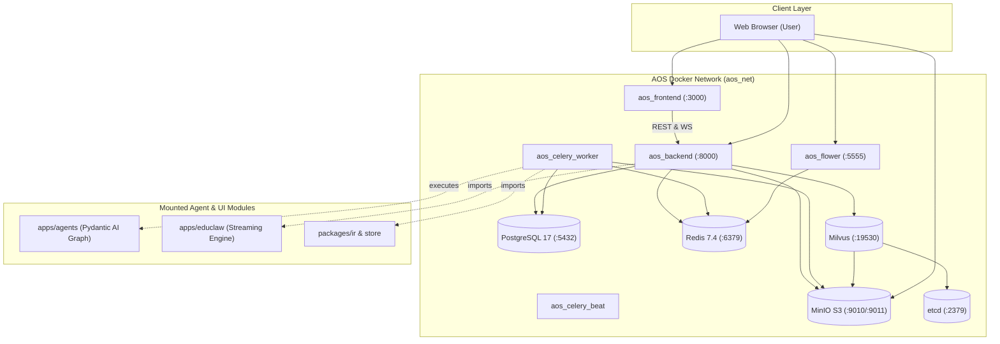

# AOS Full-Stack Docker Deployment & Management Guide

This guide details how to launch and manage the entire **AOS** platform (Next.js Frontend, FastAPI Backend, Celery Worker with Agents/Manim support, and backing storage systems) with **single commands**.

---

## 1. Quickstart: Run the Whole Platform in One Command

### Step 1: Prepare Environment Variables
Copy the root `.env.example` to `.env`:

```bash
# Linux / macOS
cp .env.example .env

# Windows (PowerShell)
copy .env.example .env
```

Open `.env` and fill in your LLM provider keys (e.g., `OPENROUTER_API_KEY`, `OPENAI_API_KEY`, or leave blank if using local Ollama).

### Step 2: Start All Services
Run the single command from the repository root:

```bash
docker compose up -d --build
```

This single command will:
1. Initialize the PostgreSQL database and run all Alembic schema migrations (`init_db`).
2. Boot PostgreSQL, Redis, MinIO S3, etcd, and Milvus vector database.
3. Automatically provision required MinIO buckets (`aos-videos`, `aos-rag`) with public download access.
4. Launch the FastAPI application backend with the EduClaw streaming engine and static media serving.
5. Launch the Celery worker configured with the Pydantic AI agent graph, Manim rendering tools, and audio synthesis.
6. Launch the Next.js React frontend.
7. Start Flower for real-time task inspection.

---

## 2. Updating Containers When Code Changes

### When modifying existing code (`.py`, `.tsx`, `.css`):
- **Live Reload Active**: The application containers mount local source code as bind mounts.
  - Backend and streaming engine changes reload automatically via Uvicorn (`--reload`).
  - Frontend edits reflect immediately via Next.js hot-reloading.

### When updating dependencies, Dockerfiles, or rebuilding images:
Run this single command to recompile and restart updated containers:

```bash
docker compose up -d --build
```

To update only a specific component (e.g., just the webapp or worker):

```bash
# Update backend and worker only:
docker compose up -d --build app celery_worker

# Update frontend only:
docker compose up -d --build frontend
```

---

## 3. Service Dashboard & Access Endpoints

| Service | Host URL | Description | Default Credentials |
| :--- | :--- | :--- | :--- |
| **Next.js Web UI** | [http://localhost:3000](http://localhost:3000) | Main user interface, chat & sequential player | — |
| **FastAPI Backend** | [http://localhost:8000](http://localhost:8000) | REST API & WebSocket orchestrator | — |
| **Interactive API Docs** | [http://localhost:8000/docs](http://localhost:8000/docs) | Swagger OpenAPI interactive documentation | — |
| **Celery Flower** | [http://localhost:5555](http://localhost:5555) | Live Celery worker & task monitor | — |
| **MinIO Console** | [http://localhost:9011](http://localhost:9011) | Object storage web admin UI | `minioadmin` / `minioadmin` |
| **MinIO S3 API** | [http://localhost:9010](http://localhost:9010) | S3 endpoint for videos and RAG chunks | `minioadmin` / `minioadmin` |
| **PostgreSQL** | `localhost:5432` | Relational database (`aos`) | `postgres` / `postgres` |
| **Redis** | `localhost:6379` | Cache & Celery broker | — |
| **Milvus Vector DB** | `localhost:19530` | Vector knowledge store for RAG | — |

---

## 4. Architecture & Scope



> [!NOTE]
> Unused, experimental subprojects located in `apps/` (such as `ManiBench`, `agentic`, `dpo`, `grpo`, `qwenCoder`, `sft`, `training`, `tui`) are intentionally excluded from the production Docker Compose stack to maintain a clean, lightweight footprint.

---

## 5. Daily Operations & Troubleshooting

### Viewing Logs
To stream logs across all services:
```bash
docker compose logs -f
```

To stream logs for a single service (e.g., backend or celery worker):
```bash
# Backend logs
docker compose logs -f app

# Celery worker / video generation logs
docker compose logs -f celery_worker

# Frontend logs
docker compose logs -f frontend
```

### Stopping the Services
To stop all containers while preserving database and video storage:
```bash
docker compose down
```

To stop all containers and wipe all database/storage volumes (fresh start):
```bash
docker compose down -v
```

### Checking Health Status
```bash
docker compose ps
```
All services should show status `healthy` or `running`.
