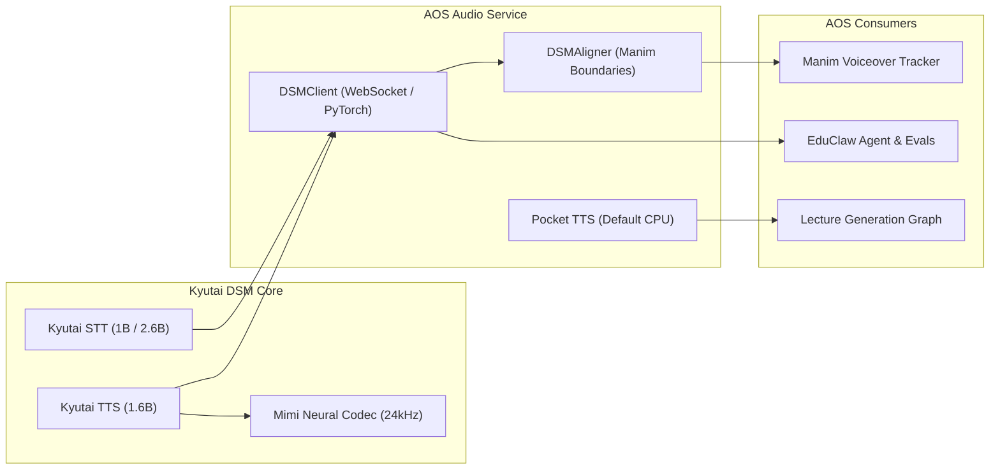

# Kyutai Delayed Streams Modeling (DSM) Guide

This guide details Kyutai's **Delayed Streams Modeling (DSM)** framework, its integration within AOS `audio_service`, and how to use it for high-fidelity speech synthesis, streaming transcription, and millisecond-accurate Manim animation alignment.

---

## 1. Overview & Architecture

Delayed Streams Modeling (DSM) is Kyutai Lab's streaming sequence-to-sequence framework for cross-modal speech-to-text (STT) and text-to-speech (TTS) tasks.

- **Paper Reference**: [Streaming Sequence-to-Sequence Learning with Delayed Streams Modeling (arXiv:2509.08753)](https://arxiv.org/abs/2509.08753).
- **Core Neural Codec**: Mimi audio codec (24 kHz, 12.5 Hz frame rate, 32 codebooks).
- **Repository Location in AOS**: [`apps/audio_service/delayed-streams-modeling`](file:///c:/Users/nabin/Desktop/myall/AOS/apps/audio_service/delayed-streams-modeling).



---

## 2. Audio Service Modules

| File | Purpose | Notes |
| :--- | :--- | :--- |
| [`narrator.py`](file:///c:/Users/nabin/Desktop/myall/AOS/apps/audio_service/narrator.py) | **Pocket TTS** resident 100M CPU model | Default offline engine for beat/scene audio |
| [`dsm_client.py`](file:///c:/Users/nabin/Desktop/myall/AOS/apps/audio_service/dsm_client.py) | **DSM WebSocket & PyTorch Client** | Interfaces with Rust `moshi-server` or local PyTorch |
| [`dsm_aligner.py`](file:///c:/Users/nabin/Desktop/myall/AOS/apps/audio_service/dsm_aligner.py) | **Manim Timestamp Aligner** | Converts token timestamps to `word_boundaries` (100ns units) |
| [`delayed-streams-modeling/`](file:///c:/Users/nabin/Desktop/myall/AOS/apps/audio_service/delayed-streams-modeling) | Cloned submodule / reference code | Contains Rust configs, MLX scripts, PyTorch examples |

---

## 3. Manim Voiceover Synchronization

Manim Voiceover requires word boundary timestamps to trigger on-screen animations precisely when words are spoken:

```python
from dsm_aligner import TimestampedWord, convert_words_to_boundaries

# Given words with timestamps from Kyutai STT / delay streams:
words = [
    TimestampedWord(text="Let", start_time=0.0, end_time=0.3),
    TimestampedWord(text="us", start_time=0.32, end_time=0.5),
    TimestampedWord(text="compute", start_time=0.55, end_time=1.1),
]

# Convert to 100ns resolution word_boundaries
boundaries = convert_words_to_boundaries(words, full_text="Let us compute")
# boundaries can now be passed directly into Manim Voiceover's tracker dict
```

---

## 4. Serving via Rust `moshi-server`

For production or low-latency multi-client streaming:

```bash
# 1. Install Rust server
cargo install --features cuda moshi-server

# 2. Start TTS worker
moshi-server worker --config apps/audio_service/delayed-streams-modeling/configs/config-tts.toml

# 3. Start STT worker (1B English/French model with VAD)
moshi-server worker --config apps/audio_service/delayed-streams-modeling/configs/config-stt-en_fr-hf.toml
```

---

## 5. Testing & Diagnostics on Local Laptop

Run the EduClaw audio test suite:

```bash
cd apps/educlaw
uv run python -m evals.audio_eval
```

This verifies:
1. **Pocket TTS**: Loads model and measures Real-Time Factor (RTF) on CPU.
2. **DSM Aligner**: Verifies boundary calculations and offsets.
3. **Server Connection**: Checks if `moshi-server` is reachable on `ws://127.0.0.1:8080`.
