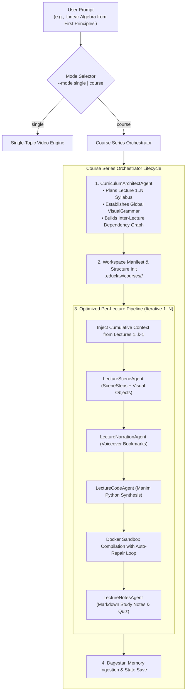

# Course & Lecture Series Generation Engine

> **Multi-Agent Curriculum Architecture, Pedagogical Scaffolding, Manim Code Synthesis, Sandbox Rendering, and Study Notes Companion**

---

## 🎯 Overview & Key Features

EduClaw provides a first-class **Course Generation System** capable of designing, planning, synthesizing, compiling, and managing complete educational video courses composed of structured, sequentially sequenced lectures ($1 \dots N$).

### Core Capabilities:
1. **Mode-Driven Execution**:
   - **Single Video Mode (`single`)**: Rapid generation of a standalone topic animation with synchronized voiceover.
   - **Course Series Mode (`course`)**: Full curriculum planning ($1 \dots N$ lectures) with global visual theming, pedagogical knowledge progression, Manim script generation, Docker sandbox compilation, and companion study guides.
2. **Pedagogical Continuity & Shared Visual Grammar**:
   - Global visual tokens (color palettes, coordinate styles, math notation, background themes) are enforced across all lectures.
   - Knowledge scaffolding: Lecture $k$ dynamically references and builds on concepts introduced in Lectures $1 \dots k-1$ through Dagestan temporal memory.
3. **Resilient Checkpointed Storage**:
   - Manifest tracking at `.educlaw/courses/<course-slug>/course_manifest.json` tracks the state of each lecture (`PENDING`, `PLANNED`, `CODED`, `RENDERED`, `FAILED`).
   - Supports incremental resumption (`educlaw course resume <slug>`) and granular re-rendering of specific lectures (`educlaw course render <slug> --lecture 2`).
4. **Complete Educational Companion**:
   - In addition to Python Manim code and MP4 videos, each lecture produces Markdown study companion notes (`notes.md`) featuring LaTeX equations, summaries, and self-assessment conceptual quizzes.
   - Full handbook export compiles the syllabus and all lecture notes into a single Markdown e-book / handbook.

---

## 📐 Architecture & Multi-Agent Pipeline



---

## 🗂️ Workspace & Storage Layout

Courses are saved under `.educlaw/courses/<course-slug>/`:

```
.educlaw/courses/linear-algebra-fundamentals/
├── course.json                 # Complete serialized Course schema
├── course_manifest.json        # Lightweight index manifest for quick listing
├── syllabus.md                 # Human-readable Markdown curriculum syllabus
├── linear-algebra_handbook.md  # (Optional) Exported full course study handbook
├── lecture_01/
│   ├── scene.py                # Python Manim script for Lecture 1
│   ├── narration.json          # Voiceover narration & synchronization bookmarks
│   ├── notes.md                # Companion study guide with LaTeX math & quiz
│   └── render/
│       └── lecture_01.mp4      # Compiled video output
├── lecture_02/
│   ├── scene.py
│   ├── narration.json
│   ├── notes.md
│   └── render/
│       └── lecture_02.mp4
└── ...
```

---

## 📊 Pydantic Contracts (`educlaw/courses/contracts.py`)

### `VisualGrammar`
Defines the visual identity shared across all lectures:
```python
class VisualGrammar(BaseModel):
    theme_name: str = "academic_modern"
    primary_color: str = "BLUE_C"
    secondary_color: str = "YELLOW_C"
    accent_color: str = "TEAL_C"
    background_color: str = "BLACK"
    coordinate_style: str = "NumberPlane(x_range=[-7, 7, 1], y_range=[-4, 4, 1])"
    latex_font: str = "modern"
    style_guidelines: list[str] = [...]
```

### `LectureSpec`
Outline and pedagogical requirements for each lecture:
```python
class LectureSpec(BaseModel):
    lecture_number: int
    title: str
    description: str
    key_concepts: list[str]
    prerequisites_from_course: list[str]
    visual_goals: list[str]
    estimated_duration_minutes: float = 3.0
```

### `CourseSyllabus`
The complete curriculum planned by the `CurriculumArchitectAgent`:
```python
class CourseSyllabus(BaseModel):
    course_id: UUID
    title: str
    slug: str
    topic: str
    subject: str
    target_audience: Audience
    overview: str
    learning_outcomes: list[str]
    visual_grammar: VisualGrammar
    lectures: list[LectureSpec]
```

### `Lecture` & `Course`
Tracks runtime state, artifacts, and compilation status:
```python
class RenderStatus(str, Enum):
    PENDING = "pending"
    PLANNED = "planned"
    CODED = "coded"
    RENDERED = "rendered"
    FAILED = "failed"

class Lecture(BaseModel):
    lecture_id: UUID
    lecture_number: int
    spec: LectureSpec
    status: RenderStatus
    scene_plan: LessonPlan | None
    narration_plan: NarrationPlan | None
    final_code: FinalCode | None
    compile_result: CompileResult | None
    study_notes: str | None
    video_path: str | None
```

---

## 💻 CLI Command Reference

### 1. `educlaw course new`
Plan, generate, and optionally render a new multi-lecture course:
```powershell
# Create a 3-lecture course and render in Docker sandbox
educlaw course new "Calculus: Limits to Derivatives" --lectures 3 --audience exploring

# Create offline with test model without rendering
educlaw course new "Quantum Computing" --lectures 4 --model test --no-render
```

### 2. `educlaw course list`
List all courses discovered in the workspace storage:
```powershell
educlaw course list
```

### 3. `educlaw course show`
Display complete syllabus overview, visual grammar, and lecture table for a course:
```powershell
educlaw course show calculus-limits-to-derivatives
```

### 4. `educlaw course render`
Render all pending lectures or a specific lecture in the Docker sandbox:
```powershell
# Render all unrendered lectures
educlaw course render calculus-limits-to-derivatives

# Render only Lecture 2 with high quality
educlaw course render calculus-limits-to-derivatives --lecture 2 --quality h
```

### 5. `educlaw course resume`
Resume an interrupted or partially failed course generation from the last unrendered lecture:
```powershell
educlaw course resume calculus-limits-to-derivatives
```

### 6. `educlaw course export`
Compile the syllabus and all lecture study notes into a consolidated Markdown book:
```powershell
educlaw course export calculus-limits-to-derivatives --output calculus_handbook.md
```

### 7. `educlaw animate` (Mode Integration)
Directly select generation mode when using the animate command:
```powershell
# Single-video mode
educlaw animate "The Butterfly Effect" --mode single

# Multi-lecture course mode
educlaw animate "Dynamical Systems & Chaos" --mode course --lectures 3
```

---

## 🧪 Testing & Verification

Run the test suite verifying all course contracts, orchestrator workflows, and CLI integration:

```powershell
# Run course-specific test suite
.venv\Scripts\python.exe -m pytest tests/test_courses_contracts.py tests/test_courses_orchestrator.py tests/test_courses_cli.py -v

# Run full project pytest suite
.venv\Scripts\python.exe -m pytest -k "not test_maybe_wrap_kitaru_when_enabled"
```
