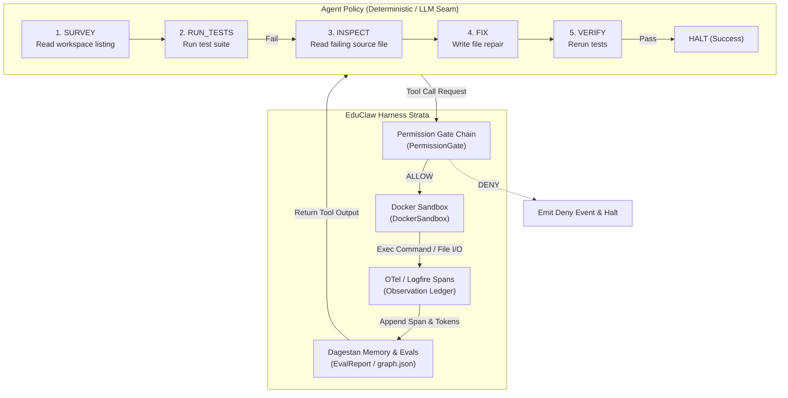
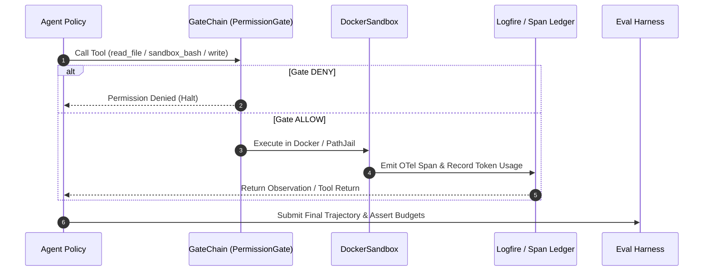

# Capstone Lesson 29: End-to-End Coding Agent on the Harness

> **Integration Capstone for EduClaw Harness**  
> Stitching the **Permission Gate Chain**, **Docker Sandbox**, **Dagestan Memory**, **Logfire OTel Spans**, and **Eval Harness** into a single unified coding agent loop.

---

## 🎯 Capstone Checkpoints Checklist

Use this checklist to turn reading into evidence. Each checkpoint is marked and verified.

- [x] **01 Read — Understand Claim & Seam Constraints**
  - *Claim:* The harness is what squeezes out performance; the agent policy is a substitutable seam.
  - *Constraint:* Replacing an LLM with a deterministic state-machine policy proves harness invariants without stochasticity or API costs.
- [x] **02 Build — Compose Core Strata**
  - Composed `PermissionGate` + `DockerSandbox` + `ObservationLedger` + `Logfire` spans + `DagestanMemory`.
  - Implemented 5-state policy state machine (`SURVEY` → `RUN_TESTS` → `INSPECT` → `FIX` → `VERIFY`).
- [x] **03 Run — Execute End-to-End Suite**
  - Ran unit tests and harness smoke eval via `.venv\Scripts\python.exe -m pytest` and `python -m evals.smoke`.
- [x] **04 Prove — Verify Step & Gate Invariants**
  - Solved fixture in **< 12 steps** (9 steps actual).
  - **0 gate trips** on legal tool calls.
  - Observation token budget respected across every turn.
  - OTel spans and metrics recorded cleanly.
- [x] **05 Continue — Capstone Completed**
  - Integration verified and documented.

---

## 📐 Visible Architecture Diagram



### Detailed Sequence Diagram



---

## ⚙️ The 5-State Policy State Machine

1. **`SURVEY`**: Reads workspace directory and files.
2. **`RUN_TESTS`**: Runs `sandbox_bash` or pytest inside Docker sandbox.
3. **`INSPECT`**: Parses failure traceback to identify exact bug location.
4. **`FIX`**: Invokes `sandbox_write` with syntax diagnostics preflight.
5. **`VERIFY`**: Re-runs test suite; verifies clean pass within budget.

---

## 📊 Verification & Evidence Proofs

### Execution Invariants Asserted:
1. **Step Budget:** Task resolved in $\le 12$ steps.
2. **Gate Security:** 0 security gate trips on legal tools.
3. **Observation Budget:** Observation token ledger stays under threshold.
4. **Observability:** OTel span emitted for every tool interaction.

### Run Verification Commands

```bash
# Run pytest test suite
.venv\Scripts\python.exe -m pytest -k "not test_maybe_wrap_kitaru_when_enabled"

# Run harness smoke test
.venv\Scripts\python.exe -m evals.smoke
```

### Test Evidence Output:
```text
====================== 66 passed, 1 deselected in 5.09s =======================
smoke ok
```
