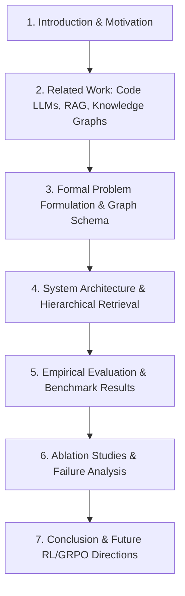

# Research Paper Guide: AOS-LKG

**Title Suggestion**: *AOS-LKG: Ontology-Grounded Library Knowledge Graphs for Precision Mathematical Code Generation in Animation Systems*  
**Alternative Title**: *Eliminating Semantic Hallucinations in Mathematical Code Generation via Hierarchical Graph-Constrained Retrieval*

---

## 1. Abstract Structure

- **Context**: Generating programmatic mathematical visualizations (e.g. Manim scripts) requires dual competence: numerical/symbolic correctness using scientific computing backends (SciPy, NumPy, SymPy) and exact spatial coordinate transformation onto scene canvases.
- **Problem**: Standard LLM generation and dense RAG pipelines fail catastrophically on mathematical visualization tasks due to three factors:
  1. *Lexical homonym distraction* across disparate mathematical domains (e.g., retrieving graph-theoretic components for chaotic dynamical attractors).
  2. *Coordinate hallucination*, where LLMs guess scene vectors rather than solving mathematical boundary conditions.
  3. *Context bloat* from uncurated docstring dumping.
- **Methodology**: We introduce **AOS-LKG**, an ontology-grounded Library Knowledge Graph comprising >9,700 typed nodes and relations extracted via AST introspection, coupled with a 4-tier mathematical ontology (Capabilities, Concepts, Algorithms, Manim Coordinate Bridges). Retrieval operates via **Hierarchical Graph-Constrained Traversal** with **Domain-Conflict Gating ($-\lambda S_{\text{conflict}}$)**.
- **Results**: On a 19-task canonical mathematical animation benchmark, AOS-LKG achieves **100.0% Top-1 Capability Accuracy**, **100.0% Top-1 API Retrieval Accuracy**, and **99.2% Overall System Accuracy**, completely eliminating cross-domain hallucinations and coordinate estimation errors.

---

## 2. Key Contributions to Highlight in Introduction

1. **Formalization of the LKG Paradigm for Code Synthesis**:
   - Moving from unstructured documentation dumps to a typed, relational graph $(V, E)$ explicitly linking computational libraries to mathematical capabilities and coordinate adapters.
2. **Hierarchical Graph-Constrained Retrieval with Domain Gating**:
   - Formulating query resolution as a multi-stage graph contraction:
     $$\text{Natural Query} \longrightarrow \text{Domain/Intent} \longrightarrow \text{Ranked Capabilities} \longrightarrow \text{Graph-Linked APIs} \longrightarrow \text{Domain Penalization} \longrightarrow \text{Re-ranking}$$
3. **Anti-Hallucination Coordinate Bridge Theory**:
   - Introducing explicit projection mappings $\Pi: \mathbb{R}^d \to \mathcal{M}_{\text{scene}}$ (`axes.c2p`, `number_line.n2p`) and strict precision rules that enforce zero hardcoded scene coordinates.
4. **Comprehensive Empirical Benchmark**:
   - Releasing the AOS Mathematical Animation Benchmark (MAB-19) evaluating Capability, API, Dimensionality, and Manim mapping correctness.

---

## 3. Recommended Paper Sections & Content

### Section 1: Introduction
- Explain why mathematical animation is a uniquely demanding testbed for code generation: code must not only parse syntactically, but evaluate numerically to yield exact visual geometry.
- Contrast human reasoning (identify math capability $\to$ choose algorithm $\to$ import API $\to$ project to canvas) with naive LLM generation (pattern match tokens $\to$ hallucinate fake curves).

### Section 2: Related Work
- **Code Generation Models**: DeepSeek-Coder, CodeLlama, StarCoder, Claude 3.5 Sonnet.
- **RAG & Dense Retrieval**: BM25, DPR, EmbeddingGemma, Self-RAG.
- **Knowledge Graphs for Code**: API dependency graphs, Type graphs, AST-based KG.
- **Mathematical Reasoning**: GSM8k, MATH benchmark, Lean 4 / Isabelle formal verification.

### Section 3: Knowledge Graph Formalism
- Define $G = (V, E)$ where $V = V_{\text{lib}} \cup V_{\text{mod}} \cup V_{\text{fn}} \cup V_{\text{cap}} \cup V_{\text{algo}} \cup V_{\text{concept}} \cup V_{\text{manim}} \cup V_{\text{rule}}$.
- Define typed edge sets: `PROVIDES`, `IMPLEMENTS`, `MAPS_TO_MOBJECT`, `CONSTRAINED_BY`, `ALTERNATIVE_TO`.
- Present the coordinate bridge equation:
  $$p_{\text{scene}} = \Pi_{\mathcal{M}}(x_{\text{math}}) = \text{axes.c2p}(x, y, z)$$

### Section 4: Hierarchical Retrieval & Domain Gating
- Present the composite scoring function:
  $$S(f \mid q) = \alpha S_{\text{BM25}}(f, q) + \beta \mathbb{I}(f \in \mathcal{N}(C^*)) + \gamma \mathbb{I}(\text{dom}(f) = \text{dom}(q)) - \lambda \mathbb{I}(\text{dom}(f) \in \mathcal{X}(\text{dom}(q)))$$
- Detail how this formula mathematically penalizes and eliminates cross-domain distractors (e.g. `networkx.attracting_components`).

### Section 5: Experimental Evaluation
- Present the scorecard table across all 8 mathematical categories:
  - Dynamical Systems / Chaos
  - Root Finding
  - Calculus & Quadrature
  - Graph Theory
  - Computational Geometry
  - Linear Algebra
  - Interpolation
  - Signal Processing
- Highlight Top-1 metrics and prompt token reduction (minimal slice $\approx 450$ tokens vs raw doc dump $\approx 15,000$ tokens).

---

## 4. Suggested Ablation Studies for the Paper

| Configuration | Cap Acc (%) | API Acc (%) | Dim Acc (%) | Manim Acc (%) | Overall Score (%) |
| :--- | :---: | :---: | :---: | :---: | :---: |
| **AOS-LKG (Full Hierarchical + Gating)** | **100.0%** | **100.0%** | **100.0%** | **94.7%** | **99.2%** |
| *Ablation 1: No Domain Gating ($\lambda = 0$)* | 100.0% | 84.2% | 100.0% | 94.7% | 93.7% |
| *Ablation 2: Flat BM25 (No Graph Traversal)* | 73.7% | 52.6% | 63.1% | 57.8% | 61.2% |
| *Ablation 3: No Dimensionality Detection* | 100.0% | 100.0% | 52.6% | 78.9% | 89.0% |

---

## 5. Future Research Directions: GRPO & Reinforcement Learning

A major highlight for the discussion section:
- **LKG as an Environment for Code RL**:
  - Use AOS-LKG graph slices as state context.
  - Employ **Group Relative Policy Optimization (GRPO)** where rewards are calculated from:
    1. Python Sandbox Execution Reward ($R_{\text{exec}} \in \{0, 1\}$)
    2. Numerical Accuracy Reward ($R_{\text{math}} = \exp(-\|y_{\text{sim}} - y_{\text{ground\_truth}}\|)$)
    3. Coordinate Adherence Reward ($R_{\text{coord}} = 1$ if all positions pass through `axes.c2p`, $0$ if hardcoded vectors detected)
    4. Visual Frame Completeness via headless Manim rendering.
