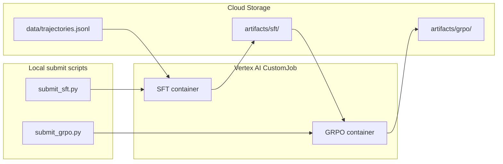

# Vertex AI Training: AOS SFT + GRPO

Runs the two-phase AOS training pipeline on [Vertex AI serverless custom training](https://docs.cloud.google.com/gemini-enterprise-agent-platform/machine-learning/training/overview):

```text
Phase 1 (SFT)  →  gs://BUCKET/artifacts/sft/  →  Phase 2 (GRPO)  →  gs://BUCKET/artifacts/grpo/
```


| Local app                 | Vertex container | Submit script    |
| ------------------------- | ---------------- | ---------------- |
| `[apps/sft](../../sft)`   | `sft:latest`     | `submit_sft.py`  |
| `[apps/grpo](../../grpo)` | `grpo:latest`    | `submit_grpo.py` |


## Layout


| File                                       | Role                                            |
| ------------------------------------------ | ----------------------------------------------- |
| `[env.py](env.py)`                         | `AIP_MODEL_DIR` / GCS download helpers          |
| `[job_common.py](job_common.py)`           | Shared CustomJob builder                        |
| `[submit_sft.py](submit_sft.py)`           | Submit Phase 1 SFT job                          |
| `[submit_grpo.py](submit_grpo.py)`         | Submit Phase 2 GRPO job                         |
| `[build.sh](build.sh)`                     | Build + push Docker images to Artifact Registry |
| `[Dockerfile.sft](Dockerfile.sft)`         | SFT GPU training image                          |
| `[Dockerfile.grpo](Dockerfile.grpo)`       | GRPO GPU training image (Unsloth)               |
| `[entrypoint_sft.sh](entrypoint_sft.sh)`   | Download data → `apps/sft/run.py`               |
| `[entrypoint_grpo.sh](entrypoint_grpo.sh)` | Download SFT adapter → `apps/grpo/run.py`       |
| `[config.example.env](config.example.env)` | GCP settings template                           |


## Prerequisites

1. **GCP project** with billing enabled
2. **APIs enabled:**
  ```bash
   gcloud services enable \
     aiplatform.googleapis.com \
     artifactregistry.googleapis.com \
     storage.googleapis.com
  ```
3. **Local tools:** `gcloud`, `docker`, `gsutil`, [uv](https://docs.astral.sh/uv/)
4. **Auth:**
  ```bash
   gcloud auth login
   gcloud auth application-default login
   gcloud config set project YOUR_PROJECT_ID
  ```
5. **Hugging Face token** with access to `google/gemma-4-31B-it`:
  ```bash
   export HF_TOKEN=hf_...
  ```
6. **Weights & Biases** (optional): copy `[apps/training/.env.example](../.env.example)` to `apps/training/.env` and set `WANDB_API_KEY`

## One-time GCP setup

Replace `YOUR_PROJECT` and pick a region (examples use `us-central1`).

### 1. Create a GCS bucket

```bash
export GCP_PROJECT=YOUR_PROJECT
export GCP_REGION=us-central1
export GCS_BUCKET=${GCP_PROJECT}-aos-training

gcloud storage buckets create "gs://${GCS_BUCKET}" \
  --project="${GCP_PROJECT}" \
  --location="${GCP_REGION}" \
  --uniform-bucket-level-access
```

Suggested layout:

```text
gs://YOUR_PROJECT-aos-training/
  data/trajectories.jsonl
  artifacts/sft/          # Phase 1 output (AIP_MODEL_DIR)
  artifacts/grpo/         # Phase 2 output
  staging/                # Vertex staging (auto-created)
```

### 2. Create a training service account (recommended)

```bash
export TRAIN_SA=aos-vertex-training

gcloud iam service-accounts create "${TRAIN_SA}" \
  --project="${GCP_PROJECT}" \
  --display-name="AOS Vertex training"

for ROLE in \
  roles/aiplatform.user \
  roles/storage.objectAdmin \
  roles/artifactregistry.reader; do
  gcloud projects add-iam-policy-binding "${GCP_PROJECT}" \
    --member="serviceAccount:${TRAIN_SA}@${GCP_PROJECT}.iam.gserviceaccount.com" \
    --role="${ROLE}"
done
```

When submitting jobs, pass `--service-account=${TRAIN_SA}@${GCP_PROJECT}.iam.gserviceaccount.com` via the console or extend `job_common.py` if needed.

### 3. Configure local settings

```bash
cd apps/training/vertex
cp config.example.env config.env
# Edit config.env with your project, bucket, and region
```

## Stage training data

**Option A — Hugging Face (default for local SFT)**

Phase 1 SFT loads from [nabin2004/AOS-Trajectories](https://huggingface.co/datasets/nabin2004/AOS-Trajectories) by default. No GCS upload needed for local runs.

Refresh the Hub dataset after trace collection:

```bash
export HF_TOKEN=hf_...
cd apps/sft && uv run python upload_dataset.py
```

**Option B — GCS (Vertex jobs)**

Upload SFT trajectories for Vertex containers that read from GCS:

```bash
gcloud storage cp \
  apps/agents/training_data/trajectories.jsonl \
  "gs://${GCS_BUCKET}/data/trajectories.jsonl"
```

Optional — upload ManiBench pilot JSON for GRPO (otherwise GRPO downloads from HuggingFace inside the job):

```bash
# After downloading locally, or from your own export:
gcloud storage cp ManiBench_Pilot_Dataset.json \
  "gs://${GCS_BUCKET}/data/ManiBench_Pilot_Dataset.json"
```

## Build and push containers

From the **repo root**:

```bash
apps/training/vertex/build.sh \
  --project "${GCP_PROJECT}" \
  --region "${GCP_REGION}"
```

This creates Artifact Registry repo `aos-training` (if missing) and pushes:

- `{REGION}-docker.pkg.dev/{PROJECT}/aos-training/sft:latest`
- `{REGION}-docker.pkg.dev/{PROJECT}/aos-training/grpo:latest`

## Install submit-script dependencies

```bash
cd apps/training/vertex
uv sync
```

## Weights & Biases

SFT logs to project `**aos-sft**`; GRPO logs to `**aos-grpo**`. Configure locally (never commit keys):

```bash
cp apps/training/.env.example apps/training/.env
# Set WANDB_API_KEY in apps/training/.env
export WANDB_API_KEY=...   # or rely on .env loaded by submit scripts
```

Submit scripts pass `WANDB_API_KEY`, `WANDB_PROJECT`, and optional `WANDB_ENTITY` into the training container when the key is present. Jobs then default to `--report-to wandb`; without a key, SFT falls back to TensorBoard and GRPO disables experiment tracking.

Override logging:

```bash
uv run python submit_sft.py ... --report-to tensorboard
uv run python submit_grpo.py ... --report-to none
```

For production, store the key in [Secret Manager](https://cloud.google.com/secret-manager) and export it before submitting, or inject it via a custom service account workflow.

## Run Phase 1 — SFT

Smoke test (1 epoch, batch size 1):

```bash
cd apps/training/vertex
export HF_TOKEN=hf_...

uv run python submit_sft.py \
  --project "${GCP_PROJECT}" \
  --region "${GCP_REGION}" \
  --bucket "${GCS_BUCKET}" \
  --data-uri "gs://${GCS_BUCKET}/data/trajectories.jsonl" \
  --smoke \
  --sync
```

Full SFT run:

```bash
uv run python submit_sft.py \
  --project "${GCP_PROJECT}" \
  --region "${GCP_REGION}" \
  --bucket "${GCS_BUCKET}" \
  --data-uri "gs://${GCS_BUCKET}/data/trajectories.jsonl" \
  --sync
```

### Recommended GPU


| Workload                 | Machine type     | GPU          | Notes                           |
| ------------------------ | ---------------- | ------------ | ------------------------------- |
| SFT 4-bit, seq 8192 (31B) | `a2-ultragpu-1g` | 1× A100 80GB | Default in `config.example.env` |
| GRPO 4-bit (31B)          | `a2-ultragpu-1g` | 1× A100 80GB | Same                            |
| SFT smoke / smaller models | `a2-highgpu-1g`  | 1× A100 40GB | Pass `--smoke` or override `--machine-type` |
| Budget / smaller context | `g2-standard-12` | 1× L4 24GB   | May OOM at default seq lengths  |


Override via CLI or `config.env`:

```bash
uv run python submit_sft.py ... \
  --machine-type g2-standard-12 \
  --accelerator-type NVIDIA_L4 \
  --accelerator-count 1
```

Boot disk defaults to **500 GiB SSD** for HuggingFace model cache.

## Run Phase 2 — GRPO

Point at the SFT adapter prefix from Phase 1. Vertex writes artifacts under the job's `base_output_dir`; after SFT completes, note the output path (typically under `gs://${GCS_BUCKET}/artifacts/sft/`).

```bash
export SFT_LORA_URI="gs://${GCS_BUCKET}/artifacts/sft/model"  # adjust to actual job output

uv run python submit_grpo.py \
  --project "${GCP_PROJECT}" \
  --region "${GCP_REGION}" \
  --bucket "${GCS_BUCKET}" \
  --sft-lora-uri "${SFT_LORA_URI}" \
  --dataset-uri "gs://${GCS_BUCKET}/data/ManiBench_Pilot_Dataset.json" \
  --smoke \
  --sync
```

Full GRPO:

```bash
uv run python submit_grpo.py \
  --project "${GCP_PROJECT}" \
  --region "${GCP_REGION}" \
  --bucket "${GCS_BUCKET}" \
  --sft-lora-uri "${SFT_LORA_URI}" \
  --sync
```

**Notes:**

- `--no-render` is always used on Vertex (Manim/Docker not available in the training VM).
- GRPO uses heuristic executability rewards only.
- Set `HF_TOKEN` so the job can download the base model and ManiBench dataset.

## Retrieve artifacts

```bash
# SFT adapter
gcloud storage cp -r "gs://${GCS_BUCKET}/artifacts/sft/" ./local-sft/

# GRPO adapter
gcloud storage cp -r "gs://${GCS_BUCKET}/artifacts/grpo/" ./local-grpo/
```

Use locally:

```bash
cd apps/grpo
uv run python run.py --sft-lora ../../local-sft/model --output-dir ./grpo_manim
```

## How it works




Inside each container:

1. Entrypoint downloads inputs from GCS (`gcs_download.py`)
2. Runs `apps/sft/run.py` or `apps/grpo/run.py`
3. Writes outputs to `AIP_MODEL_DIR` (synced to your `base_output_dir` GCS prefix)

Training configs honor Vertex env vars:

- `AIP_MODEL_DIR` → `--output-dir`
- `AIP_TENSORBOARD_LOG_DIR` → SFT TensorBoard logging (when `--report-to tensorboard`)

## Monitoring and troubleshooting


| Issue                       | What to check                                                                  |
| --------------------------- | ------------------------------------------------------------------------------ |
| Job fails immediately       | Cloud Logging → filter by CustomJob name; verify image URI and IAM             |
| CUDA OOM                    | Reduce `--batch-size` / `--seq-len` in SFT, or use A100 instead of L4          |
| HF 401 / gated model        | Set `HF_TOKEN` in submit env and accept model terms on huggingface.co          |
| SFT output path unclear     | Console → Vertex AI → Training → Custom jobs → Output location                 |
| GRPO can't find SFT adapter | Ensure `--sft-lora-uri` ends at the directory containing `adapter_config.json` |


View logs:

```bash
gcloud ai custom-jobs list --region="${GCP_REGION}"
gcloud logging read \
  'resource.type="ml_job"' \
  --project="${GCP_PROJECT}" \
  --limit=50
```

## Future work (not implemented)

- Vertex Pipelines orchestrating SFT → GRPO automatically
- Hyperparameter tuning jobs
- Model Registry import and online endpoint deployment
- Manim render rewards inside GRPO on Vertex

## Related docs

- [Vertex serverless training overview](https://docs.cloud.google.com/gemini-enterprise-agent-platform/machine-learning/training/overview)
- [Phase 1 SFT README](../../sft/README.md)
- [Phase 2 GRPO README](../../grpo/README.md)
