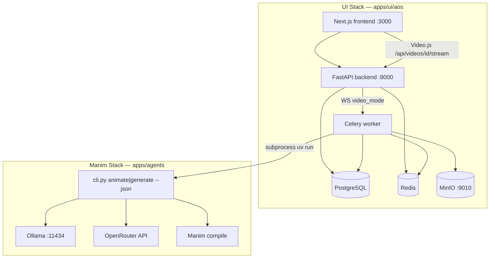

# Local Development Setup

Guide for running the **AOS web UI** and the **prompt-to-Manim agents pipeline** on your machine. Chat can enqueue Manim jobs via Celery; compiled MP4s land in MinIO and play in chat with Video.js.

---

## Architecture



| Stack | Location | Purpose |
|-------|----------|---------|
| **UI** | `apps/ui/aos` | Web app — chat, auth, RAG, billing, video jobs |
| **Manim** | `apps/agents` | Prompt → Manim code → compiled video |

### Chat → video flow

1. In chat **Settings**, set **Video generation** to **Animate** or **Lecture**.
2. Send a prompt — the WebSocket turn skips the normal assistant and enqueues `generate_video_task`.
3. Celery runs `uv run python cli.py animate|generate "…" --json --no-banner` under `apps/agents`.
4. The worker uploads the MP4 to MinIO bucket `aos-videos` and stores `minio_key` on `video_generations`.
5. Chat receives `video_status` / `tool_result` and renders the player via `/api/videos/{id}/stream`.

**Required for video jobs:** Redis + Celery worker, MinIO (`S3_VIDEO_ENDPOINT=http://localhost:9010`), agents env (Ollama/OpenRouter), and for **Lecture** also Docker Manim + ffmpeg.

```bash
# From apps/ui/aos/backend — with Redis up
uv run aos celery worker
```

---

## Prerequisites

| Tool | Version | Install |
|------|---------|---------|
| **Docker Desktop** | 24+ | [docker.com/get-docker](https://docs.docker.com/get-docker/) |
| **uv** | latest | [docs.astral.sh/uv](https://docs.astral.sh/uv/) |
| **bun** or **npm** | bun 1.x / node 18+ | [bun.sh](https://bun.sh) or [nodejs.org](https://nodejs.org) |
| **Ollama** | latest (Manim agents) | [ollama.com](https://ollama.com) |
| **Make** (optional) | GNU Make | macOS/Linux, or WSL2 / Git Bash on Windows |

### Windows notes

- **Preferred:** PowerShell + [`scripts/setup-local.ps1`](scripts/setup-local.ps1) — full UI bootstrap (deps, Docker, migrations, admin seed) with **no Make/WSL required**.
- Docker Desktop must be running before the script starts the UI stack.
- Make targets still work in **WSL2** or **Git Bash** if you prefer that workflow.
- Frontend: PowerShell + `npm run dev` (or `bun dev` if bun works on your machine).

### Optional (full lecture-to-video pipeline)

| Tool | Needed for |
|------|-----------|
| LaTeX (MiKTeX / TeX Live) | `MathTex` / `Tex` scenes |
| ffmpeg | Final video assembly (`lecture_final.mp4`) |
| Docker + `manimcommunity/manim` image | Full IR pipeline render step |

For fast prompt-to-Manim iteration, only **Ollama + OpenRouter + uv sync** are required.

---

## First-time setup

### Option A — PowerShell bootstrap (Windows)

```powershell
cd apps\ui\aos
.\scripts\setup-local.ps1
```

This is the Windows equivalent of `make bootstrap`. It:

1. Checks prerequisites (Docker daemon, uv, npm/bun)
2. Creates env files if missing
3. Installs Python/frontend dependencies
4. Builds and starts `docker-compose.dev.yml`
5. Waits for Postgres, applies migrations, restarts the API, seeds `admin@example.com`

Switches:

| Switch | Effect |
|--------|--------|
| `-SkipStack` | Deps + env only (do not start Docker) |
| `-SkipAgents` | UI only — skip repo-root `uv sync` and agents `.env` |

Then start the frontend:

```powershell
cd frontend
npm run dev          # preferred on Windows if bun is broken/missing
# or: bun dev
```

### Option B — Manual setup

#### 1. Clone and install dependencies

```bash
# From repo root
cd C:\Users\nabin\Desktop\myall\AOS
uv sync

# UI backend (separate Python env)
cd apps/ui/aos/backend
uv sync

# UI frontend
cd ../frontend
bun install          # preferred
# or: npm install --legacy-peer-deps
```

#### 2. Create environment files

```bash
cp apps/ui/aos/backend/.env.example   apps/ui/aos/backend/.env
cp apps/ui/aos/frontend/.env.example  apps/ui/aos/frontend/.env.local
cp apps/agents/.env.example           apps/agents/.env
```

#### 3. Add API keys

**UI backend** — edit `apps/ui/aos/backend/.env`:

```env
OPENROUTER_API_KEY=sk-or-v1-...    # required for chat agent
```

**Manim agents** — edit `apps/agents/.env`:

```env
OPENROUTER_API_KEY=sk-or-v1-...
OLLAMA_BASE_URL=http://localhost:11434/v1
AOS_MODEL_PROFILE=hybrid
```

Get an OpenRouter key at [openrouter.ai/keys](https://openrouter.ai/keys).

#### 4. Pull the local Manim coder model

```bash
ollama pull huggingface.co/nabin2004/AOS-gemma4-31b-manim-gguf:Q4_K_M
```

Verify:

```bash
curl http://localhost:11434/v1/models
```

---

## Running the UI stack

### Windows (PowerShell)

First time (or re-bootstrap):

```powershell
cd apps\ui\aos
.\scripts\setup-local.ps1
cd frontend
npm run dev
```

Day-to-day (stack already bootstrapped):

```powershell
cd apps\ui\aos
docker compose -f docker-compose.dev.yml up -d
docker compose -f docker-compose.dev.yml logs -f   # optional
# separate terminal:
cd frontend
npm run dev
```

Stop the stack:

```powershell
docker compose -f docker-compose.dev.yml down
```

### macOS / Linux / WSL (Make)

```bash
cd apps/ui/aos
make bootstrap    # first time: Docker up + migrations + admin seed
```

Day-to-day:

```bash
make dev                          # start backend + Postgres + Redis + Milvus
cd frontend && bun dev            # http://localhost:3000
# or: npm run dev
```

### Access URLs

| Service | URL |
|---------|-----|
| Frontend | http://localhost:3000 |
| API | http://localhost:8000 |
| API docs | http://localhost:8000/docs |
| Admin panel | http://localhost:8000/admin |

Default admin (after setup seed): `admin@example.com` / `admin123`

### Useful Make targets (bash / WSL / Git Bash)

```bash
make dev           # start dev stack (idempotent)
make seed          # create admin user (one-shot)
make dev-down      # stop all services
make dev-logs      # tail container logs
make dev-rebuild   # rebuild backend image after pyproject.toml change
```

### Backend on host (for IDE debugging)

```bash
make install
docker compose -f docker-compose.dev.yml up -d db redis milvus etcd minio
make db-upgrade
make run           # uvicorn with --reload on :8000
```

PowerShell equivalent:

```powershell
cd apps\ui\aos\backend
uv sync
cd ..
docker compose -f docker-compose.dev.yml up -d db redis milvus etcd minio
docker compose -f docker-compose.dev.yml exec -T app aos db upgrade
# or host-side: cd backend; uv run aos db upgrade
cd backend
uv run uvicorn app.main:app --reload --port 8000
```

---

## Running prompt-to-Manim

The Manim pipeline lives in `apps/agents`. It is **not** connected to the web UI yet.

### CLI (recommended for development)

```bash
cd apps/agents
uv run python cli.py animate "Explain eigenvectors in 2D with a unit circle animation"
```

Optional flags:

- `--fast` — skip narration synthesis
- `--no-banner` — skip intro animation

Output directory:

```
apps/agents/workspace/coder_runs/{timestamp}-{slug}/
├── scene.py          # generated Manim source
├── manifest.json     # scene metadata
├── media/            # compiled .mp4
├── audio/            # narration (if enabled)
└── logs/compile.log
```

### Interactive web UI

```bash
cd apps/agents
uv run pai web --agent agent_graph:animation_agent
# Opens http://127.0.0.1:7932
```

Code agent only:

```bash
uv run pai web --agent coder_agent:coder_agent
```

### Model profiles

Set in `apps/agents/.env`:

| Profile | Classifier / planner | Coder |
|---------|---------------------|-------|
| `hybrid` (default) | OpenRouter | Local Ollama |
| `local` | Ollama | Ollama |
| `cloud` | OpenRouter | OpenRouter |

See [apps/agents/README.md](../../agents/README.md) for per-role overrides and token limits.

### Full lecture pipeline (optional)

Generates a complete lecture with narration and final video:

```bash
cd apps/agents
uv run python cli.py generate "Explain the derivative of x squared"
```

Requires Docker running and the Manim image:

```bash
docker pull manimcommunity/manim
```

Output: `apps/agents/workspace/runs/{timestamp}-{slug}/lecture_final.mp4`

---

## Verification checklist

Run these after setup to confirm everything works:

| Check | Command / URL | Expected |
|-------|--------------|----------|
| Docker running | `docker ps` | Lists UI stack containers (after setup / `make dev`) |
| UI API healthy | `curl http://127.0.0.1:8000/api/v1/health` (or browser) | `{"status":"ok"}` |
| UI frontend | http://localhost:3000 | Marketing / login loads |
| Ollama running | `curl http://localhost:11434/v1/models` | Manim GGUF model listed |
| Prompt-to-Manim | `uv run python cli.py animate "draw a circle"` | Creates `coder_runs/` workspace |
| Manim compile | Check `coder_runs/.../media/` | `.mp4` file present |

---

## Troubleshooting

### `make` not found on Windows

You do not need Make. Use the PowerShell bootstrap:

```powershell
cd apps\ui\aos
.\scripts\setup-local.ps1
```

Or use WSL2 / Git Bash for `make` targets. Manual compose (migrate only — prefer the script for seed + health waits):

```powershell
cd apps\ui\aos
docker compose -f docker-compose.dev.yml up -d
docker compose -f docker-compose.dev.yml exec -T app aos db upgrade
docker compose -f docker-compose.dev.yml restart app
```

### Docker Desktop not running

`setup-local.ps1` requires a live Docker daemon (`docker info`). Start Docker Desktop, wait until it is idle/ready, then re-run the script.

### API unhealthy after first boot / missing tables

If the API crashed before migrations (e.g. `relation "channel_bots" does not exist`), re-run:

```powershell
.\scripts\setup-local.ps1
```

The script applies migrations and restarts `app` so health can recover. Or manually: `aos db upgrade` then `docker compose -f docker-compose.dev.yml restart app`.

### Port 8000 already in use

The UI backend and vLLM (if running) both default to port 8000. Stop the conflicting service or change the UI port in `docker-compose.dev.yml`.

### `bun` not found or fails on Windows

Install from [bun.sh](https://bun.sh), or use npm (recommended fallback):

```powershell
cd apps\ui\aos\frontend
npm install --legacy-peer-deps
npm run dev
```

`setup-local.ps1` automatically falls back to npm if `bun --version` does not run.

### Ollama context / token limit errors

Lower output caps in `apps/agents/.env`:

```env
AOS_CODER_MAX_TOKENS=1024
AOS_OLLAMA_NUM_CTX=16384
```

Or raise Ollama's context when starting the server:

```bash
OLLAMA_CONTEXT_LENGTH=16384 ollama serve
```

### Missing LaTeX for MathTex scenes

Install MiKTeX (Windows) or TeX Live (WSL/Linux). Manim needs `standalone.cls` and related packages for math rendering.

### Manim compile fails silently

Check the compile log:

```
apps/agents/workspace/coder_runs/{run}/logs/compile.log
```

Common causes: missing LaTeX, invalid scene class name, syntax error in generated code.

### Docker services won't start

PowerShell:

```powershell
cd apps\ui\aos
docker compose -f docker-compose.dev.yml down -v --remove-orphans   # WARNING: deletes local DB data
.\scripts\setup-local.ps1
```

Make (WSL / Git Bash):

```bash
make dev-down
make docker-clean    # WARNING: deletes local DB data
make bootstrap
```

### OpenRouter / model errors

Ensure `OPENROUTER_API_KEY` is set in both:

- `apps/ui/aos/backend/.env`
- `apps/agents/.env`

For agents, verify the profile matches your setup (`hybrid` needs both OpenRouter and Ollama).

---

## Development workflow

Typical day developing prompt-to-Manim animations:

1. **Terminal 1** — UI stack (if working on web app):
   ```bash
   cd apps/ui/aos && make dev
   cd frontend && bun dev
   ```

2. **Terminal 2** — Manim pipeline:
   ```bash
   cd apps/agents
   uv run python cli.py animate "your prompt here"
   ```

3. **Inspect output** — open `workspace/coder_runs/{latest}/scene.py` and `media/*.mp4`.

4. **Iterate** — adjust prompts, model profile, or agent code in `apps/agents/`.

For agent-only work, skip the UI stack entirely and use `cli.py animate` or `pai web`.

---

## Related docs

| Doc | Contents |
|-----|----------|
| [README.md](README.md) | UI app overview and quick start |
| [ENV_VARS.md](ENV_VARS.md) | UI backend env var reference |
| [CONTRIBUTING.md](CONTRIBUTING.md) | Code style and testing |
| [apps/agents/README.md](../../agents/README.md) | Manim model config, SFT, render perf |
| [Root README.md](../../../README.md) | Full lecture pipeline docs |
