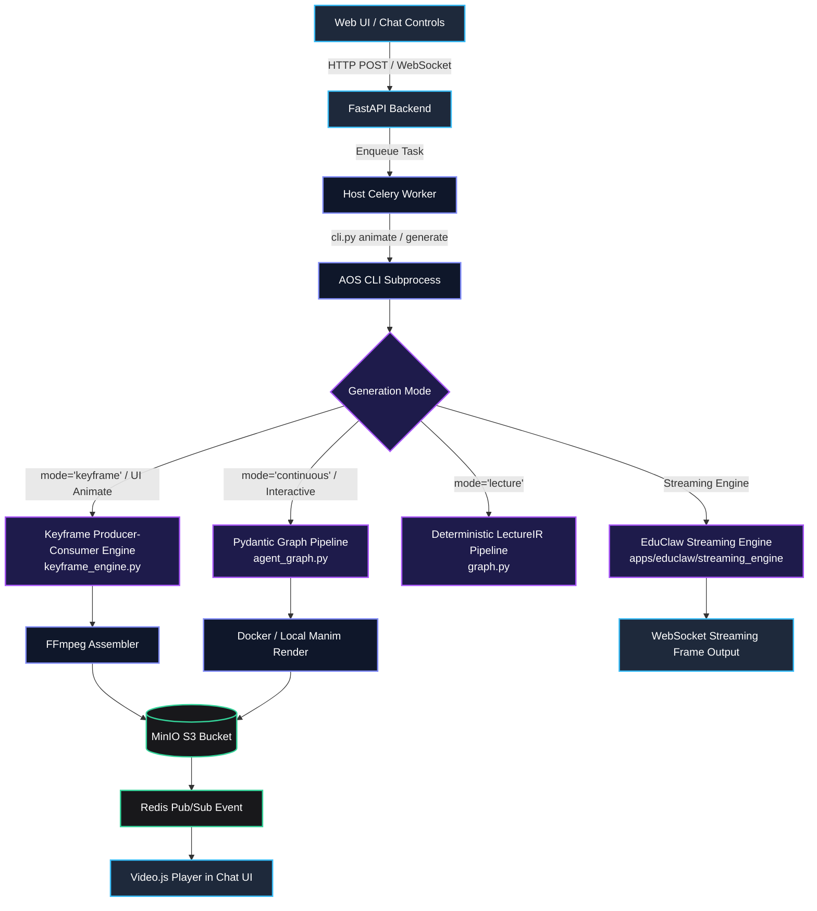
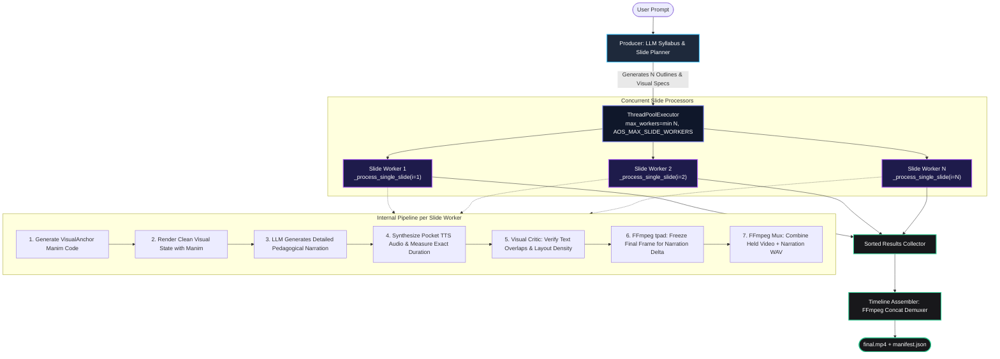
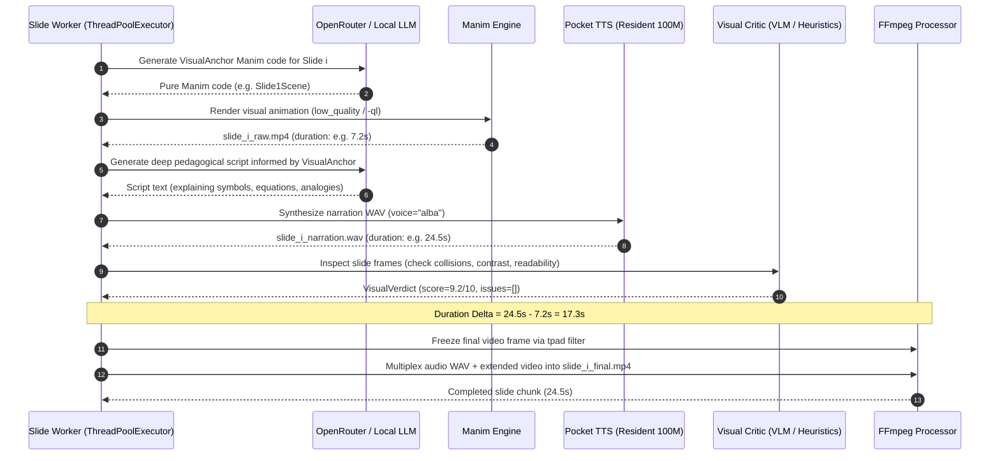
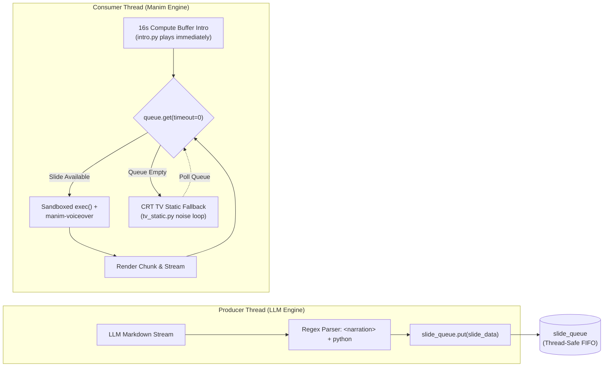

# AOS Agentic Video Generation Pipeline — Technical Architecture & Engine Guide

This document provides an in-depth architectural and implementation reference for the **Agentic Video Generation Pipelines** in the Agentic Orchestration System (AOS). It covers:
1. **The End-to-End UI "Animate" Pipeline** (from user click to MinIO/Video.js playback).
2. **The `agent_graph.py` Engine** (Pydantic Graph state machine, nodes, and Code Mode).
3. **The Keyframe Producer-Consumer Engine** (`keyframe_engine.py` parallel decoupled rendering).
4. **The EduClaw Streaming Producer-Consumer Engine** (`apps/educlaw/streaming_engine` FIFO queue & compute buffer).
5. **Comprehensive Tooling, Capabilities, and Infrastructure Matrix**.

---

## 1. Executive Summary & Pipeline Taxonomy

AOS supports distinct generation paradigms tailored for speed, mathematical rigor, and UI responsiveness:



### Architectural Comparison

| Pipeline | Primary Module | Execution Paradigm | Narration / TTS | Latency Profile | Best Use Case |
| :--- | :--- | :--- | :--- | :--- | :--- |
| **UI "Animate" (Keyframe)** | `apps/agents/keyframe_engine.py` | Concurrently renders discrete visual slides; freezes last frame via FFmpeg `tpad` for full narration length | Resident Pocket TTS (Kyutai 100M) | **15–35s** (parallelized across CPU/GPU cores) | Web UI quick animations, high-fidelity explainer cards |
| **Agent Graph (Interactive)** | `apps/agents/agent_graph.py` | Multi-agent Pydantic Graph (Classify → Plan → Script → Code Mode) | In-scene `VoiceoverScene` with bookmark sync | **45–75s** (iterative compiler self-healing) | Complex multi-concept mathematical derivations with active tool use |
| **EduClaw Streaming** | `apps/educlaw/streaming_engine/` | Asynchronous Producer-Consumer queue with 16s branding compute buffer & CRT TV Static fallback | `manim-voiceover` with `<bookmark/>` tags | **0s perceived** (streams frame 1 during intro) | Live interactive teaching sessions, real-time WebSocket lectures |
| **LectureIR Pipeline** | `apps/agents/graph.py` | 10-stage deterministic DAG manipulating schema-validated `LectureIR` | Beat-aligned Pocket TTS / DSM aligner | **90–150s** (full multi-scene lecture assembly) | Comprehensive 5–10 minute structured curriculum videos |

---

## 2. End-to-End UI "Animate" Pipeline

When a user selects the **Animate** mode in the AOS Web UI and sends a prompt, an asynchronous, fault-tolerant workflow orchestrates the job across Redis, Celery, Python agents, Docker/Manim, and MinIO.

### End-to-End Flow Diagram

```mermaid
sequenceDiagram
    autonumber
    actor User as User / Browser
    participant UI as Next.js Frontend
    participant API as FastAPI Backend
    participant Redis as Redis (Broker & Pub/Sub)
    participant Worker as Host Celery Worker
    participant CLI as cli.py animate
    participant Engine as agent_graph / keyframe_engine
    participant MinIO as MinIO Storage
    participant DB as PostgreSQL

    User->>UI: Types prompt & clicks "Animate" (or selects Animate mode)
    UI->>API: POST /api/v1/videos/generate (mode="animate", prompt, BYOK keys)
    API->>DB: Insert VideoGeneration row (status="queued")
    API->>Redis: Enqueue celery task (generate_video_task)
    API-->>UI: Return job UUID
    UI->>Redis: Subscribe to SSE / WebSocket (progress updates)

    Worker->>Redis: Fetch generate_video_task
    Worker->>DB: Update status="processing"
    Worker->>CLI: Subprocess: uv run python cli.py animate "<prompt>" --json --no-banner
    
    rect rgb(30, 40, 60)
        Note over CLI,Engine: Isolated Agent Execution
        CLI->>Engine: run_animate() -> run_pipeline(prompt, mode="keyframe")
        Engine->>Redis: Stream progress stderr: "-> ClassifyNode", "-> Slide 1", etc.
        Redis-->>UI: Real-time progress bar update
        Engine->>Engine: Render Manim slides + Pocket TTS narration + FFmpeg assembly
        Engine-->>CLI: Return VideoArtifact (ok=True, video_path="final.mp4")
    end

    CLI-->>Worker: Emit VideoArtifact JSON
    Worker->>MinIO: Upload final.mp4 (videos/pipeline/{uuid}.mp4)
    Worker->>DB: Update VideoGeneration (status="completed", minio_url, duration)
    Worker->>Redis: Publish EVENT_VIDEO_COMPLETED
    Redis-->>UI: Push completed event with Presigned MinIO URL
    UI->>User: Mount Video.js player and stream MP4
```



### Key Subsystems in the UI Flow

1. **Frontend Trigger (`apps/ui/aos/frontend/src/components/chat/chat-controls.tsx`)**:
   - The user selects `VideoMode` (`animate`, `keyframe`, `lecture`, `teaching`).
   - `Animate` defaults to `--mode keyframe` with OpenRouter cloud profile or frontend BYOK (Bring Your Own Key) endpoint.
2. **Celery Worker Execution (`apps/ui/aos/backend/app/worker/tasks/video_tasks.py`)**:
   - Runs on the host OS (required on Windows to access host `uv` and Manim).
   - Injects credentials (`OPENROUTER_API_KEY`, custom OpenAI-compatible endpoints) and sets `PYTHONUNBUFFERED=1` to capture stderr progress lines (`-> {node_id}`).
3. **Subprocess Bridge (`apps/agents/cli.py` & `video_entry.py`)**:
   - Executes `uv run python cli.py animate "<request>" --json --no-banner`.
   - Parses the returned Pydantic `VideoArtifact`:
     ```python
     class VideoArtifact(BaseModel):
         ok: bool
         mode: Literal["animate", "lecture"]
         video_path: str | None
         scene_path: str | None
         run_dir: str | None
         has_audio: bool | None
         error: str | None
         detail: dict[str, Any]
     ```
4. **Storage & Delivery (`tools/minio_storage.py`)**:
   - Stored in local or distributed S3-compatible MinIO buckets.
   - Provides presigned URLs and raw video downloads directly into the chat stream.

---

## 3. The `agent_graph.py` Engine Architecture

`apps/agents/agent_graph.py` provides the declarative Pydantic Graph workflow that coordinates high-level classification, lecture planning, teaching script generation, and LLM-driven Manim code synthesis.

### Pydantic Graph Node State Machine

```mermaid
stateDiagram-v2
    [*] --> Start
    Start --> ClassifyNode: Initialize AnimationState(user_query, target_length)

    state ClassifyNode {
        [*] --> RunClassifierAgent
        RunClassifierAgent --> CheckSubject: classifier_agent.run(user_query)
        CheckSubject --> ClassificationFailed: subject == UNKNOWN
        CheckSubject --> ClassificationSuccess: Math / Physics / CS / Biology
    }

    ClassificationFailed --> EndError: "Domain not supported"
    ClassificationSuccess --> PlanLectureNode

    state PlanLectureNode {
        [*] --> RunPlannerAgent
        RunPlannerAgent --> GenerateOutline: lecture_planner_agent.run(Topic, Subject)
        GenerateOutline --> PlanSuccess: Structured Lecture(title, outline, prerequisites)
    }

    PlanSuccess --> PlanTeachingScriptNode

    state PlanTeachingScriptNode {
        [*] --> RunTeachingScriptAgent
        RunTeachingScriptAgent --> BuildBeats: teaching_script_agent.run(Prompt, Plan)
        BuildBeats --> ScriptSuccess: TeachingScript(beats, narration, audio_anchors)
    }

    ScriptSuccess --> CodeAgent

    state CodeAgent {
        [*] --> RunCoderStep: run_coder_step()
        RunCoderStep --> CodeModeSandbox: coder_agent.run() via run_code
        CodeModeSandbox --> WriteCode: await manim_write(code, scene_name)
        WriteCode --> CompileManim: await compile_manim_code(code, scene_name)
        CompileManim --> CompileCheck{Compile OK?}
        CompileCheck -->|Fail| SelfRepair: Inject traceback & re-synthesize (<= 3 tries)
        SelfRepair --> WriteCode
        CompileCheck -->|Pass| SaveManifest: Update manifest.json & traces
    }

    CodeAgent --> UploadS3: S3_VIDEO_ENDPOINT configured?
    UploadS3 --> EndSuccess: Return VideoArtifact / CoderRunResult
    EndError --> [*]
    EndSuccess --> [*]
```

### Graph Components & Node Specifications

#### 1. Graph State: `AnimationState`
Maintains mutable context throughout pipeline traversal:
```python
@dataclass
class AnimationState:
    user_query: str
    target_length: str = "medium"      # "short" (1-2m), "medium" (3-5m), "long" (5-10m)
    cinematic: bool = False            # SciPy velocity gradients, camera orbits
    classification: Classification | None = None
    plan: Lecture | None = None
    teaching_script: TeachingScript | None = None
    code: str | None = None
    run_dir: str | None = None
    coder_result: CoderRunResult | None = None
    prompt_index: int | None = None
    animation_mode: str = "keyframe"   # "keyframe" or "continuous"
```

#### 2. Nodes in the Graph
- **`ClassifyNode`**: Invokes `classifier_agent` to extract the specific topic and validate domain feasibility (`Subject.MATH`, `Subject.PHYSICS`, `Subject.CS`, `Subject.BIOLOGY`). Rejects unsupported domains early to save token spend.
- **`PlanLectureNode`**: Invokes `lecture_planner_agent` with Pydantic AI's `SkillsCapability` (`manim-composer` and `manimce-best-practices`). It consults `manim-composer` for 3Blue1Brown pedagogical narrative arcs, hooks, and "aha moments", and `manimce-best-practices` to construct frame-safe, mathematically sound lecture plans.
- **`PlanTeachingScriptNode`**: Invokes `teaching_script_agent` to draft time-synchronized narration text, visual beats, and explicit screen-clearing boundaries.
- **`CodeAgent`**: Invokes `run_coder_step()` which launches `coder_agent` equipped with `SkillsCapability` (`manimce-best-practices` and `manim-composer`) and tool sandboxing (`pydantic_ai_harness.CodeMode`).

#### 3. Coder Agent & Code Mode Tooling (`coder_agent.py`)
Rather than relying on brittle raw text generation, the `coder_agent` uses **Code Mode** and native **Agent Skills**. It writes a small Python driver script that executes workspace tools asynchronously while adhering to the guidelines in `manimce-best-practices` and `manim-composer`:
- `load_skill(skill_name)` / `read_skill_resource(...)`: Inspects Manim Community Edition rules, mobject styling, camera timing, and LaTeX guidelines dynamically.
- `manim_write(code, scene_name, output_dir)`: Persists scene code to `scene.py` and registers it in `manifest.json`.
- `compile_manim_code(code, scene_name, output_dir)`: Invokes the Manim compiler (locally or within persistent Docker container `aos-manim-<hash>`), logging stdout/stderr to `logs/compile.log`.
- `manim_read(output_dir)`: Reads the existing scene to iteratively refine code upon compilation errors.
- `manim_doc_rag` (`search_manim_docs`, `search_manim_signatures`): Semantic lookup of Manim CE APIs when syntax or argument issues arise.
- `synthesize_narration(text, voice, output_dir)`: Generates audio previews with the resident Pocket TTS engine.

---

## 4. Producer-Consumer Architecture 1: Keyframe & Teaching Segment Engine (`keyframe_engine.py`)

### The Fundamental Problem of Monolithic Manim Generation
Generating a continuous 60-second or 120-second Manim script in a single prompt fails consistently for 7B–70B LLMs:
1. **Compounding Coordinate Drift**: Intermediate object shifts cause equations to collide with graphs.
2. **Audio Sync Fragility**: An animation designed for 4 seconds fails when TTS narration requires 14 seconds to clearly explain the concept.
3. **Execution Latency**: A single syntax error at second 55 causes the entire render to fail, requiring an expensive full-script regeneration.

### The Decoupled Keyframe Solution
`keyframe_engine.py` decouples the **visual presentation** from the **pedagogical explanation**:
- **Visual Anchor (5–15s)**: Manim renders a clean, visually dense diagram or mathematical state rapidly.
- **Pedagogical Narration (30–90s)**: Pocket TTS synthesizes a deep, patient explanation of every symbol and concept.
- **FFmpeg Frame Freezing (`tpad`)**: The final rendered frame is cloned (`tpad=stop_mode=clone`) to match the narration duration with zero additional Manim re-rendering cost.

### Concurrency & Execution Architecture



### Internal Worker Phases (`_process_single_slide`)



---

## 5. Producer-Consumer Architecture 2: EduClaw Streaming Engine (`apps/educlaw/streaming_engine`)

The EduClaw streaming engine represents an asynchronous, real-time streaming pipeline designed for live WebSocket delivery.

### Key Architectural Tenets
1. **Producer Thread**: An LLM continuously generates Markdown containing `<narration>` and ```python``` blocks. Regex parsing extracts `SlideData` objects and pushes them into an in-memory thread-safe `slide_queue` (`queue.Queue`).
2. **Compute Buffer (16s Branding Intro)**: When the user requests a topic, a cinematic introductory scene (`intro.py`) plays immediately on the client. This **16-second window completely masks the cold-start latency** of LLM inference and Slide 1 rendering.
3. **Sub-second Bookmark Sync**: Narration text contains `<bookmark mark="v1"/>` tags. The Manim code uses `self.wait_until_bookmark("v1")` through `manim-voiceover` for millisecond-accurate alignment.
4. **CRT TV Static Underrun Fallback**: If the consumer thread exhausts the queue before the LLM finishes generating the next slide, the player transitions to a retro **CRT TV Static** display (`tv_static.py`) instead of buffering or dropping frames.



---

## 6. Comprehensive Tools & Capabilities Matrix

The following matrix documents the core tools, helper libraries, and infrastructure components utilized across the agentic video pipelines:

| Tool / Component | File Location | Invocation Context | Description & Purpose |
| :--- | :--- | :--- | :--- |
| **`manim_write`** | `apps/agents/tools/manim_write.py` | `coder_agent` (Code Mode) | Formats and writes Manim Python scene code to disk; maintains `manifest.json`. |
| **`compile_manim_code`** | `apps/agents/tools/compile.py` | `coder_agent` (Code Mode) | Executes `manim` CLI inside local environment or persistent Docker container; parses error tracebacks. |
| **`manim_read`** | `apps/agents/tools/manim_read.py` | `coder_agent` (Code Mode) | Reads existing scene source files during iterative repair loops. |
| **`manim_doc_rag`** | `apps/agents/tools/manim_docs.py` | `coder_agent` (Code Mode) | Vector and keyword search over Manim CE API documentation and class signatures. |
| **`AOSSpeechService`** | `apps/agents/tools/aos_speech_service.py` | `keyframe_engine` & `coder_agent` | Resident Kyutai Pocket TTS client for fast CPU/GPU narration synthesis with disk caching. |
| **`timeline_assembler`** | `apps/agents/tools/timeline_assembler.py` | `keyframe_engine` | Concat demuxer using FFmpeg to seamlessly bind slide chunks into a single gapless `final.mp4`. |
| **`hold_final_state`** | `apps/agents/tools/timeline_assembler.py` | `keyframe_engine` | Applies FFmpeg `tpad=stop_mode=clone` filter to hold the last frame for the duration of narration. |
| **`HeuristicVisionCritic`** | `apps/agents/tools/visual_critic.py` | `keyframe_engine` | Image analysis tool checking rendered frames for text collisions, edge clipping, and luminance contrast. |
| **`upload_to_minio`** | `apps/agents/tools/minio_storage.py` | `agent_graph.py` & Celery tasks | Uploads generated MP4 videos and scene Python files to S3/MinIO buckets; returns presigned access URLs. |
| **`validate_video_file`** | `apps/agents/video_validator.py` | `video_entry.py` & Celery | Uses `ffprobe` to verify that output video has non-zero duration, valid keyframes, and playable audio streams. |
| **`execute_with_llm_retry`** | `apps/agents/llm_retry.py` | All Pydantic AI Graph Nodes | Wraps model invocations with exponential backoff and jitter to survive transient HTTP 503/429/cold starts. |
| **`SkillsCapability`** | `pydantic_ai_skills` | `lecture_planner_agent` & `coder_agent` | Integrates `manim-composer` and `manimce-best-practices` agent skills with `load_skill`, `read_skill_resource`, and progressive disclosure. |
| **`CodeMode`** | `pydantic_ai_harness` | `coder_agent.py` | Sandboxed Python runner enabling the agent to execute multi-tool orchestration in a single model turn. |

---

## 7. Execution Profiles & Configuration

The pipeline's model backend can be switched dynamically via `apps/agents/.env` or the Web UI chat controls:

```bash
# 1. Cloud Profile (Default for UI Animate)
AOS_MODEL_PROFILE=cloud
OPENROUTER_API_KEY=sk-or-v1-...
AOS_CODER_MODEL=anthropic/claude-3.5-sonnet  # or openai/gpt-4o

# 2. Hybrid Profile (Cloud Planning + Local Coder)
AOS_MODEL_PROFILE=hybrid
OPENROUTER_API_KEY=sk-or-v1-...
AOS_CODER_MODEL=ollama/qwen2.5-coder:7b

# 3. Local Profile (Full Offline Execution)
AOS_MODEL_PROFILE=local
AOS_CLASSIFIER_MODEL=ollama/qwen2.5:7b
AOS_PLANNER_MODEL=ollama/qwen2.5:7b
AOS_CODER_MODEL=ollama/qwen2.5-coder:7b

# 4. Custom BYOK / Modal Serverless GPU Profile
AOS_MODEL_PROFILE=openai_compatible
AOS_OPENAI_BASE_URL=https://your-modal-app.modal.run/v1
AOS_OPENAI_API_KEY=local
AOS_OPENAI_MODEL=nabin2004/AOS-qwen3-8b-grpo
```

### Useful Debugging & Validation Commands

```bash
# Test the Animate pipeline end-to-end via CLI (generates JSON VideoArtifact)
cd apps/agents
uv run python cli.py animate "Explain Euler's Identity visually" --json --no-banner

# Run isolated Keyframe Producer-Consumer engine
uv run python keyframe_engine.py "Demonstrate Gradient Descent optimization"

# Run hop-by-hop diagnostics across UI, Redis, Celery, and MinIO
cd apps/ui/aos
.\scripts\diagnose-animate.ps1
```
