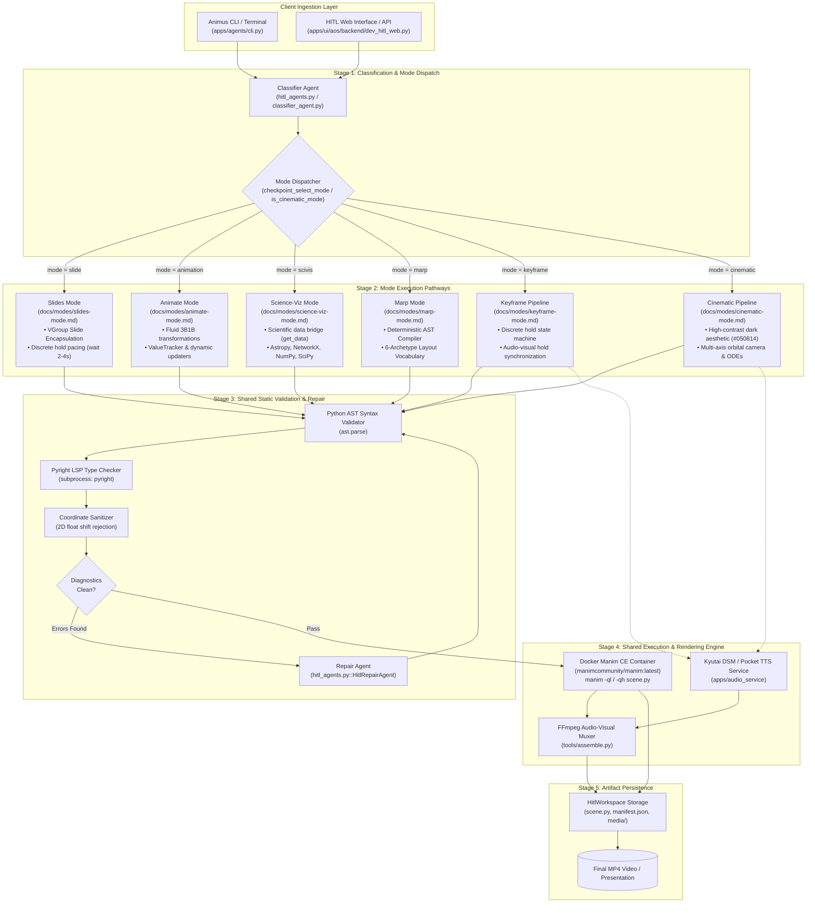

# System Architecture Overview — Agentic Orchestration System (AOS)

## 1. Executive Summary & Architectural Scope

The **Agentic Orchestration System (AOS)** is a multi-agent framework designed for the automated and semi-automated synthesis of rigorous educational animations. The system translates unstructured pedagogical queries into executable Python code targeting the **Manim Community Edition (v0.18+)** mathematical animation engine, optionally accompanied by word-aligned synthesized audio voiceovers.

Rather than treating animation synthesis as a single, unconstrained text-to-code generation problem, AOS implements a **templated plan-to-renderer architecture**. The platform segments animation production into distinct operational modes, routing each request to specialized agent graphs or deterministic compilers conditioned on mathematical domain, spatial layout requirements, and user interaction constraints.

---

## 2. Top-Level System Topology

AOS operates through two primary execution surfaces:
1. **Interactive Human-in-the-Loop (HITL) Studio** (`apps/ui/aos/backend`): An operator-supervised ASGI agent environment built with **Pydantic AI**, featuring human approval checkpoints, real-time Pyright Language Server Protocol (LSP) validation, and immediate AST repairs.
2. **Autonomous Multi-Agent Lecture Pipeline** (`apps/agents`): A batch execution graph (`pydantic_graph`) coordinating classification, pedagogical planning, visual script authoring, and audio-visual synchronization.

The following flowchart illustrates the top-level dispatch, routing, mode execution, and shared rendering infrastructure:

---

## 3. Shared Infrastructure Across All Modes

While each mode defines distinct spatial rules, intermediate schemas, and pedagogical guidelines, all modes rely on a centralized substrate of shared services:

### 3.1. Unified Model Resolution & Profile Architecture
All agents interact with large language models through the [`HitlLLMResolver`](file:///c:/Users/nabin/Desktop/myall/AOS/apps/ui/aos/backend/app/agents/hitl_agents.py#L235) and [`apps/agents/llm_config.py`](file:///c:/Users/nabin/Desktop/myall/AOS/apps/agents/llm_config.py). The system abstracts inference providers via environment profiles:
- **`cloud`**: Direct integration with OpenRouter API (defaults to `google/gemini-2.5-flash` or `openai/gpt-4o-mini`).
- **`hybrid`**: Cloud-based planning (`ClassifierAgent`, `ComposerAgent`) paired with local GPU inference for code generation.
- **`local`**: Offline execution through Ollama running fine-tuned models (e.g., `AOS-qwen3-8b-grpo`).

Model parameters across all modes enforce strict output token ceilings (`HITL_MAX_TOKENS = 4096`, `AOS_CODER_MAX_TOKENS = 2048`) and temperature controls (`temperature = 0.2` for structured planning, `temperature = 0.0` for code synthesis and repair).

### 3.2. Static Verification & Diagnostic Pipeline
Before any generated Python script is passed to the execution environment, it must survive a multi-stage static gate:
1. **Abstract Syntax Tree (AST) Validation**: Invokes Python's native `ast.parse()` to catch `SyntaxError`, unbalanced brackets, or unclosed string literals.
2. **Language Server Protocol (LSP) Analysis**: Executes a headless Pyright instance against the synthesized file. The output is structured into diagnostic entries classifying:
   - Unknown mobject attributes (e.g., calling `scene.add_title()`, which does not exist in ManimCE).
   - Illegal type assignments or invalid keyword arguments.
   - Missing symbol imports.
3. **Coordinate Sanitizer**: Scans mobject positioning to reject raw 2D coordinate lists (`[x, y]`) and force standard 3D vectors (`[x, y, 0]`), relative placement methods (`.next_to()`, `.to_edge()`), or axis-mapped coordinates (`axes.c2p(x, y)`).
4. **Repair Loop**: When diagnostics fail, the script and diagnostic traceback are packaged into [`HitlRepairDeps`](file:///c:/Users/nabin/Desktop/myall/AOS/apps/ui/aos/backend/app/agents/hitl_agents.py#L76) and dispatched to `HitlRepairAgent`, which performs targeted, in-place corrections without redesigning the scene.

### 3.3. Isolated Containerized Rendering Engine
Rendering is sandboxed to ensure host environment safety and deterministic font/LaTeX environments:
- **Docker Environment**: Executes official `manimcommunity/manim:latest` Docker containers.
- **Container Caching**: Reuses warmed Docker containers named `aos-manim-<hash>` to eliminate container startup latency between runs.
- **Quality Presets**: Supported flags map to standard resolution bounds:
  - `-ql` (480p, 15 fps) for interactive validation and development.
  - `-qm` (720p, 30 fps) for review.
  - `-qh` (1080p, 60 fps) for production exports.
  - `-qk` (4K UHD) for archival video delivery.

### 3.4. Workspace & Artifact Management
State persistence is mediated by [`HitlWorkspace`](file:///c:/Users/nabin/Desktop/myall/AOS/apps/ui/aos/backend/app/core/local_logging.py#L25). Each session creates an isolated directory structure tracking:
- `classification.json`: Categorization, subject tags, and capability requirements.
- `mode_selection.json`: Active mode, external dependencies, and target format.
- `scenes.md` or `presentation.marp.md`: The intermediate pedagogical plan.
- `scene.py` / `lecture.py`: The executable ManimCE source code.
- `manifest.json`: End-to-end execution metadata, stage durations, and compile status.
- `media/`: Output MP4 videos, SVG assets, and WAV voiceover files.

---

## 4. Mode-Specific Responsibilities Matrix

| Mode Slug | Internal Identifier | Plan / IR Artifact | Layout Paradigm | Rendering Target | Speech Integration |
| :--- | :--- | :--- | :--- | :--- | :--- |
| [**Slides**](../modes/slides-mode.md) | `"slide"` | `scenes.md` (Slide sections) | `VGroup` per slide, relative anchoring | ManimCE `Scene` | Optional post-build |
| [**Animate**](../modes/animate-mode.md) | `"animation"` | `scenes.md` (3B1B narrative) | Coordinate frames (`Axes`), continuous transforms | ManimCE `Scene` / `ThreeDScene` | Optional post-build |
| [**Science-Viz**](../modes/science-viz-mode.md) | `"scivis"` | `scenes.md` (Data specification) | Scientific mapping + `get_data()` function | ManimCE `Scene` / `MovingCameraScene` | Optional post-build |
| [**Marp**](../modes/marp-mode.md) | `"marp"` | `presentation.marp.md` | 6 layout archetypes via AST compiler | ManimCE `Scene` or `manim-slides` `Slide` | Slide frontmatter |
| [**Keyframe**](../modes/keyframe-mode.md) | `"keyframe"` | `teaching_script.json` | Discrete hold states | `VoiceoverScene` | Synchronized Pocket TTS / DSM |
| [**Cinematic**](../modes/cinematic-mode.md) | `"cinematic"` | Annotated `TeachingScript` | Orbital 3D camera + continuous ODE particles | `VoiceoverScene` + `ThreeDScene` | Synchronized Pocket TTS / DSM |

---

## 5. Architectural Glossary

- **`LectureIR`**: The central Pydantic intermediate representation defining a multi-scene lecture, including scene graphs, visual objects, beats, and voiceover scripts.
- **`SceneObject`**: An atomic visual entity (equation, geometric polygon, coordinate system) serialized within the IR with spatial coordinates, bounding box metrics, and animation properties.
- **`Beat`**: A granular visual-narration segment within a scene. Each beat represents a single conceptual action (e.g., highlighting a term, tracing a path, revealing a bullet).
- **`TeachingScript`**: An ordered list of narration lines and visual directives compiled from a high-level lecture plan, used to drive audio synthesis and camera synchronization.
- **`scenes.md`**: A human-readable and agent-interpretable Markdown plan detailing scene timings, required mobjects, coordinate ranges, and transitions.
- **`presentation.marp.md`**: CommonMark slide presentation conforming to the Marp directive specification (`<!-- _class: ... -->`), used by the deterministic AST compiler.
- **`HitlWorkspace`**: Local filesystem manager encapsulating execution artifacts, run manifests, and diagnostic logs for a given generation session.
- **`CodeMode`**: An execution capability allowing the coding agent to invoke tools and inspect filesystem artifacts via agent-written sandboxed Python scripts.
- **`VoiceoverScene`**: A specialized Manim scene subclass from `manim-voiceover` that dynamically controls animation run times based on the duration of spoken speech segments.
- **`AOSSpeechService`**: Offline, CPU-resident speech synthesis driver interfacing with the 100M Kyutai Pocket TTS or DSM engine.
- **`Pyright LSP`**: Headless type checker and static analyzer invoked during preflight to detect invalid API calls before Docker container instantiation.
- **`MarpManimCompiler`**: A deterministic AST parsing engine (`app.services.marp_compiler`) translating CommonMark tokens into ManimCE code without runtime LLM inference.
