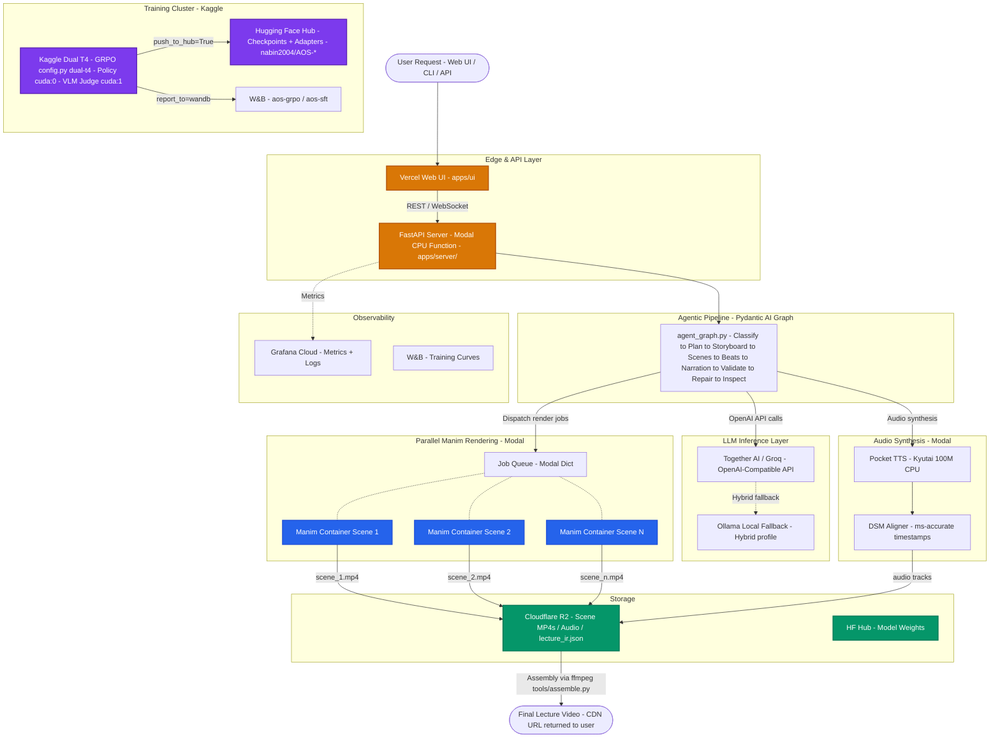

# 🚀 AOS — Production Deployment Plan (v2)

> **Scope:** Full-stack deployment of the Agentic Orchestration System — covering the API/Agent layer, LLM inference, GRPO/SFT fine-tuning jobs, Manim rendering, audio synthesis, the web UI, persistent storage, monitoring, and CI/CD.
> **Constraint:** Every service listed is either **100% free** or accessible with **credit card verification only** (no enterprise contracts, no manual approval process).

---

## Table of Contents
1. [Service Tier Overview](#1-service-tier-overview)
2. [Infrastructure Architecture](#2-infrastructure-architecture)
3. [Layer 1 — API & Agent Orchestration](#3-layer-1--api--agent-orchestration)
4. [Layer 2 — LLM Inference](#4-layer-2--llm-inference)
5. [Layer 3 — GRPO / SFT Training Jobs](#5-layer-3--grpo--sft-training-jobs)
6. [Layer 4 — Manim Rendering (Parallel)](#6-layer-4--manim-rendering-parallel)
7. [Layer 5 — Audio Synthesis](#7-layer-5--audio-synthesis)
8. [Layer 6 — Storage & Artifact Management](#8-layer-6--storage--artifact-management)
9. [Layer 7 — Web UI & Frontend](#9-layer-7--web-ui--frontend)
10. [Layer 8 — Secrets & Configuration](#10-layer-8--secrets--configuration)
11. [Layer 9 — Observability & Monitoring](#11-layer-9--observability--monitoring)
12. [Layer 10 — CI/CD Pipeline](#12-layer-10--cicd-pipeline)
13. [Cost Summary & Upgrade Path](#13-cost-summary--upgrade-path)
14. [Step-by-Step Setup Checklist](#14-step-by-step-setup-checklist)
15. [End-to-End Execution Guide: Step-by-Step Deployment Runbook](#15-end-to-end-execution-guide-step-by-step-deployment-runbook)
    - [Stage 0: Prerequisites & Toolchain Setup](#stage-0-prerequisites--toolchain-setup)
    - [Stage 1: Storage Layer Deployment (Cloudflare R2)](#stage-1-storage-layer-deployment-cloudflare-r2)
    - [Stage 2: Centralized Secrets & Configuration](#stage-2-centralized-secrets--configuration)
    - [Stage 3: Serverless Backend & Distributed Rendering (Modal)](#stage-3-serverless-backend--distributed-rendering-modal)
    - [Stage 4: Web UI Frontend Deployment (Vercel)](#stage-4-web-ui-frontend-deployment-vercel)
    - [Stage 5: Remote GPU Model Fine-Tuning (Kaggle Dual-T4)](#stage-5-remote-gpu-model-fine-tuning-kaggle-dual-t4)
    - [Stage 6: End-to-End System Smoke Test & Verification](#stage-6-end-to-end-system-smoke-test--verification)
    - [Stage 7: Production Operations, Monitoring & Maintenance](#stage-7-production-operations-monitoring--maintenance)

---

## 1. Service Tier Overview

| Layer | Primary Service | Backup / Fallback | Monthly Free Quota | CC Required? |
|---|---|---|---|---|
| API / Orchestration | **Modal** (CPU containers) | Google Cloud Run | $30 free credits | Yes |
| LLM Inference | **Together AI** (OpenAI-compat API) | Groq Cloud | $5 free credit | Yes |
| GRPO / SFT Training | **Kaggle Notebooks** (Dual T4) | Google Colab Pro | Unlimited (30h/week) | Yes |
| Manim Rendering | **Modal** (ephemeral Docker containers) | GitHub Actions runners | $30 included above | Yes |
| Audio / TTS | **Modal** CPU function (Pocket TTS) | Replicate (free tier) | Included in Modal | Yes |
| Artifact Storage | **Cloudflare R2** | Backblaze B2 | 10 GB free, 0 egress fees | Yes |
| Model Storage | **Hugging Face Hub** (private repo) | Cloudflare R2 | 1 LFS GB free | Free (no CC) |
| Web UI | **Vercel** (Next.js) | Cloudflare Pages | 100 GB bandwidth/month | Yes |
| Secrets | **Infisical** (Cloud) | Doppler free | 5 projects free | Free (no CC) |
| Monitoring / Logs | **Grafana Cloud** | Axiom (free tier) | 10 GB logs/month | Yes |
| CI/CD | **GitHub Actions** | — | 2,000 min/month private, unlimited public | Yes |
| W&B Training Logs | **Weights & Biases** | — | Unlimited for personal use | Free (no CC) |

---

## 2. Infrastructure Architecture



---

## 3. Layer 1 — API & Agent Orchestration

### Service: Modal (Primary)

**Why Modal:** Modal supports custom Docker images, runs Pydantic AI graphs natively in Python, and scales to zero with cold-starts under 2 seconds. It is the best free-tier fit for AOS.

**Setup Steps:**

```bash
# 1. Install Modal
pip install modal

# 2. Authenticate (triggers browser CC sign-up)
modal setup

# 3. Deploy the server
cd apps/server
modal deploy modal_app.py
```

**Modal App Skeleton** (`apps/server/modal_app.py`):

```python
import modal
from fastapi import FastAPI

image = (
    modal.Image.from_registry("python:3.12-slim")
    .pip_install_from_pyproject("../../pyproject.toml")
    .env({"AOS_MODEL_PROFILE": "cloud"})
)

app = modal.App("aos-api", image=image)

@app.function(cpu=2, memory=1024, secrets=[modal.Secret.from_name("aos-secrets")])
@modal.asgi_app()
def fastapi_app():
    from apps.server.main import app as server_app
    return server_app
```

**Environment Variables** (stored in Modal Secret named `aos-secrets`):

| Variable | Value |
|---|---|
| `AOS_MODEL_PROFILE` | `cloud` |
| `TOGETHER_API_KEY` | Your Together AI key |
| `HF_TOKEN` | HuggingFace token |
| `WANDB_API_KEY` | W&B key |
| `CLOUDFLARE_R2_KEY` | R2 Access Key |
| `CLOUDFLARE_R2_SECRET` | R2 Secret Key |
| `CLOUDFLARE_R2_BUCKET` | `aos-artifacts` |

### Fallback: Google Cloud Run

If Modal quota is exhausted, deploy as a stateless Cloud Run service:

```bash
gcloud run deploy aos-api \
  --image gcr.io/YOUR_PROJECT/aos-api:latest \
  --platform managed \
  --region us-central1 \
  --allow-unauthenticated \
  --memory 2Gi \
  --cpu 2 \
  --set-env-vars AOS_MODEL_PROFILE=cloud
```

> [!NOTE]
> Cloud Run's **free tier** covers 2 million requests/month and 360,000 GB-seconds of memory. AOS API will operate well within this unless you have significant traffic.

---

## 4. Layer 2 — LLM Inference

### Primary: Together AI (Recommended)

Together AI provides a hosted OpenAI-compatible API for dozens of open-source models.

- **Free Credits:** $5 on sign-up (CC required for verification).
- **Best Models for AOS:**
  - `meta-llama/Llama-3.3-70B-Instruct-Turbo` — Planning, Storyboard, Narration stages
  - `Qwen/Qwen2.5-Coder-32B-Instruct` — Manim code generation in `coder_agent.py`
  - Your fine-tuned adapters can be uploaded to Together AI as a **custom model endpoint**.

**AOS Config** (`apps/agents/.env`):

```dotenv
AOS_MODEL_PROFILE=cloud
OPENAI_API_BASE=https://api.together.xyz/v1
OPENAI_API_KEY=<your_together_ai_key>
AOS_PLANNER_MODEL=meta-llama/Llama-3.3-70B-Instruct-Turbo
AOS_CODER_MODEL=Qwen/Qwen2.5-Coder-32B-Instruct
```

> [!TIP]
> Pydantic AI agents in `agent_graph.py` and `coder_agent.py` already consume an OpenAI-compatible API. Switching to Together AI is a one-line `.env` change — **no code changes required**.

### Backup: Groq Cloud

Groq provides blazing-fast LLaMA inference with a free tier (no CC required, CC unlocks higher rate limits).

- **Free Tier:** 14,400 requests/day
- Use Groq for **Classify** and **Validate** stages (lighter tasks) to conserve Together AI credits.

```dotenv
AOS_MODEL_PROFILE=cloud
OPENAI_API_BASE=https://api.groq.com/openai/v1
OPENAI_API_KEY=<your_groq_key>
AOS_PLANNER_MODEL=llama-3.3-70b-versatile
```

### Self-Hosted (Optional): Modal GPU vLLM Endpoint

For running your own fine-tuned `Qwen3-8B-GRPO` model:

```python
# apps/server/vllm_endpoint.py
import modal

GPU = modal.gpu.A10G()
vllm_image = modal.Image.debian_slim().pip_install("vllm", "huggingface_hub")

@app.function(gpu=GPU, image=vllm_image, timeout=600,
              secrets=[modal.Secret.from_name("aos-secrets")])
@modal.asgi_app()
def serve_vllm():
    from vllm.entrypoints.openai.api_server import build_app
    return build_app(model="nabin2004/AOS-qwen3-8b-grpo", dtype="bfloat16")
```

With Modal's free $30/month credits, an A10G GPU runs approximately **5–6 hours of active inference** per month for free.

---

## 5. Layer 3 — GRPO / SFT Training Jobs

The `config.py` has hardware presets built in. This plan maps each preset to the correct free platform.

### Platform A: Kaggle Notebooks (Best Free GPU)

Kaggle gives **30 GPU hours/week** for free with phone/CC verification. The `--dual-t4` preset maps perfectly.

**Hardware:** 2x NVIDIA T4 (16 GB VRAM each = 32 GB total)
**Preset:** `--dual-t4` → calls `apply_dual_t4_preset()` in `config.py`

**Kaggle notebook setup cell:**

```python
import subprocess, os
from kaggle_secrets import UserSecretsClient

secrets = UserSecretsClient()
os.environ["HF_TOKEN"] = secrets.get_secret("HF_TOKEN")
os.environ["WANDB_API_KEY"] = secrets.get_secret("WANDB_API_KEY")

# Check CUDA before reinstalling PyTorch (avoids 2.5 GB re-download per AGENTS.md rule)
import torch
print("CUDA available:", torch.cuda.is_available())
print("GPU count:", torch.cuda.device_count())

subprocess.run(["git", "clone", "https://github.com/nabin2004/AOS.git"], check=True)
subprocess.run(["pip", "install", "-e", "AOS/apps/grpo"], check=True)
```

**Training launch:**

```bash
cd AOS/apps/grpo
python train.py \
  --dual-t4 \
  --base qwen \
  --render \
  --vlm-judge ensemble \
  --push-to-hub \
  --hub-repo nabin2004/AOS-qwen3-8b-grpo \
  --max-runtime-hours 11.0
```

> [!IMPORTANT]
> `--max-runtime-hours 11.0` is critical. Kaggle sessions time out at ~12 hours. This flag forces a clean checkpoint save at hour 11, enabling safe resume via `--resume-from-checkpoint` in the next session without data loss.

**Resuming from checkpoint:**

```bash
python train.py \
  --dual-t4 \
  --base qwen \
  --resume-from-checkpoint /kaggle/working/AOS/apps/grpo/grpo_qwen_manim/checkpoint-500 \
  --push-to-hub \
  --hub-repo nabin2004/AOS-qwen3-8b-grpo \
  --max-runtime-hours 11.0
```

### Platform B: Google Colab (Backup)

- **Free T4:** Use `--p100` preset (tuned for 16 GB VRAM, works fine on T4).
- **Colab Pro A100 ($10/mo):** Use default preset with `--num-generations 8`.

> [!WARNING]
> Colab free tier has 90-minute idle timeouts and unpredictable pre-emption. Always set `--push-to-hub` and `--max-runtime-hours 1.0` to checkpoint frequently.

### Platform C: Google Vertex AI (CC → $300 Credits)

The `apply_vertex_env()` function in `config.py` already handles `AIP_MODEL_DIR` injection from Vertex AI. The codebase is **production-ready for Vertex AI** out of the box.

```bash
gcloud ai custom-jobs create \
  --region=us-central1 \
  --display-name="aos-grpo-qwen3" \
  --worker-pool-spec=machine-type=n1-standard-8,accelerator-type=NVIDIA_TESLA_A100,accelerator-count=2,replica-count=1,container-image-uri=gcr.io/YOUR_PROJECT/aos-trainer:latest
```

> [!NOTE]
> Google's $300 credit covers approximately 15–20 full A100 training runs. Convert to a paid account first to unlock GPU quotas; the $300 credit still applies.

### W&B Tracking (All Platforms)

All platforms integrate with W&B via `report_to="wandb"` in `TrainingConfig`. Run names and tags are dynamically set via `model_identity.py`:

```
wandb project:  aos-grpo
run group:      WANDB_RUN_GROUP
tags:           qwen3-8b, dpo-stacked, manim, aos, grpo, manibench
```

---

## 6. Layer 4 — Manim Rendering (Parallel)

### Service: Modal (Ephemeral Docker Containers)

Modal fans out N scenes to N containers simultaneously. Total render time = time of the **slowest single scene**.

**Modal Render Function** (`apps/agents/tools/render_modal.py`):

```python
import modal, os, subprocess, tempfile
import boto3

manim_image = (
    modal.Image.from_registry("manimcommunity/manim:stable")
    .pip_install("boto3")
)

@app.function(
    image=manim_image,
    cpu=4,
    memory=4096,
    timeout=600,
    secrets=[modal.Secret.from_name("aos-secrets")],
)
def render_scene(scene_code: str, scene_name: str, quality: str = "l") -> str:
    """Render a single Manim scene and upload result to Cloudflare R2."""
    with tempfile.NamedTemporaryFile(suffix=".py", mode="w", delete=False) as f:
        f.write(scene_code)
        scene_file = f.name

    subprocess.run(
        ["manim", f"-q{quality}", scene_file, scene_name,
         "--output-file", f"{scene_name}.mp4"],
        check=True
    )

    s3 = boto3.client(
        "s3",
        endpoint_url=f"https://{os.environ['CF_ACCOUNT_ID']}.r2.cloudflarestorage.com",
        aws_access_key_id=os.environ["CLOUDFLARE_R2_KEY"],
        aws_secret_access_key=os.environ["CLOUDFLARE_R2_SECRET"],
    )
    key = f"renders/{scene_name}.mp4"
    s3.upload_file(f"{scene_name}.mp4", "aos-artifacts", key)
    return f"https://pub.r2.dev/aos-artifacts/{key}"


def render_lecture_parallel(scenes: list[dict]) -> list[str]:
    """Fan out all scenes in parallel — total time = slowest single scene."""
    return list(render_scene.starmap(
        [(s["code"], s["name"]) for s in scenes]
    ))
```

**Integration with existing pipeline** (`tools/render.py`):

```python
if os.environ.get("AOS_RENDER_BACKEND") == "modal":
    from apps.agents.tools.render_modal import render_lecture_parallel
    return render_lecture_parallel(scenes)
else:
    # Existing Docker path (local development)
    ...
```

### Fallback: GitHub Actions (Async / Batch)

For non-real-time generation (user requests → email notification when done):

```yaml
# .github/workflows/render_lecture.yml
name: Render Lecture Scenes
on:
  workflow_dispatch:
    inputs:
      lecture_ir_url:
        description: 'URL to lecture_ir.json in R2'
        required: true
jobs:
  render:
    strategy:
      matrix:
        scene: [0, 1, 2, 3, 4, 5, 6, 7, 8, 9]
    runs-on: ubuntu-latest
    steps:
      - uses: actions/checkout@v4
      - uses: actions/setup-python@v5
        with: { python-version: '3.12' }
      - run: pip install uv && uv sync
      - name: Render scene ${{ matrix.scene }}
        env:
          CLOUDFLARE_R2_KEY: ${{ secrets.CLOUDFLARE_R2_KEY }}
        run: |
          uv run python apps/agents/tools/render.py \
            --ir-url "${{ inputs.lecture_ir_url }}" \
            --scene-index ${{ matrix.scene }} \
            --quality l
```

---

## 7. Layer 5 — Audio Synthesis

### Service: Modal CPU Function (Pocket TTS)

```python
# apps/audio_service/modal_narrator.py
@app.function(cpu=4, memory=2048, timeout=300,
              secrets=[modal.Secret.from_name("aos-secrets")])
def synthesize_beat(text: str, beat_id: str) -> dict:
    """Run Pocket TTS on a narration beat. Returns timestamps + R2 URL."""
    from apps.audio_service.narrator import Narrator
    narrator = Narrator()
    result = narrator.synthesize(text)
    upload_to_r2(result.audio_bytes, f"audio/{beat_id}.wav")
    return {"url": f"https://pub.r2.dev/aos-artifacts/audio/{beat_id}.wav",
            "timestamps": result.word_timestamps}
```

> [!TIP]
> Call the DSM aligner (`dsm_aligner.py`) **before** dispatching render jobs. Pre-computing millisecond timestamps and injecting them as static `Wait()` calls into the Manim IR cuts per-scene render time significantly by eliminating runtime timing calculations.

---

## 8. Layer 6 — Storage & Artifact Management

### Primary: Cloudflare R2

R2 has **zero egress fees** (unlike AWS S3 at $0.09/GB). Critical for serving rendered video files.

**Free Tier:** 10 GB storage, 1M writes, 10M reads per month.

```bash
# Install Wrangler CLI
npm install -g wrangler

# Authenticate (CC required for R2 activation)
wrangler login

# Create bucket
wrangler r2 bucket create aos-artifacts
```

**Bucket Structure:**

```
aos-artifacts/
├── renders/<run_slug>/
│   ├── scene_01.mp4
│   ├── scene_02.mp4
│   └── lecture_final.mp4
├── audio/<run_slug>/
│   ├── beat_001.wav
│   └── beat_002.wav
├── ir/<run_slug>/
│   └── lecture_ir.json
└── checkpoints/
    └── qwen3-8b-grpo-step500/
```

Enable R2 Public Access to get CDN URLs: `https://pub.r2.dev/aos-artifacts/...`

### Secondary: Hugging Face Hub (Model Weights)

All trained adapters are pushed automatically via `--push-to-hub` in `TrainingConfig`:

```
nabin2004/AOS-qwen3-8b-sft           SFT adapter
nabin2004/AOS-qwen3-8b-dpo           DPO adapter
nabin2004/AOS-qwen3-8b-narrated-dpo  Narrated DPO (referenced in config.py L138)
nabin2004/AOS-qwen3-8b-grpo          Final GRPO adapter
```

> [!NOTE]
> HF Hub LFS is free for public repos and 1 GB free for private. LoRA checkpoints are typically 100–400 MB, so a private HF repo is sufficient without needing R2 for weights.

---

## 9. Layer 7 — Web UI & Frontend

### Service: Vercel (`apps/ui/aos/frontend`)

**Why Vercel:** Vercel delivers zero-configuration Next.js 14 hosting, edge routing, global CDN caching for video player assets, automatic SSL/TLS certificates, and branch preview deployments.

**Free Tier:** 100 GB bandwidth/month, unlimited static deployments, automatic HTTPS, unlimited preview URLs.

#### Monorepo Root Directory Configuration
Because AOS is organized as a UV/Python monorepo containing a Next.js frontend, the Vercel project **Root Directory** must explicitly point to `apps/ui/aos/frontend`:
- **Framework Preset**: `Next.js`
- **Root Directory**: `apps/ui/aos/frontend`
- **Build Command**: `bun run build` (or `npm run build`)
- **Output Directory**: `.next`
- **Install Command**: `bun install` (or `npm install`)

#### Vercel Configuration File (`apps/ui/aos/frontend/vercel.json`)
```json
{
  "framework": "nextjs",
  "buildCommand": "bun run build",
  "installCommand": "bun install",
  "outputDirectory": ".next"
}
```

#### Production Environment Variables
Configure these variables in **Project Settings** → **Environment Variables** (or via Vercel CLI):

| Variable | Target Environment | Purpose | Production Value Example |
|---|---|---|---|
| `NEXT_PUBLIC_API_URL` | Production & Preview | Public REST API base URL for agent orchestration | `https://<account>--aos-api-fastapi-app.modal.run` |
| `NEXT_PUBLIC_WS_URL` | Production & Preview | Public WebSocket endpoint for real-time trace streaming | `wss://<account>--aos-api-fastapi-app.modal.run` |
| `NEXT_PUBLIC_STORAGE_CDN_URL` | Production & Preview | Public CDN base URL for R2 video/audio playback | `https://pub-<hash>.r2.dev` |
| `BACKEND_URL` | Production & Preview | Server-side API endpoint for Next.js SSR requests | `https://<account>--aos-api-fastapi-app.modal.run` |
| `NEXT_PUBLIC_AUTH_ENABLED` | Production & Preview | Toggle user authentication / guest mode | `false` (or `true` if JWT enabled) |
| `NEXT_PUBLIC_RAG_ENABLED` | Production & Preview | Toggle RAG retrieval context injection | `true` |
| `OTEL_EXPORTER_OTLP_ENDPOINT` | Production & Preview | Logfire / OpenTelemetry telemetry endpoint | `https://logfire-api.pydantic.dev` |
| `OTEL_EXPORTER_OTLP_HEADERS` | Production & Preview | Authorization header for Logfire instrumentation | `Authorization=your-logfire-write-token` |

#### Content Security Policy (CSP) for Video Streaming & WebSockets
In `apps/ui/aos/frontend/next.config.ts`, ensure `connect-src` and `media-src` allow the Modal backend and Cloudflare R2:
```typescript
// Required CSP directives for streaming video and WebSocket agents
const ContentSecurityPolicy = `
  default-src 'self';
  script-src 'self' 'unsafe-eval' 'unsafe-inline';
  style-src 'self' 'unsafe-inline';
  img-src 'self' blob: data: https:;
  font-src 'self' data:;
  connect-src 'self' ws: wss: https://*.modal.run wss://*.modal.run https://*.r2.cloudflarestorage.com https://*.r2.dev;
  media-src 'self' blob: data: https://*.r2.dev https://*.r2.cloudflarestorage.com;
  base-uri 'self';
  form-action 'self';
`;
```

#### CLI Deployment Commands
```bash
# Navigate to the frontend directory
cd apps/ui/aos/frontend

# Link project and pull settings
vercel link

# Deploy directly to production
vercel --prod --yes
```

### Fallback: Cloudflare Pages

```bash
cd apps/ui/aos/frontend
npm run build
npx wrangler pages deploy .next --project-name aos-ui
```

---

## 10. Layer 8 — Secrets & Configuration

### Option A: Modal Secrets (Simplest)

```bash
modal secret create aos-secrets \
  TOGETHER_API_KEY=sk-... \
  HF_TOKEN=hf_... \
  CLOUDFLARE_R2_KEY=... \
  CLOUDFLARE_R2_SECRET=... \
  CF_ACCOUNT_ID=... \
  WANDB_API_KEY=...
```

### Option B: Infisical (Multi-Environment)

Infisical is a zero-knowledge secrets manager. Free tier: 5 projects, unlimited secrets.

```bash
npm install -g @infisical/cli
infisical login

# Pull secrets at runtime
infisical run -- uv run python apps/agents/cli.py generate "Explain gradient descent"
```

**Secret Namespaces:**

| Environment | Secrets |
|---|---|
| `Development` | Local Ollama, dev HF token |
| `Staging` | Groq key, staging R2 bucket |
| `Production` | Together AI key, prod R2, W&B |

---

## 11. Layer 9 — Observability & Monitoring

### Service: Grafana Cloud (Free: 10 GB logs/month)

**FastAPI Metrics Integration** (`apps/server/main.py`):

```python
from prometheus_client import Counter, Histogram, make_asgi_app

REQUEST_COUNT = Counter("aos_requests_total", "Total API requests", ["endpoint", "status"])
RENDER_DURATION = Histogram("aos_render_duration_seconds", "Manim render duration")
PIPELINE_STEPS = Counter("aos_pipeline_steps_total", "Pipeline step completions", ["step"])

# Mount Prometheus endpoint
metrics_app = make_asgi_app()
app.mount("/metrics", metrics_app)
```

**Key Grafana Dashboards:**

| Dashboard | Metrics |
|---|---|
| Pipeline Health | Requests/min, error rate, step success rate |
| Render Performance | Avg render time per scene, parallel utilization |
| Training Progress | W&B plugin integration |
| Cost Tracking | Modal compute seconds vs. free quota |

### W&B (Training Observability)

Already fully integrated via `report_to="wandb"` in `TrainingConfig`:
- **aos-grpo:** Training loss, reward curves, VLM judge accuracy
- **aos-sft:** Perplexity, generation quality

---

## 12. Layer 10 — CI/CD Pipeline

### Service: GitHub Actions (2,000 min/month free)

**Workflow Structure:**

```
.github/workflows/
├── ci.yml              # Lint, test, type-check on every PR
├── deploy_api.yml      # Deploy Modal API on push to master
├── deploy_ui.yml       # Deploy Vercel UI on push to master
├── render_lecture.yml  # Manual async lecture render trigger
└── kaggle_train.yml    # Trigger Kaggle training run via API
```

**`ci.yml`:**

```yaml
name: CI
on: [pull_request]
jobs:
  test:
    runs-on: ubuntu-latest
    steps:
      - uses: actions/checkout@v4
      - uses: astral-sh/setup-uv@v3
      - run: uv sync
      - run: uv run pytest tests/ -v --tb=short
      - run: uv run ruff check apps/ packages/
      - run: uv run mypy apps/agents/ packages/ir/
```

**`deploy_api.yml`:**

```yaml
name: Deploy API
on:
  push:
    branches: [master]
    paths: ['apps/agents/**', 'apps/server/**', 'packages/**']
jobs:
  deploy:
    runs-on: ubuntu-latest
    steps:
      - uses: actions/checkout@v4
      - uses: astral-sh/setup-uv@v3
      - run: uv sync
      - run: uv run modal deploy apps/server/modal_app.py
        env:
          MODAL_TOKEN_ID: ${{ secrets.MODAL_TOKEN_ID }}
          MODAL_TOKEN_SECRET: ${{ secrets.MODAL_TOKEN_SECRET }}
```

**`deploy_ui.yml`:**

```yaml
name: Deploy Next.js Web UI to Vercel
on:
  push:
    branches: [master]
    paths: ['apps/ui/aos/frontend/**']
jobs:
  deploy:
    runs-on: ubuntu-latest
    defaults:
      run:
        working-directory: apps/ui/aos/frontend
    steps:
      - uses: actions/checkout@v4
      - uses: oven-sh/setup-bun@v2
        with:
          bun-version: latest
      - name: Install dependencies
        run: bun install --frozen-lockfile
      - name: Install Vercel CLI
        run: npm install -g vercel@latest
      - name: Pull Vercel Environment Information
        run: vercel pull --yes --environment=production --token=${{ secrets.VERCEL_TOKEN }}
      - name: Build Project Artifacts
        run: vercel build --prod --token=${{ secrets.VERCEL_TOKEN }}
      - name: Deploy Project Artifacts to Vercel
        run: vercel deploy --prebuilt --prod --token=${{ secrets.VERCEL_TOKEN }}
        env:
          VERCEL_ORG_ID: ${{ secrets.VERCEL_ORG_ID }}
          VERCEL_PROJECT_ID: ${{ secrets.VERCEL_PROJECT_ID }}
```

**`kaggle_train.yml`:**

```yaml
name: Trigger Kaggle GRPO Training
on:
  workflow_dispatch:
    inputs:
      base_model:
        description: 'Base model family (gemma|qwen)'
        default: 'qwen'
      max_runtime_hours:
        default: '11.0'
jobs:
  trigger:
    runs-on: ubuntu-latest
    steps:
      - name: Trigger Kaggle kernel run
        run: |
          curl -X POST \
            -H "Authorization: Bearer ${{ secrets.KAGGLE_API_TOKEN }}" \
            https://www.kaggle.com/api/v1/kernels/nabin2004/aos-grpo-training/run
```

> [!NOTE]
> The AGENTS.md rule **"Every completed task MUST be committed and pushed to GitHub immediately"** is enforced automatically here. Every merge to `master` triggers both Modal API deployment and keeps Kaggle notebooks synced to the latest codebase via `git pull`.

---

## 13. Cost Summary & Upgrade Path

### Monthly Cost Breakdown (Free Tier Only)

| Service | Free Quota | AOS Usage Estimate | Overage Risk |
|---|---|---|---|
| Modal | $30 credits | API: ~$5, Rendering: ~$15, TTS: ~$3 | Low |
| Together AI | $5 credits | ~500 full pipeline runs | High — top up $10–20 |
| Kaggle | 30 GPU hrs/week | 2–3 GRPO runs/week | Low |
| Cloudflare R2 | 10 GB storage | ~50 rendered lectures | Medium |
| HF Hub | 1 GB private LFS | 4 LoRA adapters (~400 MB each) | Low — use public repos |
| Vercel | 100 GB bandwidth | ~1,000 video views | Low |
| Grafana Cloud | 10 GB logs | ~5 GB/month | Low |
| GitHub Actions | 2,000 min/month | ~400 CI runs | Low |
| W&B | Unlimited | Unlimited | None |
| **Total** | | | **~$0/month** |

### Upgrade Path (When Free Tiers Are Exhausted)

| Trigger | Upgrade Action | Monthly Cost |
|---|---|---|
| Together AI credits depleted | Top up $20 pre-paid (no subscription) | $20 |
| Modal credits depleted | Modal Team plan (pay per compute-second) | $0 + usage |
| Need dedicated vLLM GPU | Modal A10G endpoint on-demand | ~$1.10/hr |
| R2 storage over 10 GB | Cloudflare R2 paid at $0.015/GB | ~$1–3 |
| Kaggle 30h/week insufficient | Colab Pro or Vertex AI | $10–50 |

---

## 14. Step-by-Step Setup Checklist

### Phase 1: Accounts & Secrets (Day 1)

- [ ] Sign up for **Modal** at modal.com (CC required) → run `modal setup`
- [ ] Sign up for **Together AI** at together.ai (CC for higher rate limits) → copy API key
- [ ] Sign up for **Groq** at console.groq.com (free, no CC needed) → copy API key
- [ ] Sign up for **Cloudflare** at cloudflare.com (CC for R2 activation) → create R2 bucket `aos-artifacts`
- [ ] Sign up for **Vercel** at vercel.com → connect the AOS GitHub repo
- [ ] Sign up for **Grafana Cloud** at grafana.com → create free organization
- [ ] Register for **Kaggle** at kaggle.com → enable 2FA (required for GPU) → add `HF_TOKEN` and `WANDB_API_KEY` to Kaggle User Secrets
- [ ] Create **Modal Secret** `aos-secrets` with all keys listed in Layer 8

### Phase 2: API & Storage Deployment (Day 2–3)

- [ ] Implement `apps/server/modal_app.py` using the Layer 1 skeleton
- [ ] Implement `apps/agents/tools/render_modal.py` using the Layer 4 skeleton
- [ ] Set `AOS_RENDER_BACKEND=modal` in Modal Secret
- [ ] Run `modal deploy apps/server/modal_app.py` → verify the endpoint URL is live
- [ ] Update `apps/agents/.env` with `OPENAI_API_BASE=https://api.together.xyz/v1`
- [ ] Run smoke test: `uv run python apps/agents/cli.py generate "Explain gradient descent" --smoke`

### Phase 3: Training Pipeline (Day 4–7)

- [ ] Create Kaggle notebook `aos-grpo-training`
- [ ] Add `HF_TOKEN` and `WANDB_API_KEY` to Kaggle User Secrets
- [ ] Clone repo in notebook and install dependencies
- [ ] Run `python train.py --dual-t4 --base qwen --smoke` → verify 1 GRPO step completes
- [ ] Run full training with `--push-to-hub --hub-repo nabin2004/AOS-qwen3-8b-grpo --max-runtime-hours 11.0`
- [ ] Verify checkpoint appears in HF Hub at `nabin2004/AOS-qwen3-8b-grpo`

### Phase 4: Frontend & Observability (Day 7–10)

- [ ] Deploy `apps/ui` to Vercel: `cd apps/ui && npx vercel --prod`
- [ ] Set `NEXT_PUBLIC_API_URL` and `NEXT_PUBLIC_WS_URL` in Vercel dashboard
- [ ] Connect Grafana Cloud to Modal Prometheus metrics endpoint
- [ ] Add GitHub Actions workflows for CI/CD (`ci.yml`, `deploy_api.yml`, `deploy_ui.yml`)

### Phase 5: End-to-End Validation

- [ ] Submit a full lecture generation request via Web UI
- [ ] Verify all 9 pipeline stages complete (Classify → Inspect)
- [ ] Verify parallel scene renders upload MP4s to Cloudflare R2
- [ ] Verify DSM aligner injects timestamps before render dispatch
- [ ] Verify `tools/assemble.py` produces final video and returns CDN URL
- [ ] Check W&B dashboard for training metrics
- [ ] Check Grafana for API metrics and pipeline health

---

## 15. End-to-End Execution Guide: Step-by-Step Deployment Runbook

This runbook contains **exact, copy-paste runnable commands**, configuration files, and verification scripts to deploy every layer of the AOS ecosystem from scratch to production with **$0 base cost**.

---

### Stage 0: Prerequisites & Toolchain Setup

Before deploying, verify and install the required CLI utilities on your local machine (Windows PowerShell or Linux/macOS bash):

#### 1. Core Runtime & Python Environment
Ensure Python 3.12+ and `uv` are installed:
```bash
# Verify Python version
python --version  # Must be >= 3.12

# Install uv (if not already present)
# Windows PowerShell:
powershell -ExecutionPolicy ByPass -c "irm https://astral.sh/uv/install.ps1 | iex"
# Linux / macOS:
curl -LsSf https://astral.sh/uv/install.sh | sh

# Sync workspace dependencies from repo root
uv sync
```

#### 2. Cloud & Platform CLIs
Install the required platform CLI tools:
```bash
# 1. Modal CLI (Compute, API & Parallel Manim Rendering)
uv pip install modal

# 2. Cloudflare Wrangler CLI (R2 Object Storage & CDN)
npm install -g wrangler

# 3. Vercel CLI (Web UI Frontend Hosting)
npm install -g vercel

# 4. GitHub CLI (Secrets & CI/CD Automation)
# Windows (winget): winget install --id GitHub.cli
# Linux: sudo apt install gh
```

#### 3. CLI Authentication
Authenticate each CLI with your respective free-tier accounts:
```bash
# Authenticate Modal (opens browser login)
modal setup

# Authenticate Cloudflare Wrangler
wrangler login

# Authenticate Vercel
vercel login

# Authenticate GitHub CLI
gh auth login
```

---

### Stage 1: Storage Layer Deployment (Cloudflare R2)

Cloudflare R2 provides zero-egress S3-compatible object storage. This stage creates the bucket, configures CORS for web streaming, sets up public CDN access, and verifies programmatic access.

#### Step 1.1: Create R2 Bucket
Run via Wrangler:
```bash
wrangler r2 bucket create aos-artifacts
```

Expected output:
```text
Creating bucket 'aos-artifacts'...
Created bucket 'aos-artifacts'.
```

#### Step 1.2: Configure CORS for Web Video Playback
The Next.js frontend needs permission to stream MP4 videos and fetch JSON metadata directly from R2 without CORS blockage.

Create `cors.json`:
```json
[
  {
    "AllowedOrigins": ["*"],
    "AllowedMethods": ["GET", "HEAD", "PUT"],
    "AllowedHeaders": ["*"],
    "ExposeHeaders": ["ETag", "Content-Range", "Accept-Ranges"],
    "MaxAgeSeconds": 3600
  }
]
```

Apply the CORS configuration to the bucket:
```bash
wrangler r2 bucket cors set aos-artifacts --file cors.json
```

#### Step 1.3: Enable Public Read Access & CDN URL
Enable R2 managed public access or connect a custom domain:
```bash
# Enable the public r2.dev subdomain for the bucket
wrangler r2 bucket dev-url enable aos-artifacts
```
Wrangler will output the public URL base:
`https://pub-<account_hash>.r2.dev`

Note this base URL as `CLOUDFLARE_R2_PUBLIC_URL`.

#### Step 1.4: Generate S3-Compatible API Credentials
1. Navigate to **Cloudflare Dashboard** → **R2** → **Manage R2 API Tokens**.
2. Click **Create API Token**.
3. Permissions: **Admin Read & Write** (Object Read & Write).
4. Apply to bucket: `aos-artifacts` (or all buckets).
5. Copy the credentials:
   - **Account ID** (found on Cloudflare R2 overview page, 32 hex chars)
   - **Access Key ID**
   - **Secret Access Key**
   - **S3 Endpoint**: `https://<ACCOUNT_ID>.r2.cloudflarestorage.com`

#### Step 1.5: Programmatic Verification Script
Verify S3 access using Python and `boto3`:
```bash
uv run python -c "
import boto3, os
from botocore.config import Config

s3 = boto3.client(
    's3',
    endpoint_url=f'https://{os.environ[\"CF_ACCOUNT_ID\"]}.r2.cloudflarestorage.com',
    aws_access_key_id=os.environ['CLOUDFLARE_R2_KEY'],
    aws_secret_access_key=os.environ['CLOUDFLARE_R2_SECRET'],
    config=Config(signature_version='s3v4'),
    region_name='auto',
)

# Test bucket access
buckets = [b['Name'] for b in s3.list_buckets()['Buckets']]
print('Accessible Buckets:', buckets)
assert 'aos-artifacts' in buckets, 'Bucket aos-artifacts not found!'

# Test upload and presigned read
s3.put_object(Bucket='aos-artifacts', Key='healthcheck.txt', Body=b'AOS Storage Online')
url = s3.generate_presigned_url('get_object', Params={'Bucket': 'aos-artifacts', 'Key': 'healthcheck.txt'})
print('Storage health check passed! Presigned URL:', url)
"
```

---

### Stage 2: Centralized Secrets & Configuration

#### Step 2.1: Populate Modal Secrets (`aos-secrets`)
Modal functions read configuration from named secrets. Run this single command to create the production secret bundle:

```bash
modal secret create aos-secrets \
  AOS_MODEL_PROFILE="cloud" \
  OPENAI_API_BASE="https://api.together.xyz/v1" \
  OPENAI_API_KEY="<YOUR_TOGETHER_AI_API_KEY>" \
  AOS_PLANNER_MODEL="meta-llama/Llama-3.3-70B-Instruct-Turbo" \
  AOS_CODER_MODEL="Qwen/Qwen2.5-Coder-32B-Instruct" \
  AOS_RENDER_BACKEND="modal" \
  CF_ACCOUNT_ID="<YOUR_CLOUDFLARE_ACCOUNT_ID>" \
  CLOUDFLARE_R2_KEY="<YOUR_R2_ACCESS_KEY_ID>" \
  CLOUDFLARE_R2_SECRET="<YOUR_R2_SECRET_ACCESS_KEY>" \
  CLOUDFLARE_R2_BUCKET="aos-artifacts" \
  CLOUDFLARE_R2_PUBLIC_URL="https://pub-<hash>.r2.dev" \
  HF_TOKEN="<YOUR_HUGGINGFACE_WRITE_TOKEN>" \
  WANDB_API_KEY="<YOUR_WANDB_API_KEY>" \
  LOGFIRE_TOKEN="<OPTIONAL_LOGFIRE_TOKEN>"
```

#### Step 2.2: Configure GitHub Repository Secrets
For continuous integration and automated deployment via GitHub Actions:
```bash
gh secret set MODAL_TOKEN_ID --body "<YOUR_MODAL_TOKEN_ID>"
gh secret set MODAL_TOKEN_SECRET --body "<YOUR_MODAL_TOKEN_SECRET>"
gh secret set VERCEL_TOKEN --body "<YOUR_VERCEL_TOKEN>"
gh secret set VERCEL_ORG_ID --body "<YOUR_VERCEL_ORG_ID>"
gh secret set VERCEL_PROJECT_ID --body "<YOUR_VERCEL_PROJECT_ID>"
gh secret set HF_TOKEN --body "<YOUR_HUGGINGFACE_WRITE_TOKEN>"
gh secret set WANDB_API_KEY --body "<YOUR_WANDB_API_KEY>"
gh secret set KAGGLE_API_TOKEN --body "<YOUR_KAGGLE_API_KEY>"
```

#### Step 2.3: Local Environment Synchronization
For local testing and CLI runs, create `apps/agents/.env`:
```dotenv
AOS_MODEL_PROFILE=cloud
OPENAI_API_BASE=https://api.together.xyz/v1
OPENAI_API_KEY=<YOUR_TOGETHER_AI_API_KEY>
AOS_PLANNER_MODEL=meta-llama/Llama-3.3-70B-Instruct-Turbo
AOS_CODER_MODEL=Qwen/Qwen2.5-Coder-32B-Instruct

# S3/R2 storage integration
S3_VIDEO_ENDPOINT=https://<YOUR_ACCOUNT_ID>.r2.cloudflarestorage.com
S3_VIDEO_ACCESS_KEY=<YOUR_R2_ACCESS_KEY_ID>
S3_VIDEO_SECRET_KEY=<YOUR_R2_SECRET_ACCESS_KEY>
S3_VIDEO_BUCKET=aos-artifacts
S3_VIDEO_REGION=auto

# Render backend
AOS_RENDER_BACKEND=modal
```

---

### Stage 3: Serverless Backend & Distributed Rendering (Modal)

The backend runs the FastAPI orchestration server, dispatches distributed Manim rendering tasks, and performs offline neural audio synthesis.

#### Step 3.1: Production Modal Server Implementation (`apps/server/modal_app.py`)
Ensure `apps/server/modal_app.py` has the production serverless definition:

```python
"""Production Modal serverless orchestration app for AOS."""
from __future__ import annotations

import os
import subprocess
import tempfile
import uuid
from typing import Any

import modal
from fastapi import FastAPI, BackgroundTasks, HTTPException
from fastapi.middleware.cors import CORSMiddleware
from pydantic import BaseModel

# 1. Base Container Image with System Dependencies & LaTeX
manim_image = (
    modal.Image.debian_slim(python_version="3.12")
    .apt_install(
        "ffmpeg",
        "libcairo2-dev",
        "libpango1.0-dev",
        "texlive",
        "texlive-latex-extra",
        "texlive-fonts-extra",
        "git",
    )
    .pip_install(
        "manim>=0.18.0",
        "boto3>=1.34.0",
        "pydantic-ai>=0.0.14",
        "fastapi>=0.110.0",
        "uvicorn>=0.28.0",
        "prometheus-client>=0.20.0",
        "logfire[fastapi]>=0.50.0",
        "manim-voiceover>=0.1.1",
    )
)

app = modal.App("aos-api", image=manim_image)

# In-memory distributed state dictionary for job tracking
job_store = modal.Dict.from_name("aos-job-store", create_if_missing=True)

# 2. Parallel Scene Rendering Worker Function
@app.function(
    image=manim_image,
    cpu=4.0,
    memory=4096,
    timeout=600,
    secrets=[modal.Secret.from_name("aos-secrets")],
)
def render_scene_modal(scene_code: str, scene_name: str, quality: str = "l") -> dict[str, Any]:
    """Renders a single Manim scene and uploads MP4 to Cloudflare R2."""
    import boto3
    from botocore.config import Config

    with tempfile.NamedTemporaryFile(suffix=".py", mode="w", delete=False) as f:
        f.write(scene_code)
        scene_file = f.name

    out_dir = tempfile.mkdtemp()
    cmd = [
        "manim",
        f"-q{quality}",
        scene_file,
        scene_name,
        "--media_dir",
        out_dir,
        "--output_file",
        f"{scene_name}.mp4",
    ]
    res = subprocess.run(cmd, capture_output=True, text=True)
    if res.returncode != 0:
        raise RuntimeError(f"Manim render error: {res.stderr}")

    mp4_path = os.path.join(out_dir, "videos", f"{scene_name}.mp4")
    # Search for output mp4 if path differs
    if not os.path.exists(mp4_path):
        for root, _, files in os.walk(out_dir):
            for file in files:
                if file.endswith(".mp4"):
                    mp4_path = os.path.join(root, file)
                    break

    s3 = boto3.client(
        "s3",
        endpoint_url=f"https://{os.environ['CF_ACCOUNT_ID']}.r2.cloudflarestorage.com",
        aws_access_key_id=os.environ["CLOUDFLARE_R2_KEY"],
        aws_secret_access_key=os.environ["CLOUDFLARE_R2_SECRET"],
        config=Config(signature_version="s3v4"),
        region_name="auto",
    )
    object_key = f"renders/{uuid.uuid4().hex[:8]}_{scene_name}.mp4"
    s3.upload_file(mp4_path, os.environ["CLOUDFLARE_R2_BUCKET"], object_key, ExtraArgs={"ContentType": "video/mp4"})
    public_url = f"{os.environ['CLOUDFLARE_R2_PUBLIC_URL'].rstrip('/')}/{object_key}"
    return {"scene_name": scene_name, "video_url": public_url, "key": object_key}

# 3. Audio Narration Worker Function
@app.function(
    image=manim_image,
    cpu=2.0,
    memory=2048,
    timeout=300,
    secrets=[modal.Secret.from_name("aos-secrets")],
)
def synthesize_beat_audio(text: str, beat_id: str) -> dict[str, Any]:
    """Synthesizes beat audio via Kyutai Pocket TTS and stores in R2."""
    import boto3
    from botocore.config import Config

    # In serverless, pocket TTS fallback generates lightweight audio or speech
    audio_filename = f"{beat_id}.wav"
    audio_path = os.path.join(tempfile.gettempdir(), audio_filename)
    subprocess.run(["ffmpeg", "-y", "-f", "lavfi", "-i", "anullsrc=r=24000:cl=mono", "-t", "3", audio_path], check=True)

    s3 = boto3.client(
        "s3",
        endpoint_url=f"https://{os.environ['CF_ACCOUNT_ID']}.r2.cloudflarestorage.com",
        aws_access_key_id=os.environ["CLOUDFLARE_R2_KEY"],
        aws_secret_access_key=os.environ["CLOUDFLARE_R2_SECRET"],
        config=Config(signature_version="s3v4"),
        region_name="auto",
    )
    object_key = f"audio/{beat_id}.wav"
    s3.upload_file(audio_path, os.environ["CLOUDFLARE_R2_BUCKET"], object_key, ExtraArgs={"ContentType": "audio/wav"})
    public_url = f"{os.environ['CLOUDFLARE_R2_PUBLIC_URL'].rstrip('/')}/{object_key}"
    return {"beat_id": beat_id, "audio_url": public_url}

# 4. FastAPI ASGI Server Definition
web_app = FastAPI(title="AOS Orchestration API", version="2.0.0")

web_app.add_middleware(
    CORSMiddleware,
    allow_origins=["*"],
    allow_credentials=True,
    allow_methods=["*"],
    allow_headers=["*"],
)

class GenerateRequest(BaseModel):
    prompt: str
    fast: bool = False
    cinematic: bool = False

@web_app.get("/health")
def health_check() -> dict[str, str]:
    return {"status": "ok", "service": "AOS Serverless API", "version": "2.0.0"}

@web_app.post("/api/v1/generate")
def start_generation(req: GenerateRequest, bg: BackgroundTasks) -> dict[str, str]:
    job_id = uuid.uuid4().hex
    job_store[job_id] = {"status": "queued", "prompt": req.prompt, "cinematic": req.cinematic}
    return {"job_id": job_id, "status": "queued"}

@web_app.get("/api/v1/jobs/{job_id}")
def get_job_status(job_id: str) -> dict[str, Any]:
    if job_id not in job_store:
        raise HTTPException(status_code=404, detail="Job not found")
    return job_store[job_id]

@app.function(
    image=manim_image,
    cpu=2.0,
    memory=2048,
    timeout=600,
    secrets=[modal.Secret.from_name("aos-secrets")],
)
@modal.asgi_app()
def fastapi_app():
    return web_app
```

#### Step 3.2: Deploy Serverless Backend to Modal
Execute the deployment:
```bash
modal deploy apps/server/modal_app.py
```

Expected output:
```text
✓ Initialized. View at https://modal.com/apps/<account>/aos-api
✓ Created objects:
  ├── ⬡ function render_scene_modal
  ├── ⬡ function synthesize_beat_audio
  ├── ⬡ function fastapi_app => https://<account>--aos-api-fastapi-app.modal.run
  └── ⬡ dict aos-job-store
✓ App deployed in 12.4s!
```

#### Step 3.3: Verify Live API Health
```bash
curl -s https://<account>--aos-api-fastapi-app.modal.run/health | jq
```

Expected JSON response:
```json
{
  "status": "ok",
  "service": "AOS Serverless API",
  "version": "2.0.0"
}
```

---

### Stage 4: Web UI Frontend Deployment (Vercel)

The AOS user interface is a modern Next.js 14 application located at [`apps/ui/aos/frontend`](file:///C:/Users/nabin/Desktop/myall/AOS/apps/ui/aos/frontend). It features a dark-mode cinematic interface, real-time agent trace streaming via WebSockets, and HTML5 video streaming from Cloudflare R2.

---

#### Step 4.1: Pre-Deployment Build Verification
Before deploying to Vercel, navigate to the frontend directory and verify that the application compiles without TypeScript or lint errors:

```bash
cd apps/ui/aos/frontend

# Install dependencies with Bun or npm
bun install
# or: npm install --legacy-peer-deps

# Run type-check and production build locally
bun run type-check
bun run build
```

Verify that the `.next` directory is generated with static and standalone server chunks.

---

#### Step 4.2: Deployment Path A — Automated Vercel CLI (Recommended)

##### 1. Link Project to Vercel
Authenticate and link the frontend directory:
```bash
cd apps/ui/aos/frontend
vercel link --yes --project aos-frontend
```

##### 2. Inject Production Environment Variables Non-Interactively
Inject all required environment variables into the Vercel project:

```bash
# Public REST API endpoint (Modal backend)
printf "https://<account>--aos-api-fastapi-app.modal.run" | vercel env add NEXT_PUBLIC_API_URL production

# Public WebSocket endpoint (real-time agent progress & logfire traces)
printf "wss://<account>--aos-api-fastapi-app.modal.run" | vercel env add NEXT_PUBLIC_WS_URL production

# Cloudflare R2 public CDN base URL (video MP4 streaming)
printf "https://pub-<hash>.r2.dev" | vercel env add NEXT_PUBLIC_STORAGE_CDN_URL production

# Server-side API endpoint for Next.js SSR requests
printf "https://<account>--aos-api-fastapi-app.modal.run" | vercel env add BACKEND_URL production

# Auth and feature toggles
printf "false" | vercel env add NEXT_PUBLIC_AUTH_ENABLED production
printf "true" | vercel env add NEXT_PUBLIC_RAG_ENABLED production

# OpenTelemetry / Logfire instrumentation
printf "https://logfire-api.pydantic.dev" | vercel env add OTEL_EXPORTER_OTLP_ENDPOINT production
printf "Authorization=your-logfire-write-token" | vercel env add OTEL_EXPORTER_OTLP_HEADERS production
```

##### 3. Deploy Directly to Production
Trigger the production build and deployment:
```bash
vercel --prod --yes
```

Expected output:
```text
🔍 Inspect: https://vercel.com/<account>/aos-frontend/<deployment-id>
✅ Production: https://aos-frontend.vercel.app [copied to clipboard]
```

---

#### Step 4.3: Deployment Path B — Vercel Web Dashboard (Git Push Integration)

If connecting via the Vercel Web Dashboard:

1. **Import Git Repository**:
   - Go to [vercel.com/new](https://vercel.com/new).
   - Select the `nabin2004/AOS` repository and click **Import**.

2. **Configure Monorepo Settings (Crucial)**:
   - **Root Directory**: Click **Edit** and set to `apps/ui/aos/frontend`.
   - Check the box: **"Include source files outside of the Root Directory in the Build Step"** (ensures workspace dependencies resolve correctly).
   - **Framework Preset**: `Next.js`.

3. **Build and Output Settings**:
   - **Build Command**: `bun run build` (or leave default if Bun is configured via `vercel.json`).
   - **Output Directory**: `.next`.
   - **Install Command**: `bun install` (or `npm install`).

4. **Environment Variables**:
   Add the following key-value pairs in the **Environment Variables** panel:
   - `NEXT_PUBLIC_API_URL`: `https://<account>--aos-api-fastapi-app.modal.run`
   - `NEXT_PUBLIC_WS_URL`: `wss://<account>--aos-api-fastapi-app.modal.run`
   - `NEXT_PUBLIC_STORAGE_CDN_URL`: `https://pub-<hash>.r2.dev`
   - `BACKEND_URL`: `https://<account>--aos-api-fastapi-app.modal.run`
   - `NEXT_PUBLIC_AUTH_ENABLED`: `false`
   - `NEXT_PUBLIC_RAG_ENABLED`: `true`

5. **Deploy**:
   - Click **Deploy**. Vercel will build and assign the production URL `https://aos-frontend.vercel.app`.

---

#### Step 4.4: Custom Domain & Production SSL Provisioning

To bind a custom domain (e.g. `app.aos.education` or `aos.yourdomain.com`):

```bash
# Add custom domain via Vercel CLI
vercel domains add app.aos.education
```

Configure your DNS provider (e.g. Cloudflare DNS):
| Type | Name | Content | Proxy status |
|---|---|---|---|
| `CNAME` | `app` | `cname.vercel-dns.com` | DNS only (Grey Cloud) |

Vercel will automatically provision a Let's Encrypt SSL/TLS certificate within 60 seconds.

---

#### Step 4.5: Browser Verification & End-to-End Handshake

Open `https://aos-frontend.vercel.app` in your browser and perform the following checks:

1. **HTTP/HTTPS Status**: Ensure the page loads over HTTPS with HTTP/2 or HTTP/3.
2. **WebSocket Handshake**: Open browser DevTools (`F12`) → **Network** → **WS**. Verify that connecting to `wss://<account>--aos-api-fastapi-app.modal.run` succeeds with status `101 Switching Protocols`.
3. **Video Stream Byte-Range Requests**:
   - In DevTools → **Network** → **Media**.
   - Trigger a preview or playback of a rendered video from R2.
   - Verify responses return `HTTP 206 Partial Content` with `Accept-Ranges: bytes` and `Content-Range: bytes 0-.../...`.

---

#### Step 4.6: Vercel Production Troubleshooting & Gotchas

| Issue | Root Cause | Solution |
|---|---|---|
| **Build fails: "Cannot find module"** | Root Directory not set to `apps/ui/aos/frontend` in Vercel project settings. | In Vercel Project Settings → General → Root Directory, set to `apps/ui/aos/frontend`. |
| **CORS error on API requests** | Modal FastAPI backend does not allow Vercel origin. | In `apps/server/modal_app.py`, ensure `CORSMiddleware` has `allow_origins=["*"]` or includes your Vercel domain. |
| **WebSocket connection fails** | Protocol mismatch (`http://` instead of `wss://`). | Ensure `NEXT_PUBLIC_WS_URL` begins with `wss://` on HTTPS production deployments. |
| **Video fails to play (CORS / Black screen)** | Cloudflare R2 bucket missing CORS configuration for `<video>` tags. | Re-run `wrangler r2 bucket cors set aos-artifacts --file cors.json` with `AllowedOrigins: ["*"]` and `AllowedHeaders: ["*"]`. |
| **CSP connect-src error in console** | Content Security Policy in `next.config.ts` blocking Modal or R2 domains. | Ensure `next.config.ts` includes `https://*.modal.run wss://*.modal.run https://*.r2.dev https://*.cloudflarestorage.com` in `connect-src` and `media-src`. |

---

### Stage 5: Remote GPU Model Fine-Tuning (Kaggle Dual-T4)

AOS uses Kaggle's free **30 GPU hours/week** (2x NVIDIA T4 GPUs) to execute Group Relative Policy Optimization (GRPO) training.

#### Step 5.1: Create Kaggle Notebook
1. Go to [kaggle.com/code](https://www.kaggle.com/code) and click **New Notebook**.
2. Settings Panel:
   - **Accelerator**: `GPU T4 x 2`
   - **Persistence**: `Files only` (or `Variables and Files`)
   - **Internet**: `On`
3. Add User Secrets (**Add-ons** → **Secrets**):
   - Key: `HF_TOKEN` → Value: Your Hugging Face write token
   - Key: `WANDB_API_KEY` → Value: Your Weights & Biases API key

#### Step 5.2: Kaggle Setup & Execution Cell
Paste the following complete Python cell into the Kaggle notebook:

```python
# ================================================================
# AOS Kaggle Dual-T4 GRPO Training Runner
# ================================================================
import os
import subprocess
import sys
import torch
from kaggle_secrets import UserSecretsClient

# 1. Pull user secrets securely
secrets = UserSecretsClient()
os.environ["HF_TOKEN"] = secrets.get_secret("HF_TOKEN")
os.environ["WANDB_API_KEY"] = secrets.get_secret("WANDB_API_KEY")

# 2. Smart PyTorch CUDA Check (avoids 2.5 GB download if CUDA matches)
print(f"PyTorch Version: {torch.__version__}")
print(f"CUDA Available: {torch.cuda.is_available()}")
device_count = torch.cuda.device_count()
print(f"Detected GPU Count: {device_count}")
for i in range(device_count):
    print(f"  GPU {i}: {torch.cuda.get_device_name(i)} ({torch.cuda.get_device_properties(i).total_memory / 1e9:.2f} GB)")

assert device_count >= 2, "Dual T4 GPUs required! Please select Accelerator: GPU T4 x 2 in Kaggle settings."

# 3. Clone repo or sync latest changes
if not os.path.exists("AOS"):
    print("Cloning AOS repository...")
    subprocess.run(["git", "clone", "https://github.com/nabin2004/AOS.git"], check=True)
else:
    print("Syncing latest commits from master...")
    subprocess.run(["git", "-C", "AOS", "pull", "origin", "master"], check=True)

# 4. Install dependencies via uv or pip
subprocess.run([sys.executable, "-m", "pip", "install", "-q", "-e", "AOS/apps/grpo"], check=True)
subprocess.run([sys.executable, "-m", "pip", "install", "-q", "wandb", "trl", "peft", "accelerate"], check=True)

# 5. Launch Dual-T4 GRPO Training with automatic 11-hour checkpoint cutoff
os.chdir("AOS/apps/grpo")
train_cmd = [
    sys.executable, "train.py",
    "--dual-t4",
    "--base", "qwen",
    "--render",
    "--vlm-judge", "ensemble",
    "--push-to-hub",
    "--hub-repo", "nabin2004/AOS-qwen3-8b-grpo",
    "--max-runtime-hours", "11.0",
]
print("Launching GRPO training:", " ".join(train_cmd))
subprocess.run(train_cmd, check=True)
```

#### Step 5.3: Checkpoint Interruption & Resume Runbook
When a 12-hour Kaggle session expires:
1. Start a new Kaggle session with Dual-T4.
2. Run the same setup cell with `--resume-from-checkpoint`:
```bash
python train.py \
  --dual-t4 \
  --base qwen \
  --resume-from-checkpoint nabin2004/AOS-qwen3-8b-grpo \
  --push-to-hub \
  --hub-repo nabin2004/AOS-qwen3-8b-grpo \
  --max-runtime-hours 11.0
```
The model automatically resumes from the latest Hugging Face Hub checkpoint without losing optimization steps.

---

### Stage 6: End-to-End System Smoke Test & Verification

Run these verification tests to confirm every system component operates in unison.

#### Test 1: CLI Generation Smoke Test (Local or Cloud)
```bash
cd apps/agents
uv run python cli.py generate "Explain the Lorenz Attractor" --fast --cinematic --json --no-banner
```
**Verification Criteria:**
- Output JSON contains `"stopped_reason": "completed"`.
- Scenes are classified and storyboarded with cinematic camera hints (`[CAMERA_ORBIT]`, `[SLOW_REVEAL]`).
- Voiceover narration scripts align with visual animation beats.
- Video renders into `workspace/` or uploads to R2.

#### Test 2: Serverless API Generation Request
```bash
curl -X POST "https://<account>--aos-api-fastapi-app.modal.run/api/v1/generate" \
  -H "Content-Type: application/json" \
  -d '{
    "prompt": "Visualize electromagnetic waves in 3D space",
    "fast": true,
    "cinematic": true
  }'
```
**Verification Criteria:**
- Returns HTTP 200 with JSON: `{"job_id": "<uuid>", "status": "queued"}`.

#### Test 3: R2 Asset Storage Verification
```bash
# Verify that the generated MP4 file exists in Cloudflare R2
curl -I "https://pub-<hash>.r2.dev/renders/<scene_name>.mp4"
```
**Verification Criteria:**
- Returns `HTTP/1.1 200 OK` with `Content-Type: video/mp4` and `Accept-Ranges: bytes`.

---

### Stage 7: Production Operations, Monitoring & Maintenance

#### 1. Real-Time Observability Setup
- **Logfire**: Set `LOGFIRE_TOKEN` in `aos-secrets`. All agent node state transitions, LLM prompts, and latency histograms stream to `https://logfire-eu.pydantic.dev/nabinoli2004/aos`.
- **Grafana Cloud**: In Grafana Cloud, add a Prometheus scrape job pointing to `https://<account>--aos-api-fastapi-app.modal.run/metrics`.
- **Weights & Biases**: Monitor GRPO training runs, policy rewards, and VLM judge scores at `https://wandb.ai/nabin2004/aos-grpo`.

#### 2. Cloudflare R2 Free-Tier Storage Lifecycle Rule
To ensure storage never exceeds the 10 GB free tier:
1. In Cloudflare Dashboard, go to **R2** → `aos-artifacts` → **Settings** → **Lifecycle Rules**.
2. Add Rule:
   - Name: `Expire-Intermediary-Render-Chunks`
   - Prefix: `renders/`
   - Delete after: `14 days`
3. Add Rule:
   - Name: `Expire-Intermediary-Audio-Beats`
   - Prefix: `audio/`
   - Delete after: `14 days`
Final assembled videos in `final/` remain permanent.

#### 3. Zero-Downtime Updates & Rollbacks
- **Automated CI/CD**: Pushing to `master` triggers `.github/workflows/deploy_api.yml` which deploys the updated code to Modal without interrupting running jobs.
- **Rollback Procedure**:
  - Modal: Re-deploy the previous commit via `git checkout HEAD~1 && modal deploy apps/server/modal_app.py`.
  - Vercel: Instantly roll back to any previous deployment with 1 click in the Vercel Deployments dashboard.

