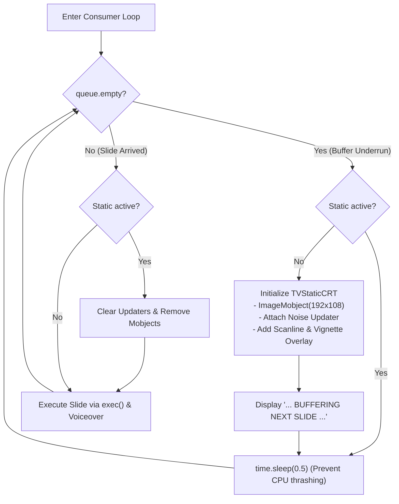

# EduClaw: Asynchronous Keyframe Streaming & TV Static Architecture

This document details the architectural design, concurrency model, visual assets, and mathematical foundations of the **EduClaw Asynchronous Streaming Manim Pipeline**. 

---

## 1. Executive Summary & Paradigm Shift

### The Bottleneck: Monolithic 60-Second Video Generation
In standard AI-to-video pipelines, an LLM is tasked with generating a continuous, monolithic Manim script (60+ seconds). For models in the 7B–8B parameter class (such as Qwen2.5-Coder-7B or Gemma 4), this produces critical failure modes:
1. **Compounding Syntax Hallucinations:** As script length grows, the probability of coordinate miscalculations, deprecated Manim API calls, and broken indentation scales exponentially.
2. **Pedagogical Dilution:** Models waste token budgets calculating intermediate micro-animations rather than focusing on mathematical rigor, clean typographic hierarchy, and sound pedagogy.
3. **Severe Cold-Start Latency:** The end-user must wait 45–90 seconds before seeing a single frame rendered.
4. **Fragile Audio Alignment:** Without discrete anchor points, syncing generated TTS narration to continuous animations requires complex post-processing and timestamp stretching.

### The Solution: The Keyframe State-Machine Pipeline
The pipeline shifts from **continuous animation synthesis** to **discrete state-machine keyframes** connected through an asynchronous **Producer-Consumer Queue**:
- **Discrete Pedagogical States:** The LLM generates 15–25 high-density, static visual states (`VGroup`, `MathTex`, `FunctionGraph`).
- **Markdown Extraction over Rigid Schemas:** The LLM emits standard Markdown containing `<narration>` and ```python``` blocks, sidestepping Pydantic JSON schema overhead on small models.
- **Compute Buffer (The Branding Intro):** A hardcoded, asset-rich 16-second cinematic intro (`intro.py`) plays immediately on the client, completely hiding the LLM's inference latency for Slide 1.
- **Sub-second Audio/Visual Anchors:** `<bookmark mark="v1"/>` tags in narration coordinate precisely with `self.wait_until_bookmark("v1")` in Manim code via `manim-voiceover`.
- **Graceful Buffer Underrun Fallback:** If the consumer exhausts the queue before the LLM generates the next slide, the engine smoothly transitions to an authentic, high-speed **CRT TV Static** display (`tv_static.py`) instead of freezing or dropping frames.

---

## 2. System Architecture & Concurrency Model

The engine operates on two decoupled concurrent threads communicating across an in-memory FIFO queue (`queue.Queue`), orchestrated via FastAPI WebSockets to the Next.js frontend.

```mermaid
flowchart TB
    subgraph Frontend["Web UI (Next.js 14 Studio)"]
        UI_Input["User Input: 'Explain Power Rule'"]
        Chat["GeminiChat.tsx"]
        Player["LecturePlayer.tsx"]
    end

    subgraph Backend["EduClaw Python Backend"]
        WS["FastAPI WebSocket (/ws/generate_lecture)"]
        Queue[("slide_queue (FIFO Queue)")]

        subgraph ProducerThread["Producer Thread (LLM Engine)"]
            P1["Phase 1: Syllabus Planner (LLM)"]
            P2["Slide Iteration Loop"]
            P3["Markdown Prompting: &lt;narration&gt; + ```python```"]
            Regex["Regex Scraper (_parse_markdown)"]
            SlideData["SlideData Object"]
        end

        subgraph ConsumerThread["Consumer Thread (Manim Engine)"]
            Intro["Phase 2: Compute Buffer Intro (intro.py)<br/>RUKUMINI & College Assets"]
            Loop["Consumer construct() Loop"]
            QueueCheck{"queue.get(timeout=0)"}
            ExecEnv["Sandboxed exec() Environment"]
            Voiceover["manim-voiceover + Tracker"]
            TVStatic["Phase 5: TVStaticCRT Fallback<br/>(ImageMobject + NumPy)"]
        end
    end

    UI_Input --> Chat
    Chat -->|WebSocket Prompt| WS
    WS --> P1
    P1 --> P2
    P2 --> P3
    P3 --> Regex
    Regex --> SlideData
    SlideData -->|put(slide)| Queue

    WS -->|Start Consumer| ConsumerThread
    Intro --> Loop
    Loop --> QueueCheck
    QueueCheck -->|Slide Available| ExecEnv
    ExecEnv --> Voiceover
    Voiceover -->|Next Slide| Loop
    QueueCheck -->|queue.Empty (Buffer Underrun)| TVStatic
    TVStatic -.->|Poll retry| QueueCheck

    WS -.->|Stream JSON Narration &amp; Status| Chat
    ConsumerThread -.->|Render Output / Live View| Player
```

---

## 3. End-to-End Latency Hiding Timeline

By decoupling generation from playback, the user perceives zero cold-start delay. The 16-second cinematic intro covers the entire latency envelope for Phase 1 (Syllabus) and Slide 1 generation.

```mermaid
gantt
    title EduClaw Concurrency & Latency Hiding Timeline
    dateFormat X
    axisFormat %s s

    section User Experience
    Send Prompt                 :milestone, m0, 0, 0
    Watch Branding Intro (16s)  :active, u1, 0, 16
    Watch Slide 1 Presentation  :u2, 16, 32
    Watch Slide 2 Presentation  :u3, 32, 48
    Buffer Underrun (TV Static) :crit, u4, 48, 52
    Watch Slide 3 Presentation  :u5, 52, 68

    section Producer Thread (LLM)
    Generate Syllabus (Light)   :p0, 0, 2
    Generate Slide 1 Markdown   :p1, 2, 10
    Generate Slide 2 Markdown   :p2, 10, 22
    Spike / Heavy Math Slide 3  :crit, p3, 22, 50
    Generate Slide 4 Markdown   :p4, 50, 60

    section Consumer Thread (Manim)
    Render Intro (intro.py)     :c1, 0, 16
    Render Slide 1 + Voiceover  :c2, 16, 32
    Render Slide 2 + Voiceover  :c3, 32, 48
    Display TVStaticCRT Noise   :crit, c4, 48, 52
    Render Slide 3 + Voiceover  :c5, 52, 68
```



---

## 4. Visual Synchronization State Machine (`manim-voiceover`)

```mermaid
sequenceDiagram
    autonumber
    actor LLM as Producer (LLM)
    participant Q as slide_queue
    participant Scene as EduClawStreamingScene
    participant Audio as VoiceoverScene Tracker
    participant Manim as Manim Renderer

    LLM->>Q: SlideData(narration, python_code)
    Q->>Scene: get() -> slide_data
    Scene->>Audio: with self.voiceover(text=narration) as tracker
    Audio->>Audio: TTS Synthesizes audio & calculates bookmark offsets
    Audio->>Audio: Play audio in background

    rect rgb(30, 40, 60)
        Note over Scene,Manim: Execution of LLM Python Code inside exec()
        Scene->>Scene: self.wait_until_bookmark("v1")
        Scene->>Manim: self.play(Create(sine_graph))
        Scene->>Scene: self.wait_until_bookmark("v2")
        Scene->>Manim: self.play(Transform(sine_graph, cosine_graph))
    end

    Audio-->>Scene: Audio concludes (tracker.duration reached)
    Scene->>Q: Check next slide
```

Precise synchronization between speech and animations is achieved using `<bookmark mark="..."/>` tags embedded directly within the `<narration>` payload.



---

## 5. Visual Assets & The Compute Buffer (`intro.py`)

The cold-start latency buffer relies on a high-production, pre-compiled branding scene located at:
- **Script:** [`apps/agents/tools/assets/intro.py`](file:///c:/Users/nabin/Desktop/myall/AOS/apps/agents/tools/assets/intro.py)
- **Wordmark Asset:** [`apps/agents/tools/assets/rukumini.png`](file:///c:/Users/nabin/Desktop/myall/AOS/apps/agents/tools/assets/rukumini.png)
- **Institution Logo:** [`apps/agents/tools/assets/college_logo.png`](file:///c:/Users/nabin/Desktop/myall/AOS/apps/agents/tools/assets/college_logo.png)

```
apps/agents/tools/assets/
├── college_logo.png     # College & University crest (DR corner reveal)
├── rukumini.png         # Primary RUKUMINI dark-red brand wordmark
├── intro.py             # 16-second Phonk-synced cinematic establishing scene
└── media/               # Pre-rendered cache
```

### Intro Structure Breakdown:
1. **Mathematical Scenery establishing shots (0.0s – 7.0s):**
   Darkened, vignetted geometric establishing animations (Euler's Formula $e^{i\pi} + 1 = 0$ and Leonardo's Vitruvian Man proportions) acting as atmospheric cinematic B-roll.
2. **Impact Flash & Brand Slam (7.0s – 11.5s):**
   Full-screen exposure flash transitioning into a dimensional scale-down slam of `rukumini.png` with dark-red accent glow (`#C41E3A`).
3. **Institutional reveal (11.5s – 15.0s):**
   Reveal of Sunway College Kathmandu / Birmingham City University via `college_logo.png`.
4. **Outro Dissolve (15.0s – 16.0s):**
   Seamless fade-out clearing the Manim camera buffer exactly as Slide 1 is dequeued.

---

## 6. Buffer Underrun & The CRT TV Static Engine (`tv_static.py`)

When local LLM inference spikes, the consumer faces a **buffer underrun**. Rather than dropping frames, hanging the renderer, or throwing an uncaught exception, the scene activates the CRT static engine defined in:
- **Module:** [`apps/agents/tools/templates/tv_static.py`](file:///c:/Users/nabin/Desktop/myall/AOS/apps/agents/tools/templates/tv_static.py)



### Engineering Principles of `tv_static.py`

#### 1. `ImageMobject` vs. Vector Rectangles
Generating random noise via thousands of `Rectangle` mobjects forces Manim to maintain individual scene-graph nodes, tessellate vertices, and compute fills every frame. At $1920 \times 1080$, this causes instant frame-rate collapse ($< 0.1$ FPS).
- `tv_static.py` creates a **single** `ImageMobject` initialized with a tiny low-resolution buffer ($192 \times 108$, $16:9$).
- Manim scales the texture to `config.frame_width` and `config.frame_height`.
- Frame regeneration executes via direct NumPy in-place array modification, achieving $60+$ FPS.

```python
def update_static(mob: ImageMobject, dt: float) -> None:
    mob.pixel_array[:, :, :3] = frame_fn()
    # Re-assign array reference to invalidate Manim's internal GPU texture cache
    mob.pixel_array = mob.pixel_array
```

#### 2. Contrast-Boosted Monochrome Noise
Randomizing RGB channels independently produces "rainbow confetti" rather than authentic TV snow. Genuine cathode-ray static is monochrome ($R = G = B$).
The function `_grayscale_noise` generates single-channel uniform noise and applies a linear contrast stretch around the midpoint ($127.5$):

$$\text{noise}_{\text{contrast}} = \text{clip}\left((\text{noise} - 127.5) \times \gamma + 127.5, \, 0, \, 255\right)$$

Where $\gamma = 1.5$. This pushes mid-grays into distinct black/white speckles, broadcast across three channels via `np.stack([gray, gray, gray], axis=-1)`.

#### 3. CRT Scanlines & Glitch Simulation
In `TVStaticCRT`, analog display artifacts are layered onto the buffer:
- **Scanlines:** Darkening alternating rows:
  ```python
  gray[::2, :] *= 0.5
  ```
- **Vertical-Sync Glitch Roll:** Occasional horizontal glitch bands simulate analog signal loss:
  ```python
  if np.random.random() < 0.15:
      row = np.random.randint(0, tex_h)
      gray[row:row+2, :] = 255
  ```
- **Luminance Flicker & Vignette:** Frame brightness jitter multiplied by a dark radial vignette overlay (`fill_opacity=0.35`).

---

## 7. Markdown Extraction vs. Pydantic Schemas

Small open-source models (e.g., 7B–8B parameter instruct checkpoints) frequently struggle with deeply nested JSON schemas, often escaping strings improperly, omitting quotes, or dropping LaTeX backslashes.

### Extraction Pattern Comparison:

| Attribute | Pydantic JSON Mode | EduClaw Markdown Extraction |
| :--- | :--- | :--- |
| **Token Efficiency** | Low (heavy structural JSON keys/braces) | **High** (direct raw content) |
| **LaTeX Formatting** | Fragile (requires double/triple backslash escapes) | **Natural** (`\lim_{x \to 0}` works as-is) |
| **Parsing Reliability** | Binary failure (one missing comma aborts run) | **Permissive** (Regex extracts tags cleanly) |
| **Model Alignment** | Strains smaller 7B/8B parameter models | Aligns natively with pre-training data |

### Prompt Structure:
```markdown
Here is the slide content:
<narration>
Welcome back. As we observe the curve <bookmark mark="v1"/>, notice how the slope changes.
When we differentiate <bookmark mark="v2"/>, the rate of change is revealed.
</narration>

```python
# Manim visual elements & bookmark synchronization
curve = FunctionGraph(lambda x: 0.1 * x**2, color=BLUE)
tangent = Line(LEFT, RIGHT, color=YELLOW).shift(UP)

self.wait_until_bookmark("v1")
self.play(Create(curve), run_time=1.5)

self.wait_until_bookmark("v2")
self.play(Create(tangent), run_time=1.2)
```
```

### Parsing Implementation:
```python
def _parse_markdown(self, markdown: str) -> SlideData:
    narration_match = re.search(r'<narration>(.*?)</narration>', markdown, re.DOTALL)
    python_match = re.search(r'```python(.*?)```', markdown, re.DOTALL)

    narration = narration_match.group(1).strip() if narration_match else ""
    python_code = python_match.group(1).strip() if python_match else ""

    return SlideData(narration=narration, python_code=python_code)
```

---

## 8. Verification & Execution Reference

### Unit Tests
The parser logic is covered under the test suite:
```bash
# Run streaming engine parser unit tests
uv run pytest tests/test_streaming_engine.py
```

### Standalone TV Static Testing
To test and preview the standalone static scenes in Manim:
```bash
cd apps/agents/tools/templates
uv run manim -ql --media_dir . tv_static.py TVStatic
uv run manim -ql --media_dir . tv_static.py TVStaticCRT
uv run manim -ql --media_dir . tv_static.py TVStaticTransition
```

### Standalone Cinematic Intro Testing
To test and preview the 16-second cold-start branding intro:
```bash
cd apps/agents/tools/assets
uv run manim -pql intro.py RukuminiIntro
```
