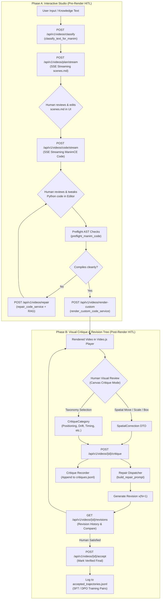

# AOS Human-in-the-Loop (HITL) Backend Architecture & Dev Setup Guide

This guide explains:
1. **Where Human-in-the-Loop (HITL) code is situated in the backend**, how the components connect, and the complete critique/repair lifecycle.
2. **Why you are currently rebuilding Docker images on every change** and the exact setup to achieve **instant hot-reloading (zero image rebuilds)** for both frontend and backend.

---

## 1. HITL in the Backend: Codebase Map & Architecture

The AOS backend implements a two-phase Human-in-the-Loop (HITL) architecture:
- **Phase A: Interactive Studio Pipeline** (Pre-render: Plan & Code Co-Creation with Streaming and Repair)
- **Phase B: Visual Critique & Review Loop** (Post-render: On-Screen Canvas Feedback, Spatial Corrections, Revision Trees, and DPO Dataset Logging)



---

### Detailed File-by-File Location Map

All backend HITL code is located in `apps/ui/aos/backend/app/`:

| Component | File Path | Key Functions / Classes | Purpose |
|-----------|-----------|-------------------------|---------|
| **Critique API Routes** | [`apps/ui/aos/backend/app/api/routes/v1/critique.py`](file:///c:/Users/nabin/Desktop/myall/AOS/apps/ui/aos/backend/app/api/routes/v1/critique.py) | `submit_critique()`, `get_revisions()`, `accept_revision()` | REST endpoints for submitting on-screen critiques, fetching revision trees, and accepting final outputs. |
| **Video Studio Routes** | [`apps/ui/aos/backend/app/api/routes/v1/videos.py`](file:///c:/Users/nabin/Desktop/myall/AOS/apps/ui/aos/backend/app/api/routes/v1/videos.py) | `compose_plan()`, `compose_plan_stream()`, `synthesize_code()`, `repair_code()`, `render_custom_scene()` | Multi-stage HITL generation endpoints supporting SSE token-by-token streaming. |
| **Critique Schemas** | [`apps/ui/aos/backend/app/schemas/critique.py`](file:///c:/Users/nabin/Desktop/myall/AOS/apps/ui/aos/backend/app/schemas/critique.py) | `CritiqueCategory`, `SpatialCorrection`, `CritiqueSubmissionRequest`, `VideoRevision` | Pydantic data models defining failure categories, bounding-box translations, and revision payloads. |
| **Critique Recorder** | [`apps/ui/aos/backend/app/services/critique_recorder.py`](file:///c:/Users/nabin/Desktop/myall/AOS/apps/ui/aos/backend/app/services/critique_recorder.py) | `CritiqueRecorder.record_critique()`, `register_revision()`, `mark_accepted()` | Thread-safe in-memory and persistent JSONL logger for revisions, user reviews, and DPO training data. |
| **Repair Dispatcher** | [`apps/ui/aos/backend/app/services/repair_dispatcher.py`](file:///c:/Users/nabin/Desktop/myall/AOS/apps/ui/aos/backend/app/services/repair_dispatcher.py) | `REPAIR_STRATEGIES`, `build_repair_prompt()` | Translates human visual feedback & coordinate offsets into surgical, high-precision prompt directives for the coding agent. |
| **Interactive Studio Service** | [`apps/ui/aos/backend/app/services/manim_studio.py`](file:///c:/Users/nabin/Desktop/myall/AOS/apps/ui/aos/backend/app/services/manim_studio.py) | `classify_text_for_manim()`, `compose_plan_service()`, `synthesize_code_service()`, `repair_code_service()`, `render_custom_code_service()` | Core orchestrator for the 5-stage interactive studio pipeline. |
| **Static Code Repair** | [`apps/ui/aos/backend/app/services/manim_code.py`](file:///c:/Users/nabin/Desktop/myall/AOS/apps/ui/aos/backend/app/services/manim_code.py) | `preflight_manim_code()`, `repair_manim_code()` | AST-based static sanity checks (mobject indexing, imports, invalid constructor kwargs) before rendering. |
| **Unit Test Suite** | [`apps/ui/aos/backend/tests/test_critique.py`](file:///c:/Users/nabin/Desktop/myall/AOS/apps/ui/aos/backend/tests/test_critique.py) | `test_critique_recorder_lifecycle()`, `test_critique_api_endpoints()` | Comprehensive automated tests for critique submission, revision tagging, and acceptance. |

---

### Core HITL Concepts in AOS

#### 1. Structured Visual Critique Taxonomy (`CritiqueCategory`)
Defined in [`app/schemas/critique.py`](file:///c:/Users/nabin/Desktop/myall/AOS/apps/ui/aos/backend/app/schemas/critique.py#L12-L22):
- `positioning`: Elements overlapping, out of frame, or bad margins.
- `visual_drift`: Coordinate frame or camera drifting unnaturally over time.
- `visibility`: Text too small, stroke lines too thin, or bad background contrast.
- `animation`: Jarring easing, messy `Transform` artifacts, or abrupt transitions.
- `timing`: Beats running too fast or audio/narration desynchronized.
- `scientific_accuracy`: Incorrect mathematical formulas, minus signs, or physics errors.
- `explanation`: Pedagogical flow is confusing or needs callout arrows / highlight boxes.
- `narration`: Voiceover script requires adjustments.

#### 2. Spatial On-Screen Corrections (`SpatialCorrection`)
When a user clicks or drags bounding boxes over a video frame in the UI, the frontend sends:
```json
{
  "action": "reposition",
  "target_object": "formula_1",
  "old_position": [-2.0, 1.0],
  "new_position": [-3.5, 2.0],
  "old_scale": 1.0,
  "new_scale": 1.25
}
```
[`repair_dispatcher.py`](file:///c:/Users/nabin/Desktop/myall/AOS/apps/ui/aos/backend/app/services/repair_dispatcher.py#L114-L125) converts these coordinates into concrete instructions:
`"Position adjustment: old=(-2.0, 1.0) -> new=(-3.5, 2.0), Scale adjustment: old=1.0 -> new=1.25"`

#### 3. Revision History & DPO / SFT Trajectory Logging
- Every re-render creates a revision (`v1`, `v2`, ...).
- Critiques are appended to `apps/agents/sft_data_gen/critiques.jsonl`.
- When the human clicks **"Accept Revision"**, the backend logs the prompt, final Manim code, user rating, and total revision steps to `apps/agents/sft_data_gen/accepted_trajectories.jsonl`. This feeds direct preference optimization (DPO) and supervised fine-tuning (SFT) datasets!

---

## 2. Why Are You Rebuilding Docker Images Every Time?

### The Root Cause

In [`docker-compose.dev.yml`](file:///c:/Users/nabin/Desktop/myall/AOS/apps/ui/aos/docker-compose.dev.yml):

1. **Frontend Has No Volume Mounts**:
   ```yaml
   frontend:
     build:
       context: ./frontend
       dockerfile: Dockerfile
   ```
   The frontend `Dockerfile` runs a **full production build** (`bun run build`) and copies the output to a standalone container (`bun server.js`).
   Because `./frontend/src` is **not mounted**, editing a `.tsx` or `.ts` file on your host machine has **zero effect** inside the running container. To see changes, you were forced to run `.\scripts\dev-refresh.ps1 -Rebuild` or `docker compose build frontend`, which takes 1–3 minutes every time!

2. **Backend Actually Already Has Hot Reload, But...**:
   In `docker-compose.dev.yml`:
   ```yaml
   app:
     volumes:
       - ./backend/app:/app/app:ro
     command: uvicorn app.main:app --host 0.0.0.0 --port 8000 --reload
   ```
   Backend files in `backend/app/` **already auto-reload** in uvicorn! However:
   - When running `dev-refresh.ps1 -Rebuild`, it unnecessarily rebuilds the backend image too.
   - Files outside `backend/app` (like `packages/ir` or new pip dependencies) aren't mounted.

3. **Celery Worker Runs on the Host**:
   As noted in `LOCAL_DEV.md` and `dev-refresh.ps1`, Docker's celery worker doesn't run Manim. `dev-refresh.ps1` starts Celery on your **host** using local `uv`. It already reads host code directly!

---

## 3. How to Make Your Dev Setup 10x Easier (Instant Hot-Reload)

### Option 1: The "Golden Workflow" (Recommended & Fastest)

Run infrastructure and backend API in Docker, but run the **Frontend natively on your host machine with `bun dev`**.

This gives you **instant Next.js Fast Refresh (sub-second UI updates on file save)** without touching Docker at all.

#### Step 1: Start Docker Stack with Host Frontend
In `apps/ui/aos`:
```powershell
# Starts infra (Postgres, Redis, MinIO, Milvus) + API + host Celery worker,
# and stops the Docker frontend so port 3000 is open for host bun dev:
.\scripts\dev-refresh.ps1 -NoFrontend
```

#### Step 2: Run Frontend Locally with Hot Reload
In a separate terminal:
```powershell
cd apps\ui\aos\frontend

# Install dependencies (only once)
bun install

# Start Next.js development server with Turbopack / Fast Refresh
bun dev
```

> [!TIP]
> Now, whenever you edit any `.tsx`, `.ts`, or CSS file in `apps/ui/aos/frontend/src/`, your browser updates **instantly in under 500ms**!
> Whenever you edit backend code in `apps/ui/aos/backend/app/`, uvicorn **auto-reloads automatically within 1s**.
> **You do NOT need to rebuild any Docker images!**

---

### Option 2: Live Hot-Reloading Frontend Inside Docker (Zero Host Tools)

If you prefer keeping everything in Docker without installing `bun` on your host machine, modify `frontend` in `docker-compose.dev.yml` to use bind mounts and `bun run dev`:

#### Update `docker-compose.dev.yml` for `frontend`:

```yaml
  frontend:
    build:
      context: ./frontend
      dockerfile: Dockerfile
      target: deps # Stop at dependencies stage
    image: aos_frontend:dev
    container_name: aos_frontend
    ports:
      - "3000:3000"
    environment:
      - NODE_ENV=development
      - WATCHPACK_POLLING=true # Ensures Windows file changes propagate into Docker
      - NEXT_PUBLIC_API_URL=http://localhost:8000
      - NEXT_PUBLIC_WS_URL=ws://localhost:8000
      - NEXT_PUBLIC_SITE_URL=http://localhost:3000
    volumes:
      - ./frontend:/app
      - /app/node_modules # Preserve container node_modules
      - /app/.next # Preserve container .next cache
    command: bun run dev --hostname 0.0.0.0 --port 3000
    networks:
      - backend
    restart: unless-stopped
```

With this change, Docker mounts your live source code, so saving a file on your Windows machine immediately triggers Next.js HMR inside the container—no rebuilding!

---

### Day-to-Day Command Cheat Sheet

| Task | What to Run | Do You Need to Rebuild? |
|------|-------------|-------------------------|
| **Edit Frontend UI / Components** | Just edit and save files (`bun dev` is running) | ❌ **NO** (Instant Fast Refresh) |
| **Edit Backend Routes / Services** | Just edit and save files in `backend/app/` | ❌ **NO** (Uvicorn auto-reloads) |
| **Edit Agent / Manim Code** | Just edit files in `apps/agents/` | ❌ **NO** (Host Celery executes live code) |
| **Restart Celery Worker Only** | `.\scripts\dev-refresh.ps1 -AgentsOnly` | ❌ **NO** (Restarts host process in 2s) |
| **Added new npm package to `package.json`** | `cd frontend && bun install` | ❌ **NO** (Only if rebuilding Docker image) |
| **Added new python package to `pyproject.toml`** | `uv sync` or `.\scripts\dev-refresh.ps1 -Rebuild` | ⚠️ **YES** (Only when dependencies change) |
| **Changed `Dockerfile` or system libs** | `.\scripts\dev-refresh.ps1 -Rebuild` | ⚠️ **YES** |
