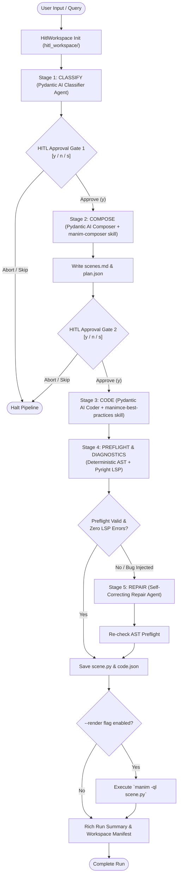

# AOS HITL Local Development Runner (`dev_hitl.py`)

> **Related Documentation**:
> - [hitl_backend_and_dev_setup.md](file:///c:/Users/nabin/Desktop/myall/AOS/docs/hitl_backend_and_dev_setup.md) covers the FastAPI REST API, Docker runtime, and production microservice deployment.
> - **This document** covers `apps/ui/aos/backend/dev_hitl.py`: the standalone, zero-cloud, friction-free CLI runner for developing, testing, and debugging Pydantic AI agents locally with Human-in-the-Loop (HITL) checkpoints.

---

## 1. Overview & Key Capabilities

`dev_hitl.py` allows developers and researchers to execute, test, and debug the complete AOS animation generation pipeline locally on their workstations without relying on cloud observability services (like Logfire) or running the full frontend web stack.

### Key Highlights
- **Zero Cloud Telemetry**: Disables Logfire remote network telemetry (`send_to_logfire=False`) for instant, offline local runs.
- **5-Stage Pipeline**: Animatability Classification $\to$ Visual Plan Composition (`scenes.md`) $\to$ Manim Code Generation $\to$ AST Preflight & Pyright LSP $\to$ Self-Correcting Repair.
- **True Human-in-the-Loop (HITL) Checkpoints**: Interactive terminal approval gates (`[y/n/s]`) between pipeline stages allow developers to inspect, approve, edit, or reject intermediate plans and code.
- **Unmistakable Offline / Mock Mode (`--mock`)**: Uses Pydantic AI's `TestModel` (0 token cost). Rendered in distinctive high-contrast amber/yellow banners with `[ MOCK ]` badges so developers never mistake simulated mock responses for live model outputs.
- **Fail-Loud & Recovery Transparency**: If a live LLM generates malformed JSON, the runner logs loud visual recovery alarms (`recovery_alarm`) stating the exact fallback heuristic used. If a pipeline errors, full tracebacks are printed by default.
- **Standardized Workspace Artifacts (`hitl_workspace/`)**: Preserves all stage inputs and outputs as structured JSON (`classification.json`, `plan.json`, `code.json`, `preflight.json`, `manifest.json`) and native files (`scenes.md`, `scene.py`).
- **Domain Skills Integration**: Automatically mounts repository skills (`manim-composer`, `manimce-best-practices`, `manim-render`) into agent system prompts and execution contexts.

---

## 2. End-to-End Architecture & Flow



---

## 3. Directory & Workspace Structure

When `dev_hitl.py` runs, it operates inside a dedicated workspace directory (`apps/ui/aos/backend/hitl_workspace/` by default, customizable via `--dir`):

```text
hitl_workspace/
├── input.json            # User query and input text metadata
├── classification.json   # Output of Stage 1: animatability, subject, topic, rationale
├── scenes.md             # Output of Stage 2: 3b1b-style Markdown visual storyboard
├── plan.json             # Output of Stage 2 in structured JSON format
├── scene.py              # Output of Stage 3/5: Executable Manim Community Python code
├── code.json             # Code metadata, AST status, and Pyright diagnostics
├── preflight.json        # Static AST validator issues and deterministic fixes applied
├── error.json            # Error tracebacks and classified error categories (for repairs)
├── repair.json           # Self-correcting repair modifications and history
└── manifest.json         # Index of latest run stage, topic, and artifact timestamps
```

In addition, full execution traces, token usage, and Pydantic AI conversation messages are persisted into `.dev_logs/hitl/`:
- `.dev_logs/hitl/run_<timestamp>_<stage>_<id>.json`
- `.dev_logs/hitl/last_run.json` (symlink/copy of latest run for quick inspection)

---

## 4. Pipeline Stages In-Depth

### Stage 1: Animatability Classification
- **Agent**: `VideoClassifyResponse` agent using Pydantic AI structured outputs.
- **System Prompt**: Evaluates whether mathematical, algorithmic, or scientific concepts can be visually explained in Manim.
- **Output**: `VideoClassifyResponse(animatable=True/False, subject="math"|"cs"|"physics", topic=..., reason=...)`.
- **Heuristic Recovery**: If a live LLM returns unstructured text instead of schema JSON, `dev_hitl.py` executes a regex JSON extractor. If that fails, it falls back to `classify_text_heuristic()`, while triggering `observer.recovery_alarm()` so the fallback is never hidden.

### Stage 2: Visual Plan Composition (`scenes.md`)
- **Agent**: `HitlComposerAgent` guided by the `manim-composer` skill.
- **Format**: Strictly follows the 3Blue1Brown-inspired `scenes.md` specification:
  - **Overview**: Topic, hook, target audience, estimated length, key insights.
  - **Narrative Arc**: Core pedagogical progression.
  - **Numbered Scenes**: Visual elements, text/formula placements, animation flow, technical notes.
  - **Color Palette & Mathematical Content**: Explicit Manim color constants (`BLUE_C`, `YELLOW`, `TEAL`) and LaTeX formulas.
- **Output**: Written to both `scenes.md` (Markdown for human review) and `plan.json` (for programmatic pipelines).

### Stage 3: Manim Python Code Synthesis
- **Agent**: `HitlCoderAgent` equipped with `manimce-best-practices` and `manim-render` skills.
- **Input**: Approved `scenes.md` visual plan and topic requirements.
- **Output**: Production-ready Manim Community Edition scene class adhering to strict conventions (proper LaTeX raw strings `r"..."`, valid `VGroup` arrangements, no outdated ManimGL APIs).

### Stage 4: AST Validation & Pyright LSP Preflight
- **Deterministic AST Engine** (`app.services.manim_code`):
  - Automatically identifies common syntax errors, invalid imports, and deprecated parameters.
  - Applies safe AST transformations (e.g., ensuring `MathTex` receives raw strings).
- **Pyright Language Server Protocol (LSP)** (`app.services.lsp_service`):
  - Runs headless type-checking and member verification.
  - Catches invalid attribute calls (e.g., calling non-existent Mobject methods).

### Stage 5: Self-Correcting Code Repair
- **Agent**: `HitlRepairAgent` combined with AST preflight loop.
- **Classification**: Analyzes compiler tracebacks or runtime errors with `classify_error()` into defined categories (`MOBJECT_ATTRIBUTE`, `LATEX_SYNTAX`, `INDEX_ERROR`, etc.).
- **Self-Correction**: Sends targeted repair guidance and previous AST diagnostics back to the repair agent with a retry budget (`max_attempts=2`).
- **Diff Presentation**: Displays colorized terminal unified diffs comparing original and repaired code.

---

## 5. Human-in-the-Loop (HITL) Checkpoints

`dev_hitl.py` implements interactive checkpoints via `hitl_approve()`:

```text
╭── 🧑 HITL Checkpoint — CLASSIFY ──────────────────────────────────────────╮
│ Topic: Dijkstra's Algorithm  |  Animatable: YES  |  Subject: cs            │
│                                                                           │
│ Proceed to next stage?  y = yes / n = abort / s = skip this stage         │
╰───────────────────────────────────────────────────────────────────────────╯
Your decision [y/n/s] (y):
```

### Options:
1. **`y` (Yes)**: Approves stage output and transitions to the next agent in the pipeline.
2. **`n` (Abort)**: Immediately halts the pipeline. All artifacts up to this stage are saved in `hitl_workspace/`.
3. **`s` (Skip)**: Skips the next stage (useful when developing downstream stages with pre-cached artifacts).
4. **`--no-hitl-approval`**: Command-line flag to bypass interactive prompts for automated batch jobs or CI/CD testing.

---

## 6. CLI Command Reference & Examples

### Running the Full Pipeline

```bash
# 1. Full interactive run with live LLM (default model: OpenRouter)
cd apps/ui/aos/backend
uv run python dev_hitl.py "Explain Dijkstra's Algorithm"

# 2. Automated run without human prompts (CI mode)
uv run python dev_hitl.py --no-hitl-approval "Explain Dijkstra's Algorithm"

# 3. Completely offline mock test (0 tokens, instant execution)
uv run python dev_hitl.py --mock "Taylor Series Approximation"
```

### Running Individual Stages

```bash
# Test classification only
uv run python dev_hitl.py --stage classify "How does Dijkstra's Algorithm work?"

# Test plan composition using cached or provided topic
uv run python dev_hitl.py --stage compose --topic "Binary Search"

# Test code synthesis from existing plan in hitl_workspace/scenes.md
uv run python dev_hitl.py --stage code

# Test preflight AST validator & Pyright LSP on any Python file
uv run python dev_hitl.py --stage preflight --file broken_scene.py

# Test type checking and member diagnostics via Pyright LSP
uv run python dev_hitl.py --stage lsp --file scene.py

# Test self-correcting repair agent with injected Mobject index bug
uv run python dev_hitl.py --stage repair --inject-mobject-bug
```

### Local Render & Inspection

```bash
# Compile and render generated scene using local manim -ql
uv run python dev_hitl.py --mock --render "Fourier Transform"

# Inspect the most recent run metadata, timing, and preflight status
uv run python dev_hitl.py --inspect-last
```

### Command Line Flags

| Flag | Short | Default | Description |
|---|---|---|---|
| `topic` | | `None` | Topic or educational text to process (omitted = read from `hitl_workspace/input.json`) |
| `--stage` | `-s` | `all` | Stage to run: `all`, `classify`, `compose`, `code`, `preflight`, `repair`, `lsp` |
| `--dir` / `--workspace` | `-d` | `hitl_workspace/` | Path to directory for structural JSON and Python artifacts |
| `--mock` | | `False` | Run with Pydantic AI `TestModel` (offline, 0 API tokens) |
| `--no-hitl-approval` | | `False` | Skip interactive human approval prompts |
| `--model` | `-m` | `nvidia/nemotron-3-ultra-550b-a55b:free` | Model override for OpenRouter or custom endpoint |
| `--base-url` | `-b` | `https://openrouter.ai/api/v1` | LLM API base URL |
| `--api-key` | `-k` | `OPENROUTER_API_KEY` | API key for LLM calls |
| `--file` | `-f` | `None` | Python source file for `preflight`, `repair`, or `lsp` |
| `--error` | `-e` | `None` | Traceback or compiler error message for `repair` stage |
| `--inject-mobject-bug` | | `False` | Injects intentional Mobject out-of-range indexing error to test repair agent |
| `--render` | | `False` | Executes `manim -ql` locally on output code |
| `--inspect-last` | | `False` | Displays structured diagnostics from the last run |
| `--verbose` | `-v` | `False` | Displays raw prompts and detailed message traces |
| `--log-dir` | | `.dev_logs/hitl/` | Custom path for JSON run logs |

---

## 7. Verification & Pytest Suite

A comprehensive test suite validates all `dev_hitl.py` functionality without requiring network access or external credentials:

```bash
cd apps/ui/aos/backend
uv run pytest tests/test_local_dev_hitl.py -v
```

### Test Coverage Summary:
- `test_hitl_run_store_lifecycle`: Verifies structured JSON run log persistence and retrieval.
- `test_hitl_workspace_directory_structure`: Validates structural JSON and Python artifact creation across all stages.
- `test_hitl_terminal_observer`: Ensures Rich terminal UI renders prompts, diffs, AST results, and error alarms cleanly.
- `test_classify_stage_mock`: Verifies Stage 1 mock execution with Pydantic AI `TestModel`.
- `test_compose_stage_mock`: Verifies Stage 2 `scenes.md` generation and scene extraction.
- `test_code_and_preflight_mock`: Verifies Stage 3 code synthesis, AST preflight checks, and LSP diagnostics.
- `test_repair_stage_mock_with_injected_bug`: Verifies Stage 5 self-correcting repair loop and unified diff emission.
