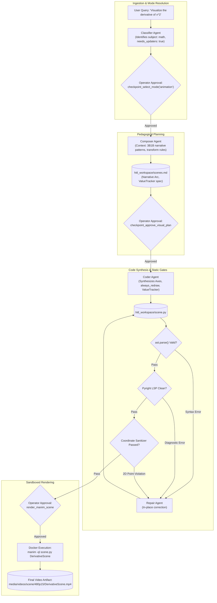

# Mode Specification: Animate Mode (`animation`)

## 1. Purpose

Animate Mode is the standard mathematical animation engine of AOS, modeled after the visual storytelling conventions pioneered by Grant Sanderson (3Blue1Brown). It synthesizes animations where conceptual intuition is conveyed through continuous motion, geometric transformations, and dynamic variable evolution rather than static slides. The mode is optimized for calculus, linear algebra, differential equations, geometry, and algorithms where seeing one mathematical form smoothly morph into another unlocks deep pedagogical comprehension. It leverages continuous parameter tracking (`ValueTracker`), dynamic mobject updaters (`always_redraw()`, `add_updater()`), seamless morphing (`Transform`, `ReplacementTransform`), and dynamic camera framing (`MovingCameraScene`, `ThreeDScene`). The final output is an MP4 video file presenting a continuous visual narrative without hard visual cuts.

---

## 2. Trigger / Routing

Animate Mode serves as the **system default** within both the web orchestrator ([`apps/ui/aos/backend/dev_hitl_web.py`](file:///c:/Users/nabin/Desktop/myall/AOS/apps/ui/aos/backend/dev_hitl_web.py)) and CLI runner ([`apps/ui/aos/backend/dev_hitl.py`](file:///c:/Users/nabin/Desktop/myall/AOS/apps/ui/aos/backend/dev_hitl.py)).

When `checkpoint_select_mode` executes at Stage 1.5, the routing condition evaluates:
```python
# Fallback to animation if not explicitly slide, scivis, or marp
mode_raw = (recommended_mode or kwargs.get("mode") or "animation").lower().strip()
if mode_raw not in ("slide", "animation", "scivis", "marp"):
    mode_raw = "animation"
```

### Heuristic Selection Criteria
1. **Mathematical Domain Analysis**: Triggered when [`VideoClassifyResponse.subject`](file:///c:/Users/nabin/Desktop/myall/AOS/apps/ui/aos/backend/app/schemas/video_generation.py#L42) is identified as `"math"`, `"physics"`, or `"ai"` involving continuous mathematical spaces (e.g., derivatives, integrals, eigenvectors, loss surfaces).
2. **Classifier Capability Flags**:
   - `needs_updaters: bool = True` (Dynamic animations, ValueTracker).
   - `needs_camera_movement: bool = True` (Camera pan, zoom, frame shift).
   - `needs_graphing: bool = True` (Parametric functions, coordinate plots).
3. **Implicit Default**: If the user query does not request slides, external scientific data libraries, or Marp Markdown formatting, the system defaults to Animate Mode.

---

## 3. Architecture

Animate Mode follows a continuous transformation pipeline:

```
[User Query]
     │
     ▼
[Stage 1: Classification & Canvas Determination] ──► Produces classification.json (Scene / ThreeDScene)
     │
     ▼
[Stage 2: Narrative Arc & Storyboard Planning]   ──► Produces scenes.md (Narrative arc & transforms)
     │
     ▼
[Stage 3: Fluid Code Synthesis]                  ──► Produces scene.py (Updaters, ValueTracker, Morphing)
     │
     ▼
[Stage 4: Static Verification & Repair Loop]     ──► AST check, Pyright LSP, Coordinate Sanitizer
     │
     ▼
[Stage 5: Sandboxed Docker Execution]            ──► Produces 1080p/480p MP4 Video
```

### Stage Details

1. **Classification & Canvas Determination**:
   - **Inputs**: User prompt text.
   - **Outputs**: `classification.json` specifying `scene_type` (`"Scene"`, `"ThreeDScene"`, or `"MovingCameraScene"`), subject classification, and visual flags.
   - **Mechanism**: Invokes `hitl_agents.get_classifier_agent()`. Detects whether 3D projection or camera tracking is necessary for visual clarity.

2. **Narrative Arc & Storyboard Planning**:
   - **Inputs**: Approved classification metadata.
   - **Outputs**: `scenes.md` containing a continuous pedagogical arc divided into scenes linked by mathematical morphs (`Transform`, `ReplacementTransform`).
   - **Mechanism**: Invokes `hitl_agents.get_composer_agent()` pre-injected with [`MODE_COMPOSER_HINTS["animation"]`](file:///c:/Users/nabin/Desktop/myall/AOS/apps/ui/aos/backend/app/agents/hitl_agents.py#L619). The planner specifies coordinate frames, camera target frames, and rate functions (`smooth`, `there_and_back`, `rush_into`).

3. **Fluid Code Synthesis**:
   - **Inputs**: Approved `scenes.md` and Tier 1 positioning guidelines.
   - **Outputs**: Complete executable `scene.py`.
   - **Mechanism**: Invokes `hitl_agents.get_coder_agent()` with context from [`get_animation_tier1_context(needs_3d=...)`](file:///c:/Users/nabin/Desktop/myall/AOS/apps/ui/aos/backend/app/agents/hitl_agents.py#L735). The prompt enforces coordinate mapping through `axes.c2p(x, y)`, parameter state management via `ValueTracker`, and strict relative layout anchoring.

4. **Static Verification & Repair**:
   - **Inputs**: Synthesized `scene.py`.
   - **Outputs**: Cleaned code or diagnostic bundle.
   - **Mechanism**: Scans code for illegal 2D coordinate lists (`[x, y]`), invalid `Scene` methods, and LaTeX compilation errors. Dispatches tracebacks to `hitl_agents.get_repair_agent()` if diagnostics fail.

5. **Sandboxed Docker Rendering**:
   - **Inputs**: Verified `scene.py`.
   - **Outputs**: MP4 video file.
   - **Mechanism**: Invokes Docker execution running `manim -ql scene.py <SceneName>`.

---

## 4. Tools & Skill Calls

| Tool / Function Name | Pipeline Stage | Invocation Trigger & Arguments | Return Type / Output | Model & Configuration |
| :--- | :--- | :--- | :--- | :--- |
| **`checkpoint_approve_classification`** | Stage 1 (Classification) | Called after classifying topic. Args: `topic`, `subject`, `animatable`, `scene_type`, `needs_updaters`, `needs_camera_movement`. | String confirmation; records `classification.json`. | Pydantic AI Agent (`ClassifierAgent`), `temperature=0.2`. Prompt: `CLASSIFIER_SYSTEM_PROMPT`. |
| **`checkpoint_select_mode`** | Stage 1.5 (Mode Routing) | Called to set mode. Args: `recommended_mode="animation"`, `reason=str`. | String confirmation; records `mode_selection.json`. | Deterministic checkpoint gate (operator approval required). |
| **`checkpoint_approve_visual_plan`** | Stage 2 (Plan Approval) | Called after narrative planning. Args: `plan_markdown`, `topic`, `title`. | String confirmation; records `scenes.md`. | Pydantic AI Agent (`ComposerAgent`), `temperature=0.2`. Context: `get_animation_tier1_context()`. |
| **`synthesize_manim_code`** | Stage 3 (Code Synthesis) | Generates Manim script. Args: `plan_markdown`, `scene_name`, `topic`. | Synthesized `code: str`, detected `scene_name: str`. | Pydantic AI Agent (`CoderAgent`), `temperature=0.0`. Prompt: `CODER_SYSTEM_PROMPT`. |
| **`read_skill_reference`** | Stage 3 (On-Demand Knowledge) | Called for specialized syntax. Args: `path="rules/transform-animations.md"` or `"rules/axes.md"`. | Reference documentation string. | Deterministic filesystem tool (`resolve_skill_reference_content`). |
| **`repair_manim_code`** | Stage 4 (Static Repair) | Triggered when Pyright LSP or AST validation fails. Args: `error`, `code`. | Corrected Python code. | Pydantic AI Agent (`RepairAgent`), `temperature=0.0`. Prompt: `REPAIR_SYSTEM_PROMPT`. |
| **`render_manim_scene`** | Stage 5 (Rendering) | Operator approves final render. Args: `scene_name`, `quality="l"`. | Video path, stream URL, duration. | Subprocess: `docker run manimcommunity/manim`. |

---

## 5. Data / State Passed Between Stages

### 5.1. Classification Metadata (`classification.json`)
```json
{
  "animatable": true,
  "subject": "math",
  "topic": "Derivative as Tangent Line",
  "reason": "Calculus concept requiring dynamic limit visualization and moving secant-to-tangent lines.",
  "scene_type": "Scene",
  "needs_3d": false,
  "needs_updaters": true,
  "needs_axes": true,
  "needs_camera_movement": false,
  "needs_timing_control": true,
  "needs_graphing": true
}
```

### 5.2. Narrative Plan (`scenes.md` Excerpt)
```markdown
# Visualizing the Derivative of x²

## Narrative Arc
We establish a quadratic curve $f(x) = x^2$ on Cartesian axes. A secant line connecting points $(x, f(x))$ and $(x+\Delta x, f(x+\Delta x))$ is established. As $\Delta x \to 0$ using a dynamic ValueTracker, the secant line continuously rotates and converges into the instantaneous tangent line.

---

## Scene 1: Coordinate Frame and Base Function
**Duration**: ~10 seconds
### Visual Elements
- `Axes(x_range=[-1, 4, 1], y_range=[-1, 9, 2])`
- `axes.plot(lambda x: x**2, color=BLUE_C)`
- Mathematical formula: $f(x) = x^2$ anchored top right.

## Scene 2: Dynamic Secant to Tangent Transition
**Duration**: ~15 seconds
### Visual Elements
- `ValueTracker` tracking $\Delta x$ from $1.5$ down to $0.001$.
- `always_redraw()` constructing the dynamic secant line between points $P$ and $Q$.
- Convergence of slope $m = \frac{f(x+\Delta x) - f(x)}{\Delta x} \to 2x$.
```

---

## 6. Mermaid Diagram



---

## 7. Failure Modes & Known Limitations

1. **Updater Stale Reference & Memory Leak**:
   - *Failure*: Calling `always_redraw(lambda: ...)` on mobjects that reference variables garbage-collected after a scene block, or creating duplicate updaters inside loops without removing earlier callbacks.
   - *Mitigation*: The pre-injected rules mandate assigning updaters to explicit references and cleaning up dynamic groups via `self.remove(updater_group)` or fading them out before introducing new coordinate frames.
2. **Division by Zero in Dynamic Slope Callbacks**:
   - *Failure*: Setting a `ValueTracker` target directly to `0.0` when computing secant slope $\frac{\Delta y}{\Delta x}$, resulting in runtime `ZeroDivisionError` within the updater loop.
   - *Mitigation*: Coder rules instruct models to clamp delta variables to small non-zero limits (e.g., `dx.animate.set_value(0.001)` instead of `0.0`).
3. **Invalid 2D Point Assignments**:
   - *Failure*: Manim strictly requires 3D coordinates `[x, y, 0]`. Passing a 2D coordinate `[x, y]` to `Dot()` or `Line()` triggers an unhandled `IndexError: tuple index out of range` inside Manim's spatial transform core.
   - *Mitigation*: The static coordinate sanitizer intercepts any 2-element numeric lists in AST mobject constructors and rewrites them or triggers `HitlRepairAgent`.

---

## 8. Concrete End-to-End Example

### User Query
> "Animate the derivative of f(x) = x^2 showing the secant line approaching the tangent line at x = 1."

### Intermediate Representation (`scenes.md` excerpt)
```markdown
# Tangent Line as Limit of Secants

## Narrative Progression
1. Render coordinate axes and graph $f(x) = x^2$.
2. Fix point $P$ at $x = 1$. Place point $Q$ at $x = 1 + \Delta x$.
3. Draw secant line between $P$ and $Q$.
4. Animate $\Delta x \to 0$ with ValueTracker; update secant line dynamically to become tangent line.
```

### Generated ManimCE Python Code (`scene.py`)
```python
from manim import *

class DerivativeTangentScene(Scene):
    def construct(self):
        # 1. Setup Coordinate Axes
        axes = Axes(
            x_range=[-0.5, 3.0, 1],
            y_range=[-0.5, 5.0, 1],
            x_length=7,
            y_length=5,
            axis_config={"color": GRAY_A},
        ).to_edge(LEFT, buff=0.8)
        
        labels = axes.get_axis_labels(x_label="x", y_label="f(x)")
        graph = axes.plot(lambda x: x**2, color=BLUE_C, x_range=[0, 2.2])
        graph_label = MathTex(r"f(x) = x^2", color=BLUE_C, font_size=32)
        graph_label.next_to(axes.c2p(2.0, 4.0), RIGHT, buff=0.2)

        self.play(Create(axes), Write(labels))
        self.play(Create(graph), FadeIn(graph_label))

        # 2. Points & Secant Setup
        x_val = 1.0
        p_coords = axes.c2p(x_val, x_val**2)
        dot_p = Dot(point=p_coords, color=YELLOW, radius=0.08)
        p_label = MathTex("P", font_size=24, color=YELLOW).next_to(dot_p, UL, buff=0.1)

        dx = ValueTracker(1.2)

        # Dynamic Secant Line and Point Q
        dot_q = always_redraw(
            lambda: Dot(
                point=axes.c2p(x_val + dx.get_value(), (x_val + dx.get_value())**2),
                color=TEAL,
                radius=0.08,
            )
        )

        secant_line = always_redraw(
            lambda: axes.get_secant_slope_group(
                x=x_val,
                target_dx=dx.get_value(),
                func=lambda x: x**2,
                dx_line_color=YELLOW_C,
                df_line_color=YELLOW_C,
                secant_line_color=RED_C,
                secant_line_length=4,
            )
        )

        formula = MathTex(
            r"f'(x) = \lim_{\Delta x \to 0} \frac{f(x+\Delta x) - f(x)}{\Delta x} = 2x",
            font_size=32,
            color=WHITE,
        ).to_edge(UP, buff=0.5)

        self.play(FadeIn(dot_p), Write(p_label), Write(formula))
        self.play(Create(dot_q), Create(secant_line))
        self.wait(1.0)

        # 3. Animate Limit Transition
        self.play(dx.animate.set_value(0.01), run_time=4.0, rate_func=smooth)
        self.wait(2.0)
```

### Resulting Output
An MP4 video rendering Cartesian coordinate axes, a blue parabolic curve $f(x)=x^2$, and a yellow fixed point $P$ at $(1,1)$. A red secant line dynamically rotates as point $Q$ slides down the parabola toward $P$, culminating in the instantaneous tangent line with slope $2x=2$.
