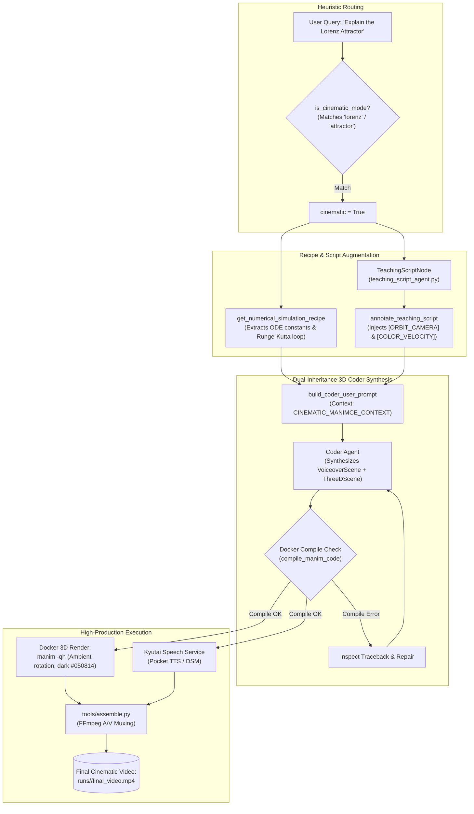

# Mode Specification: Cinematic Director Mode (`cinematic`)

## 1. Purpose

Cinematic Director Mode is an advanced visual production specialization within the autonomous agent pipeline. Tailored for complex physical, astronomical, and mathematical dynamical systems—such as chaotic strange attractors (e.g., the Lorenz attractor), quantum mechanical wavepackets, n-body gravitational orbits, and differential manifolds—this mode overrides standard textbook layouts in favor of an immersive visual presentation. It enforces a signature visual contract: a deep space dark background (`#050814`), continuous multi-axis orbital camera rotations in `ThreeDScene`, velocity-gradient color interpolation (e.g., smoothly shifting from deep blue through violet to neon red based on trajectory velocity), and continuous numerical ODE solvers integrated in NumPy. The final output is an audio-visual MP4 video presenting mathematically rigorous physics simulations set to synchronized voiceover narration.

---

## 2. Trigger / Routing

Cinematic Director Mode is governed by the heuristic classifier in [`apps/agents/cinematic_director.py`](file:///c:/Users/nabin/Desktop/myall/AOS/apps/agents/cinematic_director.py).

In `apps/agents/cli.py` and `apps/agents/agent_graph.py`, the routing decision is evaluated before planner initialization:
```python
from cinematic_director import is_cinematic_mode

# Auto-detect or explicit flag
cinematic_active = is_cinematic_mode(user_request, flag=cinematic)
state = AnimateState(
    user_query=user_request,
    cinematic=cinematic_active,
    ...
)
```

### Heuristic Selection Criteria
1. **Explicit CLI Flag**: Activated whenever `--cinematic` is passed to the generation command:
   ```bash
   uv run python cli.py generate "Chaos Theory" --cinematic
   ```
2. **Autonomous Keyword Matching**: [`is_cinematic_mode()`](file:///c:/Users/nabin/Desktop/myall/AOS/apps/agents/cinematic_director.py) scans the user query for dynamical keywords:
   - Chaotic systems: `"lorenz"`, `"attractor"`, `"chaos"`, `"butterfly effect"`, `"strange attractor"`.
   - Advanced physics: `"quantum"`, `"wavepacket"`, `"schrodinger"`, `"relativity"`, `"n-body"`, `"gravitational"`.
3. **Mathematical Model Binding**: If the query matches a pre-indexed dynamical system in `cinematic_director.py`, the system automatically attaches dedicated numerical recipes.

---

## 3. Architecture

Cinematic Director Mode enriches the standard autonomous pipeline by injecting computational physics recipes and specialized 3D camera contracts:

```
[User Query: e.g. 'Lorenz Attractor']
     │
     ▼
[Stage 1: Cinematic Heuristic Detection]   ──► Activates is_cinematic_mode flag
     │
     ▼
[Stage 2: Numerical Recipe Selection]      ──► Fetches get_numerical_simulation_recipe(topic)
     │
     ▼
[Stage 3: Cinematic Script Annotation]     ──► annotate_teaching_script injects camera & color tags
     │
     ▼
[Stage 4: Dual-Inheritance Coder Synthesis]──► Synthesizes class Scene(VoiceoverScene, ThreeDScene)
     │
     ▼
[Stage 5: High-Precision Docker Rendering] ──► Produces high-definition 3D orbital MP4
```

### Stage Details

1. **Cinematic Heuristic Detection**:
   - **Inputs**: User query string and optional `--cinematic` boolean flag.
   - **Outputs**: `cinematic_active: bool`.
   - **Mechanism**: Inspects query tokens against domain lists in `cinematic_director.py`.

2. **Numerical Recipe Selection**:
   - **Inputs**: Detected mathematical topic.
   - **Outputs**: Concrete Python simulation parameters (e.g., Lorenz constants $\sigma=10.0, \rho=28.0, \beta=8/3$, step size $dt=0.01$, integration bounds $N=2000$).
   - **Mechanism**: Calls `get_numerical_simulation_recipe(topic)`.

3. **Cinematic Script Annotation**:
   - **Inputs**: Base `TeachingScript` from `teaching_script_agent`.
   - **Outputs**: Enriched `TeachingScript` with camera cues (`[ORBIT_CAMERA]`, `[ZOOM_IN]`, `[COLOR_VELOCITY]`).
   - **Mechanism**: Calls `annotate_teaching_script(script, topic, subject)` using definitions from `apps/agents/cinematic_hints.py`.

4. **Dual-Inheritance Coder Synthesis**:
   - **Inputs**: Annotated script, numerical recipe, and [`CINEMATIC_MANIMCE_CONTEXT`](file:///c:/Users/nabin/Desktop/myall/AOS/apps/agents/coder_prompt.py#L215).
   - **Outputs**: `lecture.py` implementing dual inheritance:
     ```python
     class LorenzAttractorScene(VoiceoverScene, ThreeDScene):
     ```
   - **Mechanism**: Invokes `coder_agent` with instructions to initialize ambient camera rotations (`self.begin_ambient_camera_rotation(rate=0.15)`), compute trajectories using NumPy arrays, and trace divergence between perturbed initial conditions ($x$ vs $x + 10^{-4}$).

5. **High-Precision Docker Rendering**:
   - **Inputs**: Compiled `lecture.py`.
   - **Outputs**: High-contrast, multi-axis 3D MP4 video.

---

## 4. Tools & Skill Calls

| Tool / Function Name | Pipeline Stage | Invocation Trigger & Arguments | Return Type / Output | Execution Context |
| :--- | :--- | :--- | :--- | :--- |
| **`is_cinematic_mode`** | Stage 1 (Routing) | Tests query against chaos/physics keywords. Args: `query: str`, `flag: bool`. | `bool` flag. | Deterministic Python regex evaluator. |
| **`get_numerical_simulation_recipe`** | Stage 2 (Recipe Binding) | Fetches ODE solver parameters. Args: `topic: str`. | Simulation recipe string. | Pre-configured scientific catalog in `cinematic_director.py`. |
| **`annotate_teaching_script`** | Stage 3 (Annotation) | Injects cinematic camera cues into beats. Args: `script`, `topic`, `subject`. | Enriched `TeachingScript`. | AST script transformer (`cinematic_hints.py`). |
| **`coder_agent.run`** | Stage 4 (Code Synthesis) | Generates dual-inheritance 3D scene. Args: `prompt` containing `CINEMATIC_MANIMCE_CONTEXT`. | Coder agent message trajectory. | Pydantic AI Tool Loop (`UsageLimits(request_limit=6)`). |
| **`compile_manim_code`** | Stage 4 (Tool Loop) | Verifies 3D camera methods in Docker. Args: `scene_file`, `scene_name`. | JSON: `{"ok": bool, "error": str}`. | Sandboxed Docker Manim container. |
| **`synthesize_narration`** | Stage 5 (Speech Synthesis)| Generates audio for beats. Args: `text: str`. | Audio WAV path. | Kyutai Pocket TTS / DSM. |

---

## 5. Data / State Passed Between Stages

### 5.1. Numerical Simulation Recipe (`cinematic_director.py`)
```python
LORENZ_SIMULATION_RECIPE = """
sigma, rho, beta = 10.0, 28.0, 8.0 / 3.0
dt = 0.01
pts_a, pts_b = [], []
x1, y1, z1 = 0.1, 0.1, 0.1
x2, y2, z2 = 0.1001, 0.1, 0.1  # Micro-perturbation

for _ in range(2500):
    dx1 = sigma * (y1 - x1) * dt; dy1 = (x1 * (rho - z1) - y1) * dt; dz1 = (x1 * y1 - beta * z1) * dt
    x1 += dx1; y1 += dy1; z1 += dz1
    pts_a.append(axes.c2p(x1, y1, z1))

    dx2 = sigma * (y2 - x2) * dt; dy2 = (x2 * (rho - z2) - y2) * dt; dz2 = (x2 * y2 - beta * z2) * dt
    x2 += dx2; y2 += dy2; z2 += dz2
    pts_b.append(axes.c2p(x2, y2, z2))
"""
```

---

## 6. Mermaid Diagram



---

## 7. Failure Modes & Known Limitations

1. **Numerical Instability & Coordinate Explosion**:
   - *Failure*: Setting an excessively large time-step $dt > 0.05$ causes numerical Euler integration to diverge to infinity ($\pm \infty$), crashing Manim's bezier curve builder.
   - *Mitigation*: The numerical simulation recipes supply validated constants ($dt=0.01$) and bounded iteration counts ($N \le 3000$).
2. **Spatial Camera Occlusion**:
   - *Failure*: Instantiating 3D axes directly over 2D title equations placed at `ORIGIN`, resulting in unreadable overlapping geometry.
   - *Mitigation*: The prompt enforces strict screen hygiene: *"Before introducing 3D phase space, clear previous equations: `self.play(FadeOut(Group(*self.mobjects)))`."* Titles must be pinned to the upper edge or projected via `self.add_fixed_in_frame_mobjects(title)`.
3. **Extended 3D Render Latency**:
   - *Failure*: Continuous ambient camera rotation applied across thousands of trajectory points significantly increases frame rasterization time in Docker.
   - *Mitigation*: For development, the pipeline defaults to `-ql` (480p, 15fps) and switches to high resolution (`-qh`) only for final export.

---

## 8. Concrete End-to-End Example

### User Query
> "Create a cinematic 3D animation of the Lorenz Attractor showing sensitive dependence on initial conditions."

### Generated ManimCE Python Code (`lecture.py`)
```python
from manim import *
from manim_voiceover import VoiceoverScene
from tools.aos_speech_service import AOSSpeechService

class LorenzAttractorScene(VoiceoverScene, ThreeDScene):
    def construct(self):
        # 1. Initialize Speech & Dark Aesthetic Canvas
        self.set_speech_service(AOSSpeechService(voice="alba", cache_dir="voiceover_cache"))
        self.camera.background_color = "#050814"
        
        # Fixed 2D Title
        title = Text("The Lorenz Attractor & Chaos", font_size=36, color=BLUE_B).to_edge(UP, buff=0.5)
        self.add_fixed_in_frame_mobjects(title)

        with self.voiceover(
            text="In deterministic chaos, two paths starting almost identically will diverge exponentially."
        ) as tracker:
            self.play(Write(title), run_time=1.2)

        # 2. Setup 3D Coordinate Space & Camera Orbit
        axes = ThreeDAxes(
            x_range=[-30, 30, 10],
            y_range=[-30, 30, 10],
            z_range=[0, 50, 10],
            x_length=6, y_length=6, z_length=5,
        ).move_to(ORIGIN + DOWN * 0.5)

        self.set_camera_orientation(phi=65 * DEGREES, theta=30 * DEGREES)
        self.begin_ambient_camera_rotation(rate=0.12)
        self.play(Create(axes), run_time=1.5)

        # 3. Numerical ODE Integration (Lorenz System)
        sigma, rho, beta = 10.0, 28.0, 8.0 / 3.0
        dt = 0.01
        pts_blue, pts_red = [], []
        x1, y1, z1 = 0.1, 0.1, 0.1
        x2, y2, z2 = 0.1001, 0.1, 0.1  # Sensitive perturbation

        for _ in range(2000):
            # Trajectory 1
            dx1 = sigma * (y1 - x1) * dt; dy1 = (x1 * (rho - z1) - y1) * dt; dz1 = (x1 * y1 - beta * z1) * dt
            x1 += dx1; y1 += dy1; z1 += dz1
            pts_blue.append(axes.c2p(x1, y1, z1))

            # Trajectory 2 (Divergence)
            dx2 = sigma * (y2 - x2) * dt; dy2 = (x2 * (rho - z2) - y2) * dt; dz2 = (x2 * y2 - beta * z2) * dt
            x2 += dx2; y2 += dy2; z2 += dz2
            pts_red.append(axes.c2p(x2, y2, z2))

        curve_blue = VMobject(color=BLUE_C, stroke_width=2.5).set_points_smoothly(pts_blue)
        curve_red = VMobject(color=RED_C, stroke_width=2.5).set_points_smoothly(pts_red)

        with self.voiceover(
            text="Observe the butterfly wings emerge as the two nearby points trace out completely independent futures."
        ) as tracker:
            self.play(Create(curve_blue), Create(curve_red), run_time=tracker.duration)

        self.wait(1.5)
```

### Resulting Output
An MP4 video rendering a deep space navy canvas with a slowly revolving 3D camera. Two trajectories (one in blue, one in red) trace out the dual butterfly lobes of the strange attractor, visibly diverging over time while spoken narration describes sensitive dependence on initial conditions.
