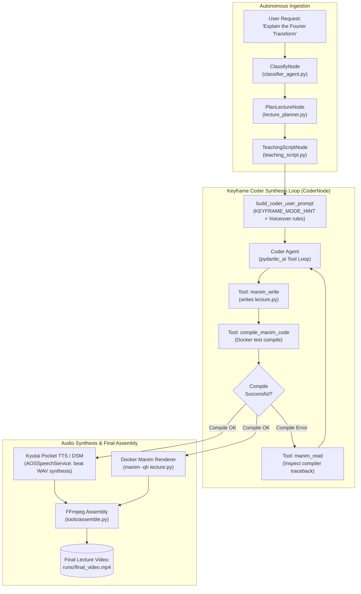

# Mode Specification: Keyframe Pipeline Mode (`keyframe`)

## 1. Purpose

Keyframe Pipeline Mode is the core operational engine of the autonomous multi-agent lecture system (`apps/agents`). Designed for generating complete, voice-narrated educational videos without human-in-the-loop intervention, it resolves the fundamental challenge of **audio-visual synchronization drift** in AI-generated animations. Rather than attempting frame-by-frame temporal calculations, Keyframe Mode models an animation as a **discrete state machine**: the scene progresses through an ordered sequence of visually stable keyframe states, each strictly bound to an accompanying narration segment through a Manim Voiceover context block (`with self.voiceover(text=...) as tracker:`). The visual elements transition into place and automatically hold on screen while the offline text-to-speech engine delivers the explanation. The final output is an audio-video multiplexed MP4 file with millisecond-aligned narration.

---

## 2. Trigger / Routing

Keyframe Mode is the **default operational mode** of the autonomous agent graph ([`apps/agents/agent_graph.py`](file:///c:/Users/nabin/Desktop/myall/AOS/apps/agents/agent_graph.py)) and the Animus CLI ([`apps/agents/cli.py`](file:///c:/Users/nabin/Desktop/myall/AOS/apps/agents/cli.py)).

In `apps/agents/cli.py`, the pipeline dispatcher initializes:
```python
async def _run_animate_pipeline(
    user_request: str,
    length: str = "medium",
    cinematic: bool = False,
    mode: str = "keyframe",
) -> dict:
    state = AnimateState(
        user_query=user_request,
        target_length=length,
        cinematic=cinematic_active,
        animation_mode=mode, # Defaults to "keyframe"
    )
```

### Heuristic Selection Criteria
1. **Autonomous Batch Ingestion**: Invoked whenever a lecture is initiated via the command line (`uv run python cli.py generate "<topic>"`).
2. **Audio-First Pacing**: Triggered when the user requests a complete explainer video with spoken narration rather than silent visual animations.
3. **Dispatcher Evaluation**: Unless overridden by `--cinematic` or routed to the interactive HITL web backend, all autonomous multi-agent pipeline tasks execute under Keyframe Mode.

---

## 3. Architecture

Keyframe Mode executes through a multi-agent graph coordinated by `pydantic_graph`:

```
[User Query]
     │
     ▼
[Stage 1: Classification]           ──► Produces Classification model (Subject, Domain)
     │
     ▼
[Stage 2: Pedagogical Lecture Plan] ──► Produces Lecture model (Objectives, Narrative Arc)
     │
     ▼
[Stage 3: Teaching Script Authoring]──► Produces TeachingScript model (Ordered beats & voiceovers)
     │
     ▼
[Stage 4: Keyframe Coder Agent]     ──► Produces lecture.py (VoiceoverScene + discrete hold blocks)
     │
     ▼
[Stage 5: Audio Synthesis & Mux]    ──► Pocket TTS / Kyutai DSM speech generation & FFmpeg assembly
     │
     ▼
[Final Output]                      ──► Multi-scene audio-visual MP4 video
```

### Stage Details

1. **Classification**:
   - **Inputs**: Raw query string.
   - **Outputs**: [`Classification`](file:///c:/Users/nabin/Desktop/myall/AOS/packages/ir/manim_ir.py) object (subject domain, difficulty tier, animatability).
   - **Mechanism**: Invokes [`classifier_agent`](file:///c:/Users/nabin/Desktop/myall/AOS/apps/agents/classifier_agent.py). Rejects non-pedagogical or non-visual queries.

2. **Pedagogical Lecture Planning**:
   - **Inputs**: Query and classification metadata.
   - **Outputs**: [`Lecture`](file:///c:/Users/nabin/Desktop/myall/AOS/apps/agents/lecture_planner.py) model outlining opening hook, core formulas, assumptions, and learning outcomes.
   - **Mechanism**: Invokes [`lecture_planner_agent`](file:///c:/Users/nabin/Desktop/myall/AOS/apps/agents/lecture_planner.py).

3. **Teaching Script Authoring**:
   - **Inputs**: `Lecture` outline.
   - **Outputs**: [`TeachingScript`](file:///c:/Users/nabin/Desktop/myall/AOS/apps/agents/teaching_script.py) containing an ordered list of `TeachingBeat` instances. Each beat pairs verbatim spoken narration with concrete visual staging instructions and `<bookmark mark="..."/>` temporal tags.
   - **Mechanism**: Invokes [`teaching_script_agent`](file:///c:/Users/nabin/Desktop/myall/AOS/apps/agents/teaching_script.py).

4. **Keyframe Coder Synthesis (Tool-Calling Loop)**:
   - **Inputs**: Compacted teaching script and output directory path.
   - **Outputs**: Valid `lecture.py` script subclassing `VoiceoverScene`.
   - **Mechanism**: Invokes [`coder_agent`](file:///c:/Users/nabin/Desktop/myall/AOS/apps/agents/coder_agent.py) with [`KEYFRAME_MODE_HINT`](file:///c:/Users/nabin/Desktop/myall/AOS/apps/agents/coder_prompt.py#L149). The agent writes code to disk using `manim_write`, compiles it iteratively using `compile_manim_code`, and inspects tracebacks via `manim_read`.

5. **Audio Synthesis & Multiplexing**:
   - **Inputs**: Compiled Manim scene and cached narration strings.
   - **Outputs**: Multi-track audio-visual MP4.
   - **Mechanism**: `AOSSpeechService` synthesizes beat audio via the resident 100M Kyutai Pocket TTS or DSM engine. `tools/assemble.py` executes `ffmpeg` to mux audio stems with the rendered visual frames.

---

## 4. Tools & Skill Calls

| Tool / Function Name | Pipeline Stage | Invocation Trigger & Arguments | Return Type / Output | Model & Configuration |
| :--- | :--- | :--- | :--- | :--- |
| **`classifier_agent.run`** | Stage 1 (Classification) | Classifies domain. Args: `user_query: str`. | `Classification` Pydantic model. | Cloud / Ollama LLM (`temperature=0.2`). |
| **`lecture_planner_agent.run`** | Stage 2 (Planning) | Generates outline. Args: `user_query`, `classification`. | `Lecture` Pydantic model. | Cloud / Ollama LLM (`temperature=0.2`). |
| **`teaching_script_agent.run`** | Stage 3 (Scripting) | Authoring beats. Args: `lecture_plan`. | `TeachingScript` model. | Cloud / Ollama LLM (`temperature=0.2`). |
| **`manim_write`** | Stage 4 (Code Writing) | Agent writes script to disk. Args: `code: str`, `path: str`. | String file write confirmation. | Local filesystem tool. |
| **`compile_manim_code`** | Stage 4 (Compilation) | Agent tests scene compilation. Args: `scene_file: str`, `scene_name: str`. | JSON: `{"ok": bool, "error": str, "duration": float}`. | Docker Manim container execution (`manim -ql`). |
| **`manim_read`** | Stage 4 (File Inspection) | Agent reads generated files. Args: `path: str`. | File text contents. | Local filesystem tool. |
| **`synthesize_narration`** | Stage 5 (Speech Synthesis)| Generates beat speech. Args: `text: str`, `voice="alba"`. | WAV audio file path. | Kyutai Pocket TTS / DSM CPU model. |
| **`assemble_video`** | Stage 5 (Muxing) | Muxes video and audio. Args: `video_path`, `audio_paths`. | Final MP4 video path. | Subprocess: `ffmpeg`. |

---

## 5. Data / State Passed Between Stages

### 5.1. Teaching Script Specification (`teaching_script.json`)
```json
{
  "scene_class_name": "FourierTransformLecture",
  "throughline": "Understanding how continuous signals decompose into sinusoids.",
  "beats": [
    {
      "id": "beat_1",
      "takeaway": "Introduce the time-domain signal",
      "visual": "Cartesian axes showing f(t) as a combined wave",
      "narration": "Every complex sound or vibration is simply an addition of pure frequencies.",
      "bookmark_marks": ["wave_drawn"]
    },
    {
      "id": "beat_2",
      "takeaway": "Present the Fourier transform integral",
      "visual": "Morph wave into the Fourier integral equation with frequency spectrum below",
      "narration": "The Fourier transform acts as a mathematical prism, unwrapping the hidden spectrum.",
      "bookmark_marks": ["integral_shown"]
    }
  ]
}
```

---

## 6. Mermaid Diagram



---

## 7. Failure Modes & Known Limitations

1. **Silent Animations Failing Validation**:
   - *Failure*: If the coding agent invokes `self.play(...)` outside of an enclosing `with self.voiceover(...) as tracker:` context, static validation rejects the code.
   - *Mitigation*: The system prompt contract strictly dictates: *"Silent self.play(...) without a voiceover block will fail static validation."* The compiler verification tool inspects the AST for un-tracked `self.play` nodes.
2. **Audio Model Cold-Start Latency**:
   - *Failure*: If the Pocket TTS or Kyutai DSM weights are not pre-warmed in memory, the initial speech synthesis call can exceed standard HTTP request timeouts.
   - *Mitigation*: AOS initializes a resident background worker for `AOSSpeechService` at process launch. If audio generation fails entirely, the pipeline gracefully falls back to video-only assembly without aborting.
3. **Bookmark Synchronization Desync**:
   - *Failure*: If the narration text defines `<bookmark mark="v1"/>` but the Manim script fails to call `self.wait_until_bookmark("v1")`, the visual animation finishes prematurely before the audio reaches the trigger phrase.
   - *Mitigation*: Coder prompt templates supply canonical dual-synchronization patterns tying animation run times to tracker durations (`run_time=tracker.duration`).

---

## 8. Concrete End-to-End Example

### User Query
> "Explain the Fourier Transform with audio narration."

### Intermediate Representation (`teaching_script.json` Excerpt)
```json
{
  "beats": [
    {
      "id": "beat_1",
      "narration": "The Fourier transform decomposes any function into a sum of pure frequencies.",
      "visual": "Render title and core integral equation centered on screen."
    }
  ]
}
```

### Generated ManimCE Python Code (`lecture.py`)
```python
from manim import *
from manim_voiceover import VoiceoverScene
from tools.aos_speech_service import AOSSpeechService

class FourierTransformLecture(VoiceoverScene):
    def construct(self):
        # 1. Initialize Speech Engine
        self.set_speech_service(
            AOSSpeechService(voice="alba", cache_dir="voiceover_cache")
        )

        # 2. Keyframe Beat 1: Core Definition
        title = Text("The Fourier Transform", font_size=42, color=BLUE_B).to_edge(UP, buff=0.6)
        formula = MathTex(
            r"\hat{f}(\xi) = \int_{-\infty}^{\infty} f(x) e^{-2\pi i x \xi} dx",
            font_size=40,
        ).move_to(ORIGIN)

        with self.voiceover(
            text="The Fourier transform decomposes any function into a sum of pure frequencies."
        ) as tracker:
            self.play(Write(title), run_time=1.0)
            self.play(FadeIn(formula, shift=UP * 0.3), run_time=tracker.duration - 1.0)

        self.wait(0.5)
```

### Resulting Output
An MP4 video rendering the Fourier transform integral while clear, synthesized speech delivers the voiceover in perfect synchronization with the equation's appearance.
