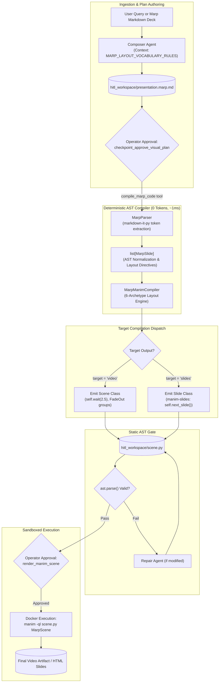

# Mode Specification: Marp Mode (`marp`)

## 1. Purpose

Marp Mode establishes a declarative bridge between Markdown slide authoring and programmatic mathematical animation. Instead of attempting open-ended, fragile translation of arbitrary CSS, Marp Mode treats **Marp Markdown** (`presentation.marp.md`) as a formal *plan format* and **Manim Community Edition** as a deterministic *renderer*. The system parses the Marp CommonMark Abstract Syntax Tree (AST) using `markdown-it-py` and deterministically maps each slide to one of **six fixed layout archetypes** (`title`, `bullets`, `two-col`, `code-focus`, `math-focus`, and `quote`). Marp Mode supports two distinct output targets: a standard rendered MP4 video (`class Scene(Scene)`) with automatic reading pauses and clean `FadeOut` transitions, or an interactive presentation deck (`class Presentation(Slide)`) powered by `manim-slides`, enabling presenters to advance animation stages using keyboard cues.

---

## 2. Trigger / Routing

Marp Mode is selected during Stage 1.5 mode configuration via [`checkpoint_select_mode`](file:///c:/Users/nabin/Desktop/myall/AOS/apps/ui/aos/backend/dev_hitl_web.py#L217).

```python
# In dev_hitl_web.py checkpoint_select_mode
mode_resp = ModeSelectionResponse(
    mode="marp",
    reason="Marp Markdown deck requested for presentation compilation.",
    marp_layout=kwargs.get("marp_layout", "hybrid"),
    marp_target=kwargs.get("marp_target", "video"), # "video" or "slides"
    marp_theme=kwargs.get("marp_theme", "default"),
)
```

### Heuristic Selection Criteria
1. **Document Syntax Detection**: Triggered automatically when the incoming prompt contains standard Marp directives:
   - Frontmatter containing `marp: true`.
   - Slide break separators (`---`).
   - HTML comment layout directives (e.g., `<!-- _class: two-col -->` or `<!-- _class: title -->`).
2. **User Directives**: Triggered when the user asks to "convert this markdown deck to Manim," "render my Marp presentation," or "generate a manim-slides deck."
3. **Operator Selection**: Configured through the interactive UI modal or CLI (`dev_hitl.py --mode marp`).

---

## 3. Architecture

Marp Mode provides a unique **dual-engine architecture**: a sub-millisecond **deterministic AST compiler** that bypasses LLM inference entirely for compliant decks, paired with an **agentic fallback** for custom refinement.

```
[User Query / Markdown Deck]
     │
     ▼
[Stage 1: Marp Plan Authoring / Ingestion]  ──► Produces presentation.marp.md
     │
     ▼
[Stage 2: Deterministic AST Compilation]     ──► markdown-it-py token parsing & layout mapping
     │                                            (app/services/marp_compiler.py)
     ▼
[Stage 3: Manim Script Generation]          ──► Produces scene.py (Scene or Slide target)
     │
     ▼
[Stage 4: Static AST Verification]          ──► Python AST & Pyright validation
     │
     ▼
[Stage 5: Rendering / Export]               ──► Video (Docker Manim) OR Interactive (manim-slides)
```

### Stage Details

1. **Plan Ingestion & Normalization**:
   - **Inputs**: User prompt or raw Marp Markdown.
   - **Outputs**: `presentation.marp.md` saved in `hitl_workspace/`.
   - **Mechanism**: If raw markdown is supplied, it is written directly; if a natural language prompt is given, `hitl_agents.get_composer_agent()` synthesizes compliant Marp CommonMark adhering to the 6 layout archetypes under [`MARP_LAYOUT_VOCABULARY_RULES`](file:///c:/Users/nabin/Desktop/myall/AOS/apps/ui/aos/backend/app/agents/hitl_agents.py#L130).

2. **Deterministic AST Parsing**:
   - **Inputs**: Raw `presentation.marp.md` content.
   - **Outputs**: Ordered `list[MarpSlide]` structured data models.
   - **Mechanism**: [`MarpParser`](file:///c:/Users/nabin/Desktop/myall/AOS/apps/ui/aos/backend/app/services/marp_compiler.py#L61) extracts top-level YAML frontmatter (`marp: true`, `theme: ...`, `voiceover: ...`), splits slides along `^---\s*$`, scans HTML comment directives (`<!-- _class: <layout> -->`), and walks the `markdown-it-py` token stream to extract headings, code fences, equations, and bullets.

3. **Deterministic Layout Compilation**:
   - **Inputs**: Structured `list[MarpSlide]` objects.
   - **Outputs**: Executable Manim Python script string.
   - **Mechanism**: [`MarpManimCompiler`](file:///c:/Users/nabin/Desktop/myall/AOS/apps/ui/aos/backend/app/services/marp_compiler.py#L198) translates each slide into clean ManimCE Python code using a fixed 6-archetype spatial vocabulary:
     - `title`: Large centered `Text` with `to_edge(UP, buff=0.8)` and offset subtitle.
     - `bullets`: `Title` at top, sequential `BulletedList` anchored left (`buff=1.0`).
     - `two-col`: Left column anchored at `LEFT * 3.5`, right column anchored at `RIGHT * 3.5`.
     - `code-focus`: Centerpiece syntax-highlighted `Code` window.
     - `math-focus`: Centerpiece `MathTex` formula accompanied by bulleted variable explanations.
     - `quote`: Italicized blockquote in `TEAL` with em-dash author attribution.

4. **Static Verification**:
   - **Inputs**: Synthesized `scene.py`.
   - **Outputs**: AST validation pass or repair bundle.
   - **Mechanism**: `ast.parse(code)` validates that the emitted Python script is syntactically sound.

5. **Rendering & Export**:
   - **Inputs**: Verified `scene.py`.
   - **Outputs**: MP4 video file or `manim-slides` presentation package.

---

## 4. Tools & Skill Calls

| Tool / Function Name | Pipeline Stage | Invocation Trigger & Arguments | Return Type / Output | Execution Mechanism |
| :--- | :--- | :--- | :--- | :--- |
| **`checkpoint_select_mode`** | Stage 1 (Mode Routing) | Configures Marp parameters. Args: `recommended_mode="marp"`, `marp_target="video"`, `marp_theme="default"`. | String confirmation; records `mode_selection.json`. | Deterministic checkpoint gate (operator approval required). |
| **`checkpoint_approve_visual_plan`** | Stage 1 (Plan Approval) | Approves Marp markdown plan. Args: `plan_markdown`, `topic`, `title`. | String confirmation; writes `presentation.marp.md`. | Pydantic AI Agent (`ComposerAgent`), `temperature=0.2`. Prompt: `MARP_LAYOUT_VOCABULARY_RULES`. |
| **`compile_marp_code`** | Stage 2 (Deterministic Compiler) | Compiles Marp AST into Manim. Args: `scene_name="GeneratedScene"`, `target="video"`. | Emitted `code: str`, `slide_count: int`. | Pure Python AST compiler ([`MarpManimCompiler`](file:///c:/Users/nabin/Desktop/myall/AOS/apps/ui/aos/backend/app/services/marp_compiler.py#L198)), sub-millisecond, 0 LLM tokens. |
| **`synthesize_manim_code`** | Stage 3 (Agentic Fallback) | Invoked if operator requests custom code changes. Args: `plan_markdown`, `scene_name`. | Synthesized `code: str`. | Pydantic AI Agent (`CoderAgent`), `temperature=0.0`. Prompt: `CODER_SYSTEM_PROMPT`. |
| **`render_manim_scene`** | Stage 5 (Rendering) | Operator approves rendering. Args: `scene_name`, `quality="l"`. | Video path, stream URL, duration. | Subprocess: `docker run manimcommunity/manim`. |

---

## 5. Data / State Passed Between Stages

### 5.1. Marp Presentation Plan (`presentation.marp.md`)
```markdown
---
marp: true
theme: default
voiceover: "Welcome to this lecture on neural optimization."
---

<!-- _class: title -->
# Deep Learning Optimization
### From Gradient Descent to Adam

---
<!-- _class: two-col -->
## SGD vs Batch Gradient Descent
- Faster iteration updates
- High variance noisy path

- Deterministic exact gradients
- High GPU memory overhead

---
<!-- _class: math-focus -->
## The Weight Update Equation
$$ w_{t+1} = w_t - \eta \nabla L(w_t) $$
- $\eta$ represents the learning rate
- $\nabla L$ is the gradient vector
```

### 5.2. Marp Compiler Internal Model (`MarpSlide`)
```python
class MarpSlide(BaseModel):
    index: int = 1
    layout: Literal["title", "bullets", "two-col", "code-focus", "math-focus", "quote"] = "bullets"
    title: str = "Deep Learning Optimization"
    subtitle: str | None = "From Gradient Descent to Adam"
    bullets: list[str] = []
    col1_items: list[str] = ["Faster iteration updates", "High variance noisy path"]
    col2_items: list[str] = ["Deterministic exact gradients", "High GPU memory overhead"]
    math_equations: list[str] = [" w_{t+1} = w_t - \\eta \\nabla L(w_t) "]
    voiceover: str | None = "Welcome to this lecture on neural optimization."
```

---

## 6. Mermaid Diagram



---

## 7. Failure Modes & Known Limitations

1. **Arbitrary CSS and HTML Directives**:
   - *Failure*: If the user inputs raw CSS classes (e.g. `<div style="display: flex; position: absolute; ...">`), Manim cannot parse browser CSS stylesheets, resulting in stripped styling.
   - *Mitigation*: The Marp compiler constrains the input to the 6 layout archetypes. Unrecognized directives safely fall back to the standard `"bullets"` layout archetype.
2. **Multi-Column Content Imbalance**:
   - *Failure*: In `"two-col"` mode, if Column 1 has 8 bullet points and Column 2 has 1 bullet point, the columns exhibit visual height asymmetry.
   - *Mitigation*: The compiler centers each column vertically (`col_group.move_to(ORIGIN)`) and clamps the inter-column separation buffer to `buff=0.8`.
3. **LaTeX Escape Syntax in Math-Focus Blocks**:
   - *Failure*: Math equations containing single backslashes in markdown (e.g. `\nabla` or `\eta`) can trigger Python string escape warnings or invalid LaTeX tokens.
   - *Mitigation*: `MarpManimCompiler` wraps all extracted math expressions inside raw string literals (`r"""..."""`) and sanitizes LaTeX escape sequences before code generation.

---

## 8. Concrete End-to-End Example

### Input Marp Deck (`presentation.marp.md`)
```markdown
---
marp: true
theme: default
---
<!-- _class: title -->
# Computational Linear Algebra
### Matrix Factorization Fundamentals

---
<!-- _class: code-focus -->
## NumPy QR Decomposition
```python
import numpy as np
A = np.array([[1, 2], [3, 4]])
Q, R = np.linalg.qr(A)
```
```

### Emitted ManimCE Python Code (`scene.py`)
```python
# Auto-generated by AOS MarpManimCompiler (Deterministic AST Engine)
from manim import *

class LinearAlgebraScene(Scene):
    def construct(self):
        # ── Slide 1: TITLE ──
        title_1 = Text("Computational Linear Algebra", font_size=48, color=BLUE_B)
        title_1.move_to(ORIGIN + UP * 0.8)
        subtitle_1 = Text("Matrix Factorization Fundamentals", font_size=28, color=GRAY_A)
        subtitle_1.next_to(title_1, DOWN, buff=0.4)
        slide_1_group = VGroup(title_1, subtitle_1)

        self.play(Write(title_1, run_time=0.8))
        self.play(FadeIn(subtitle_1, shift=0.2 * UP), run_time=0.6)
        self.wait(2.5)
        self.play(FadeOut(slide_1_group))
        self.wait(0.5)

        # ── Slide 2: CODE-FOCUS ──
        title_2 = Title("NumPy QR Decomposition", font_size=38, color=BLUE_C)
        title_2.to_edge(UP, buff=0.5)
        code_str = "import numpy as np\nA = np.array([[1, 2], [3, 4]])\nQ, R = np.linalg.qr(A)"
        code_box_2 = Code(code=code_str, language="python", font_size=22)
        code_box_2.next_to(title_2, DOWN, buff=0.5).move_to(ORIGIN + DOWN * 0.3)
        slide_2_group = VGroup(title_2, code_box_2)

        self.play(Write(title_2, run_time=0.8))
        self.play(Create(code_box_2, run_time=1.2))
        self.wait(2.5)
        self.play(FadeOut(slide_2_group))
```

### Resulting Output
An MP4 video rendering a title slide that smoothly clears, followed by a dark syntax-highlighted monospaced code window displaying the NumPy QR factorization code.
