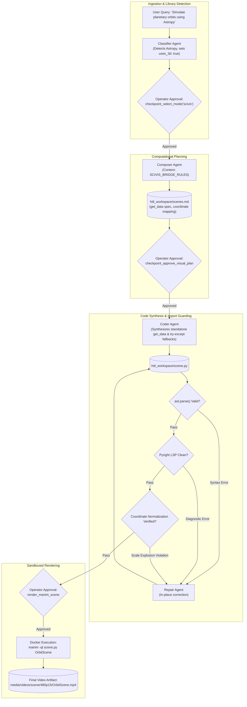

# Mode Specification: Science-Viz Mode (`scivis`)

## 1. Purpose

Science-Viz Mode bridges mathematical animation with real computational scientific Python libraries, enabling high-fidelity visualizations of computational physics, astrophysics, biochemistry, network theory, and empirical datasets. While standard animation modes rely purely on idealized mathematical equations, Science-Viz Mode interfaces directly with scientific computing libraries—including **NumPy**, **SciPy**, **Astropy**, **NetworkX**, and **Matplotlib**. The mode enforces a strict architectural boundary between data generation and visual rendering: all simulation or data-fetching logic is isolated inside a standalone `get_data()` function executed outside the Manim `Scene.construct()` method. Visual components explicitly map scientific data points into Manim primitives (`Sphere` for celestial bodies or atoms, `Line3D` for chemical bonds, `Dot` for graph nodes, and `ParametricFunction` for numerical orbital trajectories) while guaranteeing graceful synthetic data fallbacks and prominent data-provenance annotations.

---

## 2. Trigger / Routing

Science-Viz Mode is routed through [`checkpoint_select_mode`](file:///c:/Users/nabin/Desktop/myall/AOS/apps/ui/aos/backend/dev_hitl_web.py#L217) whenever user queries require external computational modeling or empirical scientific datasets.

### Heuristic Selection Criteria
1. **Explicit Library or Domain Mentions**: Triggered when the user request references domain libraries (e.g., "use astropy to plot orbits," "networkx graph visualization," "scipy numerical ODE simulation," "molecular structure").
2. **Pedagogical Classifier Extraction**: The [`ClassifierAgent`](file:///c:/Users/nabin/Desktop/myall/AOS/apps/ui/aos/backend/app/agents/hitl_agents.py#L87) inspects the query and populates:
   - `scivis_libraries: list[str]` (e.g. `["astropy", "scipy"]` or `["networkx"]`).
   - `scivis_domain: str` (e.g. `"astronomy"`, `"biochemistry"`, `"graph_theory"`).
   - `needs_3d: bool = True` for molecular or orbital spatial models.
3. **Dispatcher Logic**:
```python
# Evaluated in dev_hitl_web.py checkpoint_select_mode
if any(lib in query.lower() for lib in ["astropy", "networkx", "scipy", "rdkit", "data", "orbit"]):
    recommended_mode = "scivis"
```

---

## 3. Architecture

Science-Viz Mode implements a decoupled computational pipeline:

```
[User Query]
     │
     ▼
[Stage 1: Scientific Domain Classification] ──► Produces scivis_libraries & domain tags
     │
     ▼
[Stage 2: Scientific Plan Composition]     ──► Produces scenes.md with get_data() spec & mapping table
     │
     ▼
[Stage 3: Data-Bridged Code Synthesis]     ──► Produces scene.py (Standalone get_data + synthetic fallback)
     │
     ▼
[Stage 4: Static Verification & LSP]       ──► Pyright LSP check, coordinate normalization verify
     │
     ▼
[Stage 5: Sandboxed Docker Execution]      ──► Produces MP4 Video with data-provenance tag
```

### Stage Details

1. **Scientific Domain Classification**:
   - **Inputs**: User prompt.
   - **Outputs**: `classification.json` and `mode_selection.json` specifying `scivis_libraries`, `scivis_domain`, and 3D requirements.
   - **Mechanism**: Extracts target scientific packages and determines whether coordinate projection requires a 3D coordinate system (`ThreeDScene`).

2. **Scientific Plan Composition**:
   - **Inputs**: Classification metadata and domain tags.
   - **Outputs**: `scenes.md` detailing the computational contract:
     - Mathematical model formulation.
     - Standalone `get_data()` function signature.
     - Coordinate normalization formula (mapping astronomical or microscopic units into the Manim 16:9 frame $X \in [-7, 7]$, $Y \in [-4, 4]$).
     - Data provenance label.
   - **Mechanism**: Invokes `hitl_agents.get_composer_agent()` pre-injected with [`SCIVIS_BRIDGE_RULES`](file:///c:/Users/nabin/Desktop/myall/AOS/apps/ui/aos/backend/app/agents/hitl_agents.py#L580) and [`MODE_COMPOSER_HINTS["scivis"]`](file:///c:/Users/nabin/Desktop/myall/AOS/apps/ui/aos/backend/app/agents/hitl_agents.py#L630).

3. **Data-Bridged Code Synthesis**:
   - **Inputs**: Approved `scenes.md` plan.
   - **Outputs**: `scene.py` containing a standalone computational function `get_data() -> dict[str, Any]` followed by `class GeneratedScene(Scene)`.
   - **Mechanism**: Invokes `hitl_agents.get_coder_agent()` with context from [`get_scivis_tier1_context()`](file:///c:/Users/nabin/Desktop/myall/AOS/apps/ui/aos/backend/app/agents/hitl_agents.py#L747). The agent wraps external library imports in `try...except ImportError` blocks, automatically supplying synthetic NumPy mock data if the target environment lacks the specialized library.

4. **Static Verification & Type Checking**:
   - **Inputs**: Synthesized `scene.py`.
   - **Outputs**: Verified code or repair diagnostics.
   - **Mechanism**: Scans for coordinate normalization violations, unbound variables across `get_data()` and `construct()`, and syntax errors.

5. **Sandboxed Docker Execution**:
   - **Inputs**: Validated `scene.py`.
   - **Outputs**: MP4 video file.
   - **Mechanism**: Executes within a container environment pre-loaded with scientific computing packages.

---

## 4. Tools & Skill Calls

| Tool / Function Name | Pipeline Stage | Invocation Trigger & Arguments | Return Type / Output | Model & Configuration |
| :--- | :--- | :--- | :--- | :--- |
| **`checkpoint_approve_classification`** | Stage 1 (Classification) | Called after domain parsing. Args: `topic`, `subject`, `animatable`, `scene_type`. | String confirmation; records `classification.json`. | Pydantic AI Agent (`ClassifierAgent`), `temperature=0.2`. Prompt: `CLASSIFIER_SYSTEM_PROMPT`. |
| **`checkpoint_select_mode`** | Stage 1.5 (Mode Routing) | Called to set SciVis mode. Args: `recommended_mode="scivis"`, `scivis_libraries=["networkx"]`, `scivis_domain="graph_theory"`. | String confirmation; records `mode_selection.json`. | Deterministic checkpoint gate (operator approval required). |
| **`checkpoint_approve_visual_plan`** | Stage 2 (Plan Approval) | Approves computational plan. Args: `plan_markdown`, `topic`, `title`. | String confirmation; records `scenes.md`. | Pydantic AI Agent (`ComposerAgent`), `temperature=0.2`. Context: `SCIVIS_BRIDGE_RULES`. |
| **`synthesize_manim_code`** | Stage 3 (Code Synthesis) | Generates data-bridged code. Args: `plan_markdown`, `scene_name`, `topic`. | Synthesized `code: str`, detected `scene_name: str`. | Pydantic AI Agent (`CoderAgent`), `temperature=0.0`. Prompt: `CODER_SYSTEM_PROMPT` + `get_scivis_tier1_context()`. |
| **`read_skill_reference`** | Stage 3 (On-Demand Knowledge) | Called for data mapping reference. Args: `path="rules/graphing.md"` or `"rules/3d.md"`. | Reference documentation string. | Deterministic filesystem tool (`resolve_skill_reference_content`). |
| **`repair_manim_code`** | Stage 4 (Static Repair) | Triggered on static/LSP error. Args: `error`, `code`. | Corrected Python code. | Pydantic AI Agent (`RepairAgent`), `temperature=0.0`. Prompt: `REPAIR_SYSTEM_PROMPT`. |
| **`render_manim_scene`** | Stage 5 (Rendering) | Operator approves rendering. Args: `scene_name`, `quality="l"`. | Video path, stream URL, duration. | Subprocess: `docker run manimcommunity/manim`. |

---

## 5. Data / State Passed Between Stages

### 5.1. SciVis Mode Selection Schema (`mode_selection.json`)
```json
{
  "mode": "scivis",
  "reason": "Topic 'Keplerian Planetary Orbits' requires computational celestial mechanics calculations using Astropy.",
  "scivis_libraries": ["astropy", "scipy", "numpy"],
  "scivis_domain": "astronomy",
  "uses_3d": true,
  "uses_camera_movement": true
}
```

### 5.2. Visual Plan Specification (`scenes.md` Excerpt)
```markdown
# Keplerian Orbital Mechanics — Planetary Motion

## Computational Specifications
- **Scientific Libraries**: `astropy.coordinates`, `numpy`
- **Data Function**: `get_data()` computes elliptical orbit coordinates $(r, \theta)$ with eccentricity $e=0.6$.
- **Coordinate Normalization**: Orbit semi-major axis $a=5.0$, semi-minor axis $b=4.0$. Normalized to screen space: $X \in [-6.0, 6.0]$, $Y \in [-3.5, 3.5]$.
- **Data Provenance Tag**: "Data: Keplerian Two-Body Simulation (Astropy)" anchored at bottom edge.

## Mapping Dictionary
- Central Star $\to$ `Dot(point=axes.c2p(c, 0, 0), radius=0.2, color=YELLOW)`
- Orbit Path $\to$ `ParametricFunction(orbit_eq, color=BLUE_C)`
- Orbiting Planet $\to$ `Dot(radius=0.1, color=TEAL)`
```

---

## 6. Mermaid Diagram



---

## 7. Failure Modes & Known Limitations

1. **Host Environment Missing Scientific Packages**:
   - *Failure*: If the runtime container lacks a specialized package (e.g. `astropy` or `networkx`), a top-level import crashes the script with `ModuleNotFoundError`.
   - *Mitigation*: The `SCIVIS_BRIDGE_RULES` mandate that all scientific imports reside within `get_data()` surrounded by a `try...except ImportError` block that generates an identical mock dictionary using standard `numpy` or `math`.
2. **Astrophysical / Microscopic Coordinate Explosion**:
   - *Failure*: Real scientific data often uses non-visual units (e.g., $10^{11}$ meters for astronomical orbits or $10^{-10}$ meters for atomic bonds). Passing raw numbers directly to Manim throws camera bounds off into infinity.
   - *Mitigation*: Plan guidelines mandate explicit normalization formulas:
     $$\tilde{x} = \frac{x - x_{\min}}{x_{\max} - x_{\min}} \cdot W_{\text{frame}} - \frac{W_{\text{frame}}}{2}$$
     All transformed coordinates must lie within the safe 16:9 frustum ($[-7.0, 7.0] \times [-4.0, 4.0]$).
3. **Graph Topology Layout Collision in NetworkX**:
   - *Failure*: Generating dense graph networks ($>50$ nodes) with default spring layouts causes overlapping node dots and unreadable edge crossings.
   - *Mitigation*: Coder prompt advises restricting network demonstrations to $N \le 20$ nodes or using circular/kamada-kawai layout algorithms with an explicit bounding scale factor (`scale=3.0`).

---

## 8. Concrete End-to-End Example

### User Query
> "Visualize a 10-node scale-free network using NetworkX mapped into Manim."

### Intermediate Representation (`scenes.md` excerpt)
```markdown
# Scale-Free Network Topology

## Scientific Data Specification
- **Library**: `networkx`
- **Algorithm**: Barabási-Albert model ($n=10, m=2$).
- **Function**: `get_data()` returns node coordinates and edge index pairs.
```

### Generated ManimCE Python Code (`scene.py`)
```python
from manim import *

# ── Standalone Computational Data Generator ──────────────────────────────────
def get_data() -> dict:
    try:
        import networkx as nx
        # Generate Barabási-Albert scale-free graph
        G = nx.barabasi_albert_graph(n=10, m=2, seed=42)
        pos = nx.spring_layout(G, scale=3.0, seed=42)
        nodes = {node: [float(coord[0]), float(coord[1]), 0.0] for node, coord in pos.items()}
        edges = list(G.edges())
    except ImportError:
        # Graceful synthetic fallback
        import numpy as np
        nodes = {}
        for i in range(10):
            angle = i * (2 * np.pi / 10)
            nodes[i] = [float(3.0 * np.cos(angle)), float(2.2 * np.sin(angle)), 0.0]
        edges = [(i, (i + 1) % 10) for i in range(10)]
    
    return {"nodes": nodes, "edges": edges}


# ── Visual Animation Scene ───────────────────────────────────────────────────
class ScaleFreeNetworkScene(Scene):
    def construct(self):
        # 1. Title & Provenance Label
        title = Text("Scale-Free Network Topology", font_size=36, color=BLUE_B).to_edge(UP, buff=0.4)
        provenance = Text("Data: NetworkX Barabási-Albert Model (m=2)", font_size=18, color=GRAY_B).to_edge(DOWN, buff=0.3)
        self.play(Write(title), FadeIn(provenance))

        # 2. Fetch Computational Data
        data = get_data()
        node_positions = data["nodes"]
        edge_pairs = data["edges"]

        # 3. Create Node Mobjects
        node_mobjects = {}
        node_group = VGroup()
        for node_id, pos in node_positions.items():
            dot = Dot(point=pos, radius=0.12, color=YELLOW)
            node_mobjects[node_id] = dot
            node_group.add(dot)

        # 4. Create Edge Mobjects
        edge_group = VGroup()
        for u, v in edge_pairs:
            line = Line(start=node_positions[u], end=node_positions[v], color=TEAL, stroke_width=2.5)
            edge_group.add(line)

        # 5. Animate Network Assembly
        self.play(Create(edge_group), run_time=2.0)
        self.play(FadeIn(node_group, scale=1.5), run_time=1.5)
        self.wait(2.5)
```

### Resulting Output
An MP4 video rendering 10 yellow graph nodes interconnected by teal lines arranged in a spring layout. A title anchors the top edge, and a provenance tag ("Data: NetworkX Barabási-Albert Model") sits unobtrusively at the bottom edge.
