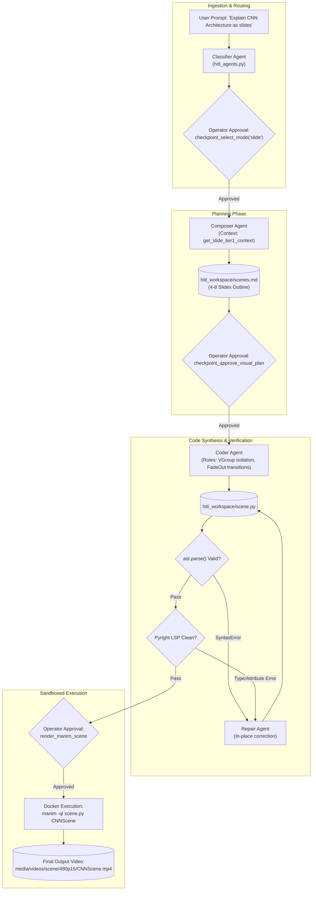

# Mode Specification: Slides Mode (`slide`)

## 1. Purpose

Slides Mode synthesizes structured, presentation-style educational animations designed for topics where information is best consumed through progressive visual disclosure rather than continuous motion. Unlike fluid mathematical transformations, this mode breaks down concepts into discrete, sequentially staged slides (typically 4 to 8 slides per video), encapsulating each slide's visual elements inside dedicated Manim `VGroup` containers. It targets user requests asking for "slide decks," "presentations," "step-by-step overviews," or structured comparisons. The final output is an MP4 video (rendered by Manim Community Edition) characterized by calm pacing, distinct 2-to-4-second reading pauses (`self.wait(2.5)`), progressive bullet/formula entrance animations (`Write`, `FadeIn`), and clean slide-clearing transitions (`FadeOut` of the active `VGroup`) that prevent visual clutter.

---

## 2. Trigger / Routing

In the Human-in-the-Loop web orchestrator ([`apps/ui/aos/backend/dev_hitl_web.py`](file:///c:/Users/nabin/Desktop/myall/AOS/apps/ui/aos/backend/dev_hitl_web.py)) and CLI runner ([`apps/ui/aos/backend/dev_hitl.py`](file:///c:/Users/nabin/Desktop/myall/AOS/apps/ui/aos/backend/dev_hitl.py)), mode routing occurs at **Stage 1.5** immediately following pedagogical classification.

The orchestrator invokes the human-approval tool [`checkpoint_select_mode`](file:///c:/Users/nabin/Desktop/myall/AOS/apps/ui/aos/backend/dev_hitl_web.py#L217):
```python
@agent.tool_plain(requires_approval=True)
def checkpoint_select_mode(
    recommended_mode: str = "animation",
    reason: str = "",
    scivis_libraries: list[str] | None = None,
    scivis_domain: str = "",
    uses_3d: bool | None = None,
    uses_camera_movement: bool | None = None,
    **kwargs: Any,
) -> str:
    """[HITL Checkpoint 1.5] Request human operator confirmation or choice for animation mode.
    Available Modes: 'slide', 'animation', 'scivis', 'marp'.
    """
```

### Routing Heuristics
The orchestrator agent's system prompt enforces the following decision rule:
1. **Explicit Lexical Cues**: If the user prompt explicitly requests "slides", "slide deck", "presentation", "bullet points", or "lecture slides", `recommended_mode` is set to `"slide"`.
2. **Pedagogical Classification Cues**: If [`VideoClassifyResponse`](file:///c:/Users/nabin/Desktop/myall/AOS/apps/ui/aos/backend/app/schemas/video_generation.py#L42) indicates that the subject matter consists of categorized taxonomies, architectural stages, or comparative pros/cons without continuous geometric deformation, the agent recommends `"slide"`.
3. **Operator Override**: The human operator can override the agent's suggestion and force `"slide"` mode through the interactive modal or CLI prompt (`dev_hitl.py --mode slide`).

---

## 3. Architecture

Slides Mode executes across five sequential stages:

```
[User Query] 
     │
     ▼
[Stage 1: Classification & Mode Selection] ──► Produces classification.json & mode_selection.json
     │
     ▼
[Stage 2: Slide Plan Composition]          ──► Produces scenes.md (Slide-structured plan)
     │
     ▼
[Stage 3: Code Synthesis]                  ──► Produces scene.py (VGroup per slide, FadeOut cleanup)
     │
     ▼
[Stage 4: Static Verification & Repair]    ──► AST Parsing, Pyright LSP check, Repair Loop
     │
     ▼
[Stage 5: Sandboxed Docker Rendering]      ──► Produces 1080p/480p MP4 Video
```

### Stage Details

1. **Classification & Mode Ingestion**:
   - **Inputs**: User prompt text.
   - **Outputs**: `classification.json` (subject, animatability flag) and `mode_selection.json` (`{"mode": "slide", ...}`).
   - **Mechanism**: Invokes `hitl_agents.get_classifier_agent()`. Once approved by the operator via `checkpoint_select_mode`, the selection is written to the [`HitlWorkspace`](file:///c:/Users/nabin/Desktop/myall/AOS/apps/ui/aos/backend/app/core/local_logging.py#L25).

2. **Slide Plan Composition**:
   - **Inputs**: Confirmed topic, subject, and mode directives.
   - **Outputs**: `scenes.md` containing 4 to 8 sequentially numbered slide specifications.
   - **Mechanism**: Invokes `hitl_agents.get_composer_agent()`. Pre-injects [`MODE_COMPOSER_HINTS["slide"]`](file:///c:/Users/nabin/Desktop/myall/AOS/apps/ui/aos/backend/app/agents/hitl_agents.py#L607) instructing the LLM to format each scene as an independent slide with explicit `VGroup` definitions, entrance pacing, and exit fade-outs.

3. **Code Synthesis**:
   - **Inputs**: Approved `scenes.md` plan and slide layout rules.
   - **Outputs**: Complete `scene.py` script containing a single `Scene` subclass.
   - **Mechanism**: Invokes `hitl_agents.get_coder_agent()` with context from [`get_slide_tier1_context()`](file:///c:/Users/nabin/Desktop/myall/AOS/apps/ui/aos/backend/app/agents/hitl_agents.py#L723). The prompt explicitly forbids continuous updaters (`always_redraw`) and mandates relative spatial positioning (`.next_to`, `.to_edge`) with slide groups.

4. **Static Verification & Repair Loop**:
   - **Inputs**: Raw synthesized `scene.py`.
   - **Outputs**: Cleaned, verified code or an error traceback.
   - **Mechanism**: Code is checked against `ast.parse()`, scanned by a headless Pyright LSP instance, and evaluated by the coordinate sanitizer. If invalid methods or 2D coordinate lists are detected, `hitl_agents.get_repair_agent()` executes an in-place patch.

5. **Sandboxed Docker Rendering**:
   - **Inputs**: Validated `scene.py`.
   - **Outputs**: Rendered MP4 video artifact.
   - **Mechanism**: Invokes `render_manim_scene` tool, which spins up a cached Docker container running `manim -ql scene.py <SceneClass>` (or `-qh` for high-definition).

---

## 4. Tools & Skill Calls

| Tool / Function Name | Pipeline Stage | Invocation Trigger & Arguments | Return Type / Output | Model & Configuration |
| :--- | :--- | :--- | :--- | :--- |
| **`checkpoint_approve_classification`** | Stage 1 (Classification) | Called after classifying query. Args: `topic`, `subject`, `animatable`, `scene_type`. | String confirmation; records `classification.json`. | Pydantic AI Agent (`ClassifierAgent`), `temperature=0.2`. Prompt: `CLASSIFIER_SYSTEM_PROMPT`. |
| **`checkpoint_select_mode`** | Stage 1.5 (Mode Routing) | Called to set animation mode. Args: `recommended_mode="slide"`, `reason=str`. | String confirmation; records `mode_selection.json`. | Deterministic checkpoint gate (operator approval required). |
| **`checkpoint_approve_visual_plan`** | Stage 2 (Plan Approval) | Called after composing slide outline. Args: `plan_markdown`, `topic`, `title`. | String confirmation; records `scenes.md`. | Pydantic AI Agent (`ComposerAgent`), `temperature=0.2`. Context: `get_slide_tier1_context()`. |
| **`synthesize_manim_code`** / **`generate_and_validate_manim_code`** | Stage 3 (Code Synthesis) | Called to generate code. Args: `plan_markdown`, `scene_name`, `topic`. | Synthesized `code: str`, detected `scene_name: str`. | Pydantic AI Agent (`CoderAgent`), `temperature=0.0`. Prompt: `CODER_SYSTEM_PROMPT` + slide guidelines. |
| **`read_skill_reference`** | Stage 3 (On-Demand Knowledge) | Called if coder needs reference. Args: `path="rules/positioning.md"`. | Content of requested skill Markdown file. | Deterministic filesystem tool (`resolve_skill_reference_content`). |
| **`repair_manim_code`** | Stage 4 (Static Repair) | Triggered when Pyright LSP or AST validation fails. Args: `error`, `code`. | Corrected Python code block. | Pydantic AI Agent (`RepairAgent`), `temperature=0.0`. Prompt: `REPAIR_SYSTEM_PROMPT`. |
| **`render_manim_scene`** | Stage 5 (Rendering) | Operator approves final render. Args: `scene_name`, `quality="l"`. | Video path, stream URL, render duration. | Subprocess execution: `docker run manimcommunity/manim`. |

---

## 5. Data / State Passed Between Stages

### 5.1. Mode Selection Schema (`mode_selection.json`)
```json
{
  "mode": "slide",
  "reason": "Topic 'Convolutional Neural Networks' is structured into discrete architecture layers suitable for a slide presentation.",
  "scivis_libraries": [],
  "scivis_domain": "ai",
  "uses_3d": false,
  "uses_camera_movement": false,
  "slide_count": 5
}
```

### 5.2. Visual Plan Specification (`scenes.md` Abbreviated)
```markdown
# Convolutional Neural Networks — Architecture Overview

## Overview
- **Topic**: Convolutional Neural Networks
- **Target Audience**: Undergraduate CS students
- **Format**: Slide Presentation (5 Slides)

---

## Scene 1: Slide 1 — The Problem of Spatial Invariance
**Duration**: ~12 seconds
**Purpose**: Introduce why dense networks fail on 2D images.
### Visual Elements
- Title: "Spatial Invariance in Vision" (top edge)
- BulletedList:
  * Dense layers destroy 2D spatial locality
  * Parameter explosion on high-resolution inputs
  * Need for weight sharing and localized kernels
### Technical Notes
- Anchor title with `.to_edge(UP, buff=0.5)`
- Group elements into `slide_1 = VGroup(title, bullets)`
- Transitions: FadeOut(slide_1) at end of slide

---

## Scene 2: Slide 2 — The Convolutional Kernel
...
```

---

## 6. Mermaid Diagram



---

## 7. Failure Modes & Known Limitations

1. **Slide Overlap & Visual Bleed**:
   - *Failure*: If the coding agent fails to call `self.play(FadeOut(slide_group))` before instantiating the subsequent slide, mobjects accumulate on screen, leading to unreadable text collisions.
   - *Mitigation*: The pre-injected rules explicitly instruct: *"Group each slide's elements in a VGroup and FadeOut the whole group before proceeding to the next slide."* Static validation checks for `FadeOut` calls matching declared `VGroup` variables.
2. **Text Font Size Clipping**:
   - *Failure*: In slides with more than 4 bullet points, text strings formatted with default font sizes can exceed the 16:9 vertical frame boundary ($Y \in [-4.0, 4.0]$).
   - *Mitigation*: Coder prompt enforces `font_size \le 28` for bullet lists and `font_size \le 38` for slide titles, paired with relative layout anchoring (`.next_to(..., DOWN, buff=0.4)`).
3. **Absence of Native Pause Interactivity in Plain Video**:
   - *Limitation*: When rendered as a raw video (`Scene`), the slide pauses are hardcoded (`self.wait(2.5)`). If the presenter requires manual click-to-advance interactivity, the user must select [**Marp Mode**](marp-mode.md) targeting `manim-slides`.

---

## 8. Concrete End-to-End Example

### User Query
> "Create a 3-slide presentation introducing Gradient Descent in machine learning."

### Intermediate Representation (`scenes.md` excerpt)
```markdown
# Gradient Descent Fundamentals

## Scene 1: Slide 1 — Core Optimization Goal
- **Elements**: Title, mathematical objective function $\min_\theta L(\theta)$, and intuition bullet.
- **Layout**: Title at top, formula centered, bullet below.
- **Pacing**: Write title (0.8s), FadeIn formula (1.0s), wait 2.5s, FadeOut slide 1.

## Scene 2: Slide 2 — The Update Rule
- **Elements**: Update formula $\theta_{t+1} = \theta_t - \eta \nabla L(\theta_t)$, parameter definitions.
- **Layout**: Centered MathTex with explanation labels.
```

### Generated ManimCE Python Code (`scene.py`)
```python
from manim import *

class GradientDescentScene(Scene):
    def construct(self):
        # ── Slide 1: Core Goal ──
        title_1 = Text("Optimization Goal", font_size=40, color=BLUE_C).to_edge(UP, buff=0.5)
        formula_1 = MathTex(r"\min_{\theta} L(\theta)", font_size=44).shift(UP * 0.5)
        bullet_1 = Text("Find parameters that minimize loss", font_size=26, color=GRAY_B)
        bullet_1.next_to(formula_1, DOWN, buff=0.6)
        
        slide_1 = VGroup(title_1, formula_1, bullet_1)
        self.play(Write(title_1), run_time=0.8)
        self.play(FadeIn(formula_1, shift=UP * 0.2))
        self.play(Write(bullet_1))
        self.wait(2.5)
        self.play(FadeOut(slide_1))
        self.wait(0.5)

        # ── Slide 2: Update Rule ──
        title_2 = Text("The Parameter Update Rule", font_size=40, color=BLUE_C).to_edge(UP, buff=0.5)
        formula_2 = MathTex(
            r"\theta_{t+1} = \theta_t - \eta \nabla L(\theta_t)", 
            font_size=42
        ).shift(UP * 0.5)
        note_2 = Text("Step in the negative gradient direction", font_size=26, color=YELLOW)
        note_2.next_to(formula_2, DOWN, buff=0.6)
        
        slide_2 = VGroup(title_2, formula_2, note_2)
        self.play(Write(title_2), run_time=0.8)
        self.play(FadeIn(formula_2, shift=UP * 0.2))
        self.play(Write(note_2))
        self.wait(2.5)
        self.play(FadeOut(slide_2))
```

### Resulting Output
An MP4 video rendering two crisp, centered slides with navy/yellow accents. Slide 1 constructs its title, objective equation, and subtitle, holds for 2.5 seconds, smoothly clears the canvas, and yields to Slide 2's parameter update equation.
