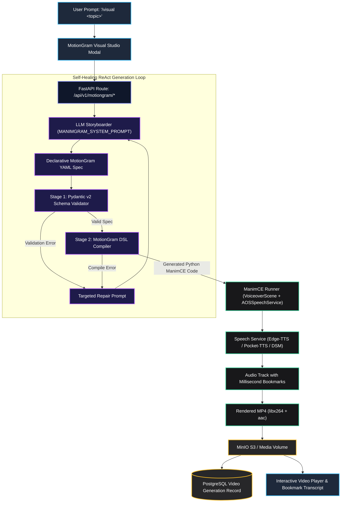
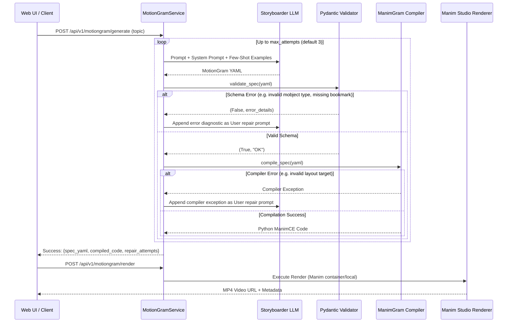

# MotionGram: Declarative Kinetic Teaching Animation Architecture

This document provides a comprehensive technical guide to **MotionGram**, the declarative animation engine in the Agentic Orchestration System (AOS). MotionGram enables the generation of short, deterministic, and frame-accurately synchronized ManimCE explainer videos with natural voice narration.

---

## 1. Executive Summary: What is MotionGram?

While large language models (LLMs) can generate raw Python code for Manim, direct imperative Python generation frequently suffers from:
1. **Spatial Overlap & Boundary Violations**: Objects placed off-screen or colliding due to raw coordinate calculations.
2. **Audio-Visual Desynchronization**: Animations firing at arbitrary second timestamps rather than exactly when key pedagogical terms are spoken.
3. **Runtime Python Crashes**: Incompatible API calls, missing imports, or incorrect scene inheritance.

**MotionGram solves this by introducing a Declarative Animation DSL (YAML/JSON)**:
* **Separation of Content and Engine**: The LLM specifies *what* appears (`mobjects`), *what is spoken* (`narration`), and *when it reacts* (`timeline` actions tied to speech bookmarks).
* **Guaranteed Determinism**: The DSL compiler maps high-level declarative primitives to battle-tested Manim Community Edition code.
* **Kinetic Speech Synchronization**: Spoken narration embeds `<bookmark mark='...'/>` tags; visual actions wait for those bookmarks via `wait_until_bookmark(mark)`.
* **Autonomous Self-Healing Loop**: Output is validated against a strict Pydantic v2 schema and pre-compiled before rendering; any errors trigger automatic reflection and repair.

---

## 2. End-to-End System Architecture



---

## 3. The MotionGram Declarative DSL

A MotionGram document is a structured YAML or JSON document adhering to the `ManimGramScene` schema. It contains three primary sections: `scene`, `mobjects`, and `timeline`.

### Anatomy of a MotionGram YAML Document

```yaml
scene:
  class_name: BayesTheoremExplainer
  type: VoiceoverScene          # Enables audio-visual synchronization
  voiceover:
    service: AOSSpeechService
    voice: alba
    cache_dir: voiceover_cache

mobjects:
  - id: title
    type: Text
    params:
      text: "Bayes' Theorem"
      font_size: 44
      color: "#38bdf8"
    layout:
      to_edge: UP

  - id: formula
    type: MathTex
    params:
      tex: "P(A|B) = \\frac{P(B|A) \\cdot P(A)}{P(B)}"
      font_size: 40
    layout:
      next_to:
        target: title
        direction: DOWN
        buff: 0.8

  - id: prior_box
    type: SurroundingRectangle
    params:
      target: formula
      color: "#fbbf24"
      buff: 0.15

timeline:
  - action: speech
    text: "In probability theory, <bookmark mark='intro'/> Bayes' Theorem updates our belief in a hypothesis <bookmark mark='show_formula'/> based on new evidence. Here, <bookmark mark='highlight_prior'/> the prior represents our initial degree of belief."

  - action: wait_until_bookmark
    bookmark: intro

  - action: reveal
    target: title
    animation: Write
    run_time: 1.0

  - action: wait_until_bookmark
    bookmark: show_formula

  - action: reveal
    target: formula
    animation: FadeIn
    run_time: 1.2

  - action: wait_until_bookmark
    bookmark: highlight_prior

  - action: indicate
    target: prior_box
    color: "#fbbf24"
    run_time: 1.0

  - action: wait
    duration: 1.5
```

---

## 4. Kinetic Voice Narration & Bookmark Synchronization

Traditional video generation relies on pre-calculating animation durations or rendering audio and video separately, which causes visual cues to lag or lead speech. MotionGram uses **Kinetic Bookmark Synchronization**:

### 1. In-Line `<bookmark mark='...'/>` Tags
Narration scripts contain lightweight XML bookmark tags positioned immediately preceding the visual reveal:
```text
"When the frequency increases <bookmark mark='freq_up'/>, the wavelength compresses <bookmark mark='wave_shrink'/>."
```

### 2. Multi-Backend Speech Services
Through `AOSSpeechService` and Dytto, MotionGram supports four speech engines:
* **Edge-TTS** (Default): High-speed, high-fidelity neural voices with zero local GPU overhead.
* **Pocket TTS**: Resident 100M CPU Kyutai model for fully offline environments.
* **Kyutai DSM (Delayed Streams Modeling)**: Word-level alignment and natural prosody.
* **Kitten TTS**: Ultra-lightweight local fallback.

### 3. Execution Mechanics
When `compile_dsl` generates the Python script, it emits:
```python
with self.voiceover(text=narration_text) as tracker:
    self.wait_until_bookmark("freq_up")
    self.play(freq_indicator.animate.scale(1.5), run_time=0.8)
    self.wait_until_bookmark("wave_shrink")
    self.play(Transform(wave, compressed_wave), run_time=1.0)
```
The Manim Voiceover tracker pauses or extends scene hold frames until the audio stream reaches the exact timestamp of each bookmark.

---

## 5. The Self-Healing ReAct Reflection Loop

To ensure reliability, the backend (`MotionGramService.generate_with_healing`) executes an autonomous self-healing loop:



### Validation Layers:
1. **Schema Validation**: Ensures all mobject identifiers are unique, layout references point to existing objects, and bookmark names in the timeline match bookmarks in the speech action.
2. **Compiler Preflight**: Executes `compile_dsl` in memory to verify that AST generation and Manim code construction succeed before consuming compute for video rendering.
3. **Targeted Repair Prompting**: When validation fails, `format_repair_prompt` generates structured feedback showing exactly what failed, allowing the model to self-correct in 1 turn.

---

## 6. Frontend & User Experience Integration

MotionGram is directly accessible from the AOS Web Interface:

### 1. `/visual` Slash Command
Typing `/visual <topic>` or `/mg <topic>` in the chat bar immediately launches the **MotionGram Visual Studio Modal** with the prompt pre-populated.

### 2. Video Generation Mode Dropdown
In **Chat Controls**, switching the video mode to **MotionGram Visual (/visual)** routes prompts sent in the chat conversation directly into the MotionGram synthesis pipeline.

### 3. MotionGram Visual Studio Modal (`motiongram-visual-modal.tsx`)
The Studio Modal provides a unified control center featuring:
* **Audio & Voice Selector**: Choose between Edge-TTS (`alba`, `andrew`, `brian`, etc.), Pocket-TTS, or Kyutai DSM.
* **Live Pipeline Badges**: Real-time status indicators across the 5 stages:
  1. *Storyboard*: LLM drafting declarative YAML.
  2. *Schema Validation*: Pydantic v2 compliance check.
  3. *Self-Healing*: Dynamic repair iterations if warnings arise.
  4. *Compilation*: Python ManimCE script generation.
  5. *Rendering*: Video generation and audio muxing.
* **Interactive Tabs**:
  * **Video Player**: High-definition video playback with speed control, seek bar, and download button.
  * **Narration Transcript**: Display of spoken narration with interactive clickable `<bookmark>` chips highlighting synchronized animation moments.
  * **MotionGram YAML Editor**: Full YAML editor allowing manual parameter adjustments and instant re-validation.
  * **Compiled Code Tab**: Read-only Python ManimCE code view for advanced developers.
  * **Diagnostics Tab**: Complete log of validation checks, repair attempts, and compiler outputs.

---

## 7. Comparison: MotionGram vs Other AOS Video Engines

| Attribute | MotionGram (`/visual`) | Keyframe Engine (`/animate`) | Interactive Agent Graph | LectureIR Pipeline (`cli.py`) |
| :--- | :--- | :--- | :--- | :--- |
| **Input Format** | High-level YAML/JSON DSL | Multi-slide Python templates | Freeform Tool-Calling Python | Pydantic `LectureIR` DAG |
| **Voice Sync** | Frame-accurate `<bookmark/>` tags | Post-render `tpad` hold freeze | In-scene voiceover tracker | Audio muxing per beat |
| **Typical Duration** | 15–45 seconds | 20–60 seconds | 30–90 seconds | 3–10 minutes |
| **Failure Recovery** | Fast DSL reflection loop (1–2s) | Retry slide synthesis | Code Mode repair loop | Validate ⇄ Repair DAG node |
| **Primary Strength** | Maximum reliability, zero hallucinations | Parallel slide rendering speed | Complex custom algorithmic logic | Full structured curriculum lectures |
| **Trigger Mechanism** | `/visual` command & Studio tab | `/animate` command & Studio modal | Chat Agent Video Mode | Terminal CLI & Batch runner |

---

## 8. REST API Reference

The MotionGram engine exposes a dedicated REST API under `/api/v1/motiongram`:

* `GET /api/v1/motiongram/schema`: Returns the full JSON Schema, system prompt, and few-shot examples.
* `POST /api/v1/motiongram/validate`: Validates a YAML specification against `ManimGramScene` without rendering.
* `POST /api/v1/motiongram/compile`: Compiles a YAML specification into Python ManimCE code.
* `POST /api/v1/motiongram/generate`: Generates and repairs a YAML specification from a natural language topic.
* `POST /api/v1/motiongram/render`: Compiles and renders an approved YAML specification into an MP4 video.
* `POST /api/v1/motiongram/generate-and-render`: One-shot end-to-end endpoint (topic → self-healing YAML → compilation → MP4 video).
