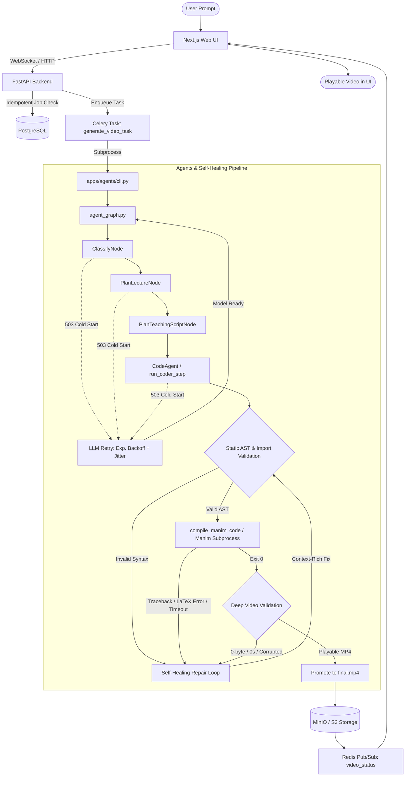

# AOS Robust Generation Pipeline — Technical Guide & Reliability Architecture

This document details the fault-tolerant, self-healing pipeline that powers prompt-to-video generation in the Agentic Orchestration System (AOS). It outlines how transient infrastructure failures, cold starts, rendering exceptions, and video corruption are automatically detected, classified, repaired, and gracefully communicated to users.

---

## 1. System Architecture

The AOS generation pipeline spans the web frontend, backend Celery workers, the Pydantic AI agent graph, and the Manim rendering engine:



---

## 2. Generation State Machine

Generation jobs are tracked as explicit, deterministic states rather than a single monolithic request:

| State | Type | Description | Human-Facing UI Message |
| :--- | :--- | :--- | :--- |
| `QUEUED` | Normal | Job enqueued in database and worker queue | *"Queued — waiting for an available worker…"* |
| `WAITING_FOR_LLM` | Transient | Verifying model endpoint readiness | *"Checking AI service availability…"* |
| `LLM_COLD_START` | Recoverable | Model container scaling up from zero (HTTP 503) | *"Starting the AI model… The model was temporarily asleep and is waking up."* |
| `LLM_RETRYING` | Recoverable | Exponential backoff active after transient error | *"The AI service is waking up. Retrying automatically… (Attempt X of Y)"* |
| `GENERATING_CODE` | Normal | LLM writing Manim Python code | *"Writing animation code…"* |
| `VALIDATING_CODE` | Normal | AST syntax and scene structure pre-validation | *"Validating animation code syntax…"* |
| `CODE_REPAIRING` | Recoverable | Self-healing loop diagnosing and fixing error | *"The generated animation had a rendering issue. AOS is fixing the code automatically…"* |
| `RENDERING` | Normal | Subprocess running Manim with low-quality flags | *"Rendering animation scene…"* |
| `RENDER_RETRYING` | Recoverable | Re-rendering scene after code repair | *"Re-rendering repaired animation…"* |
| `VALIDATING_VIDEO` | Normal | Probing MP4 file size, duration, and video stream | *"Validating output animation video…"* |
| `VIDEO_VALIDATION_FAILED` | Recoverable | Output video 0-byte or corrupt; triggers repair | *"The rendered video was incomplete. Regenerating scene…"* |
| `COMPLETED` | Terminal Success | Valid MP4 stored and ready to stream | *"Animation generated successfully."* |
| `FAILED` | Terminal Failure | All recovery attempts and retry budget exhausted | *"We couldn't generate the animation after several automatic recovery attempts. Your prompt was saved."* |

---

## 3. LLM Retry Strategy & 503 / Cold-Start Handling

### The Problem
Serverless GPU endpoints (such as Modal or scaled-down cloud instances) scale to zero when idle. The first request returns **HTTP 503 Service Unavailable** while the container boots, downloads model weights, and initializes CUDA.

### The Solution (`apps/agents/llm_retry.py`)
1. **Detection**: `error_classifier.py` inspects exceptions and response codes. Patterns matching `503`, `502`, `504`, or serverless startup indicators are marked as `TRANSIENT_LLM_ERROR`.
2. **State Transition**: The job transitions to `LLM_COLD_START` and emits a human-readable notification:
   > *"Starting the AI model… The model was temporarily asleep and is waking up automatically."*
3. **Exponential Backoff with Full Jitter**:
   $$\text{delay} = \min\left(\text{base} \times 1.8^{\text{attempt} - 1} + \text{jitter}, \text{max\_delay}\right)$$
   Defaults: `LLM_BACKOFF_BASE = 2.0s`, `LLM_BACKOFF_MAX = 30.0s`, `LLM_MAX_RETRIES = 6`.
4. **Transparent Resolution**: Once the container warms up, the call succeeds and generation transitions directly to `GENERATING_CODE`. The user never needs to press Generate again.

---

## 4. Centralized Error Classification (`error_classifier.py`)

Every error is categorized into a typed `ErrorCategory`:

```text
TRANSIENT_LLM_ERROR   -> Retry automatically with backoff
RATE_LIMIT            -> Retry with backoff (429)
AUTHENTICATION_ERROR  -> Fatal; prompt for API key configuration
NETWORK_ERROR         -> Retry with reconnection attempts
LLM_INVALID_RESPONSE  -> Retry generation
CODE_GENERATION_ERROR -> Trigger code repair
CODE_VALIDATION_ERROR -> Trigger code repair
MANIM_RENDER_ERROR    -> Trigger code repair
RENDER_TIMEOUT        -> Trigger code repair with complexity reduction
VIDEO_VALIDATION_ERROR-> Trigger code repair
STORAGE_ERROR         -> Retry upload
INTERNAL_ERROR        -> Controlled failure with saved prompt
```

---

## 5. Self-Healing Manim Code Repair Loop (`code_repair.py`)

When rendering fails, generation does not terminate. Instead, AOS enters a self-healing repair cycle (`CODE_REPAIR_MAX_ATTEMPTS = 3`):

### 1. Static Pre-Validation Before Rendering
Prior to running the heavy Manim subprocess, `validate_manim_code_static` parses the Python Abstract Syntax Tree (AST):
- Catches syntax errors (unclosed parentheses, indentation errors).
- Verifies that a valid `Scene` or `VoiceoverSlideScene` class definition exists.
- Checks voiceover rules (speech service setup, voiceover blocks).
- Rejects recursive sandbox calls (`run_code`).

### 2. Context-Rich Repair Prompting
When a failure occurs, the repair model is provided with:
- The **Original User Prompt** (preserving intent).
- The **Broken Code**.
- The **Exact Compiler Diagnostic / Traceback**.
- The **Attempt Counter** (e.g. `Attempt 1 of 3`).
- Strict constraints: fix the root cause, return the complete file, and fall back to `Text` if LaTeX environment issues arise.

### 3. Isolated Attempt Staging
Each repair attempt runs in an isolated directory (`repair_attempt_1/`, `repair_attempt_2/`). Stale partial files are never served. Only after a repair compiles and passes video validation are its artifacts promoted to `final.mp4`.

---

## 6. Deep Video Output Validation (`video_validator.py`)

A successful return code (`0`) from a rendering subprocess does **not** guarantee a playable video. AOS verifies:
1. **File Existence**: File must exist on disk.
2. **Minimum File Size**: File size must exceed `MIN_VIDEO_SIZE_BYTES` (default 1024 bytes).
3. **Stream Probing**: Using `ffprobe` (or MP4 box atom inspection if ffprobe is absent):
   - At least one active video stream must exist.
   - Video duration must be strictly greater than $0.05$ seconds.
   - Resolution and container format must be valid.
4. If validation fails, `VIDEO_VALIDATION_FAILED` triggers the self-healing repair loop rather than presenting a broken video to the user.

---

## 7. Frontend UX & Developer Drawer (`video-result.tsx`)

A critical principle of reliability is **user trust**. Raw infrastructure noise is separated from user guidance:

- **No Raw Leakage**: The user is never shown raw `HTTP 503`, `CUDA out of memory`, or `Traceback (most recent call last)`.
- **Informative Badges**: Status cards show contextual badges (`Model Booting`, `Self-Healing`, `Animation Ready`).
- **Preserved User Prompt**: If generation ultimately fails after exhausting all retries, the user's prompt is displayed in a dedicated block with a **"Copy Prompt"** button.
- **Developer / Diagnostic Details Accordion**: Full technical details (Job ID, Failed Stage, Raw Diagnostics) are tucked into an expandable `<details>` drawer for engineers and advanced debugging.
- **Idempotent Submission**: Duplicate "Generate" clicks are debounced and re-attached to the active job rather than spawning duplicate worker tasks.

---

## 8. Timeouts & Stuck-Job Watchdog

Every external operation has strict, bounded timeouts:
- **LLM Connect Timeout**: 30s
- **LLM Read Timeout**: 180s
- **Render Subprocess Timeout**: 180s (configurable via `AOS_RENDER_TIMEOUT_SECONDS`)
- **Video Probing Timeout**: 15s
- **Job Watchdog**: The `VideoGenerationService.recover_stale_jobs()` method detects any job stuck in `pending` or `running` past `JOB_TIMEOUT_SECONDS` (default 1200s) and transitions it to `failed` with a preserved prompt.

---

## 9. Configuration Variables

All reliability limits can be adjusted through environment variables:

| Variable | Default | Purpose |
| :--- | :--- | :--- |
| `AOS_LLM_MAX_RETRIES` | `6` | Maximum retry attempts for 503/cold-start and network errors |
| `AOS_LLM_BACKOFF_BASE` | `2.0` | Initial exponential backoff delay in seconds |
| `AOS_LLM_BACKOFF_MAX` | `30.0` | Maximum cap on retry backoff sleep in seconds |
| `AOS_CODE_REPAIR_MAX_ATTEMPTS` | `3` | Maximum self-healing repair attempts for broken code |
| `AOS_RENDER_TIMEOUT_SECONDS` | `180` | Maximum execution time for Manim rendering |
| `AOS_MIN_VIDEO_SIZE_BYTES` | `1024` | Minimum acceptable MP4 file size |
| `AOS_JOB_TIMEOUT_SECONDS` | `1200` | Global watchdog timeout for stale jobs |

---

## 10. Failure Recovery Scenarios

### Scenario A: Serverless GPU Cold Start (503 → 503 → 200)
1. User enters *"Visualize Fourier Transform"* and clicks Generate.
2. Initial LLM request hits scaled-to-zero container; server returns `HTTP 503`.
3. `llm_retry` catches 503, emits `-> LLM_COLD_START`, and sleeps 2.4s.
4. UI displays: *"Starting the AI model… The model was temporarily asleep and is starting automatically."*
5. Second retry returns `503`; `llm_retry` emits `-> LLM_RETRYING` and sleeps 4.1s.
6. Third retry succeeds (`200 OK`). Generation proceeds smoothly to code generation and rendering.
7. Final playable video is delivered without manual intervention.

### Scenario B: LaTeX Syntax Error (Code Error → Self-Healing Repair → Success)
1. Model generates Manim scene using an invalid LaTeX command `\badtex{}`.
2. Static AST passes, but `compile_manim_code` fails with `LaTeX Error`.
3. `run_animate` catches the failure and invokes `run_manim_repair_loop`.
4. The repair agent receives the original prompt, the broken code, and the compiler traceback.
5. Attempt 1 replaces the broken LaTeX with standard `Text` or clean math.
6. Re-compilation in `repair_attempt_1/` succeeds (`ok=True`).
7. Deep video validation confirms 4.8MB file with 12s duration.
8. Artifact promoted to `final.mp4`; UI displays completed video player.
