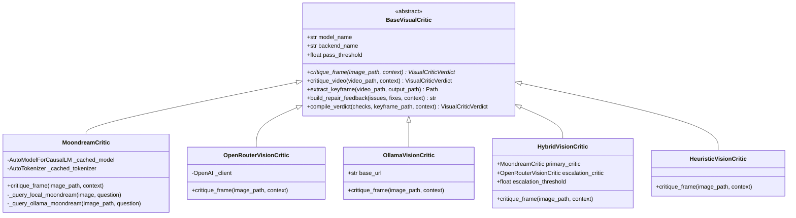
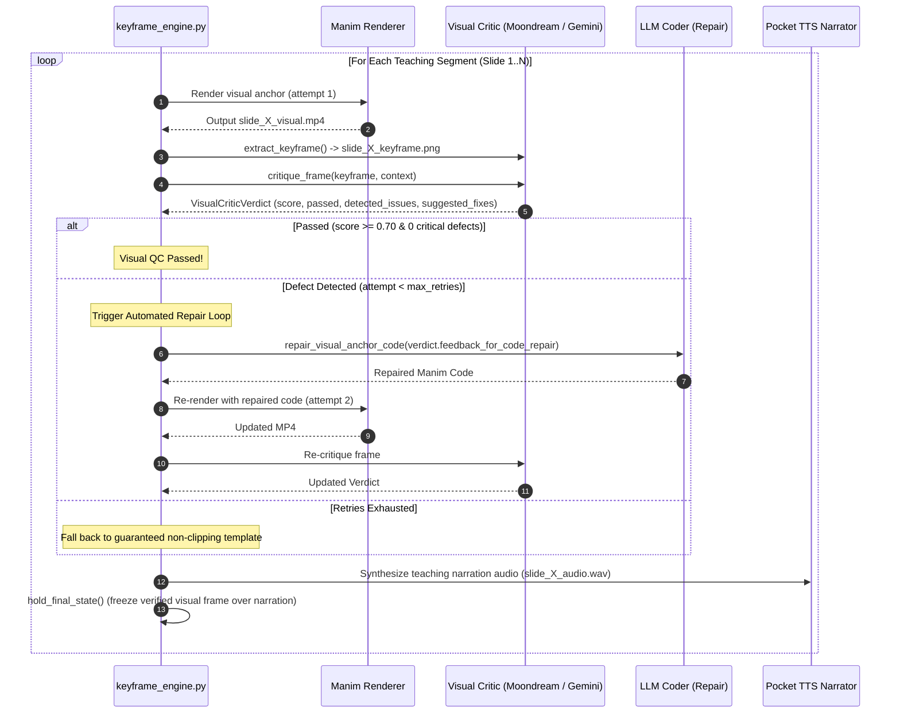

# AOS Visual Critic Subsystem — Technical Guide & Architecture

This document details the **Visual Quality Control (QC)** and **Automated Code Repair Loop** integrated into the Agentic Orchestration System (AOS) mathematical animation pipeline. It explains how lightweight Vision-Language Models (specifically **Moondream 0.5B**) and frontier multimodal models (like **Google Gemini 2.5 Flash**) are employed to inspect rendered Manim slides, diagnose visual defects, and feed actionable spatial corrections back into code generation.

---

## 1. Executive Summary & Design Philosophy

### The Challenge with Visual Inspection in Mathematical Code Generation
In autonomous animation synthesis, code may compile cleanly without Python runtime errors and yet produce serious visual defects:
- Elements clipping off the canvas boundaries ($|x| > 7.1$ or $|y| > 4.0$).
- Overlapping text, formulas, and geometric axes.
- Pitch-black or empty canvases (e.g. uninstantiated scene classes).
- Illegibly small fonts, low-contrast text, or unbalanced layouts.

### Why Moondream 0.5B (and Why Constrained Interrogation)?
Frontier vision models like GPT-4o or Gemini 2.5 Pro are powerful but costly and introduce significant latency in iterative compilation loops. Conversely, tiny open-source vision models like **Moondream 0.5B** (~500M parameters) struggle if asked open-ended mathematical questions such as:
> *"Is this Fourier transform visualization mathematically correct?"*

However, Moondream 0.5B excels at **targeted visual queries and object detection**. The AOS Visual Critic reformulates visual inspection into **10 highly-constrained, binary visual questions**:
1. *Is the scene empty?*
2. *Is the main equation visible?*
3. *Is the equation cut off?*
4. *Are objects overlapping?*
5. *Is text too small?*
6. *Is there excessive empty space?*
7. *Did the intended diagram actually appear?*
8. *Is the animation stuck on an unintended frame?*
9. *Are labels readable?*
10. *Is the visual layout generally coherent?*

By constraining the model to evaluate physical, spatial, and layout properties rather than graduate-level theorem proving, even a sub-billion parameter model becomes a reliable, ultra-fast visual critic.

---

## 2. The 10-Question Targeted Interrogation Protocol

Each rendered keyframe is evaluated against 10 explicit checks defined in `apps/agents/tools/visual_critic/types.py`:

| # | Check Identifier | Interrogation Query | Defect Trigger | Score Penalty | Actionable Code Recommendation |
|---|---|---|---|---|---|
| **1** | `scene_empty` | *Is this image completely blank, pitch black, or empty with no visual content?* | `Yes` (Critical) | `-1.00` | Ensure `self.play(Create(...))` or `self.add(...)` places objects on screen. |
| **2** | `equation_visible` | *Is a mathematical formula, equation, or primary text clearly visible on screen?* | `No` (Critical) | `-0.35` | Render formula using `MathTex` or `Text` with `self.play(Write(...))`. |
| **3** | `equation_cutoff` | *Is any equation, formula, or text cut off, clipped, or running off the border edges?* | `Yes` (Critical) | `-0.35` | Scale equation down (`formula.scale_to_fit_width(11.5)`) or adjust `buff`. |
| **4** | `objects_overlapping` | *Are any text elements, formulas, or shapes overlapping or colliding?* | `Yes` (Critical) | `-0.35` | Use `VGroup.arrange(DOWN, buff=0.35)` or `.next_to(..., DOWN, buff=0.4)`. |
| **5** | `text_too_small` | *Is any text or formula excessively tiny, blurry, or difficult to read?* | `Yes` | `-0.20` | Increase font sizes: `title font_size=34`, `math font_size=36`, body $\ge 22$. |
| **6** | `excessive_empty_space` | *Is there excessive empty space where the slide looks bare and uninformative?* | `Yes` | `-0.15` | Add definition cards or geometric visual components to balance canvas. |
| **7** | `diagram_appeared` | *If coordinate axes, geometric figures, or visual diagrams were intended, are they present?* | `No` | `-0.25` | Render intended geometry (`Axes`, `Circle`, `NumberPlane`) using `Create()`. |
| **8** | `stuck_frame` | *Is the animation stuck on an unintended intermediate transition or broken frame?* | `Yes` (Critical) | `-0.40` | Ensure animations finish cleanly and conclude with a stable `self.wait(1.0)`. |
| **9** | `labels_readable` | *Are all text labels and annotations clearly readable with strong contrast?* | `No` | `-0.25` | Use bright high-contrast colors (`YELLOW`, `GOLD`, `TEAL`, `WHITE`) on dark backgrounds. |
| **10**| `layout_coherent` | *Is the overall visual layout organized, coherent, and educationally well-balanced?* | `No` | `-0.20` | Organize with title at top (`to_edge(UP)`), main formula in center, breakdown below. |

---

## 3. Subsystem Architecture

The Visual Critic subsystem resides in `apps/agents/tools/visual_critic/`:

```
apps/agents/tools/visual_critic/
├── __init__.py           # Exports public API and types
├── types.py              # VisualContext, VisualCriticVerdict, TARGETED_VISUAL_QUESTIONS
├── base.py               # BaseVisualCritic (abstract interface, keyframe extractor, prompt builder)
├── moondream.py          # MoondreamCritic (0.5B / 2B local transformers + Ollama runner)
├── openrouter.py         # OpenRouterVisionCritic (Gemini 2.5 Flash / GPT-4o structured JSON)
├── ollama.py             # OllamaVisionCritic (qwen2.5-vl, minicpm-v, ollama:moondream)
├── hybrid.py             # HybridVisionCritic (Moondream 0.5B filter + Gemini Flash escalation)
├── heuristic.py          # HeuristicVisionCritic (pixel statistics, mean luminance safety net)
└── factory.py            # get_visual_critic() factory for dynamic model swapping
```

### Class Hierarchy



---

## 4. The Visual Critic Retry & Self-Healing Loop

The visual critic is embedded directly in `keyframe_engine.py` during per-slide generation.



### The Code Repair Prompt Format
When a defect is flagged, `repair_visual_anchor_code` injects concrete spatial constraints into the repair prompt:

```markdown
Topic: Euler's Formula
Displayed Formula: e^{i\theta} = \cos\theta + i\sin\theta
Visible Elements: ['e', 'i', 'theta', 'cos', 'sin']

### VISUAL CRITIC FEEDBACK & REPAIR REQUIREMENTS:
The previous rendered keyframe contained the following visual defects:
1. Equation, text, or shapes are cut off or clipping off the screen edges. (Right margin clipped)
2. Visual objects, formulas, or labels are colliding or overlapping.

Required Adjustments in Manim Code:
- Scale down width using `formula.scale_to_fit_width(11.5)` or position with `buff=0.4`.
- Use VGroup.arrange(DOWN, buff=0.35) or `.next_to(..., DOWN, buff=0.4)` to prevent overlap.

Previous Manim Code:
```python
title = Title("Euler's Formula")
formula = MathTex(r"e^{i\theta} = \cos(\theta) + i\sin(\theta)").scale(2.0)
self.play(Write(title), Write(formula))
```

Please provide the repaired, fully working Manim code snippet.
CRITICAL REQUIREMENTS:
1. Fix all reported visual defects.
2. Output ONLY clean executable Python code inside ```python ... ``` without Scene class.
3. Start directly with mobjects and self.play(...).
```

---

## 5. Model Swapping & Configuration

The Visual Critic is fully decoupled and model-agnostic. You can switch models across local, hybrid, cloud, or offline modes simply by adjusting environment variables:

### Option A: Local Moondream 0.5B (Default)
Fast, lightweight, offline-capable:
```bash
AOS_VISUAL_CRITIC_BACKEND="moondream"
AOS_VISUAL_CRITIC_MODEL="vikhyatk/moondream-0_5b"
AOS_VISUAL_CRITIC_DEVICE="auto" # cuda if available, else cpu
```

### Option B: Moondream 2B or Custom Fine-Tuned Checkpoint
Easily upgrade to a larger Moondream checkpoint without code changes:
```bash
AOS_VISUAL_CRITIC_BACKEND="moondream"
AOS_VISUAL_CRITIC_MODEL="vikhyatk/moondream2"
```

### Option C: Cloud Frontier Model via OpenRouter (Google Gemini 2.5 Flash / GPT-4o)
Ultra-high visual grounding and high-resolution LaTeX OCR:
```bash
AOS_VISUAL_CRITIC_BACKEND="openrouter"
AOS_VISUAL_CRITIC_MODEL="google/gemini-2.5-flash"
# or
AOS_VISUAL_CRITIC_MODEL="openai/gpt-4o-mini"
```

### Option D: Multi-Tier Hybrid Mode (Recommended for Production)
Runs **Moondream 0.5B** as the front-line gatekeeper. If Moondream flags any defect or if the quality score is borderline ($< 0.85$), it escalates to **Gemini 2.5 Flash** for deep spatial reasoning and code repair:
```bash
AOS_VISUAL_CRITIC_BACKEND="hybrid"
AOS_VISUAL_CRITIC_MODEL="google/gemini-2.5-flash"
```

### Option E: Local Ollama VLM
Works with locally hosted vision models in Ollama:
```bash
AOS_VISUAL_CRITIC_BACKEND="ollama"
AOS_VISUAL_CRITIC_MODEL="moondream" # or qwen2.5-vl:7b
OLLAMA_BASE_URL="http://localhost:11434"
```

---

## 6. Manifest Serialization & Observability

Every generated run directory (e.g. `workspace/producer_consumer_runs/run_...`) saves `manifest.json`. The visual verdict, quality score, and check breakdown are recorded for every slide:

```json
{
  "ok": true,
  "mode": "animate",
  "prompt": "Teach me about the BODMAS rule",
  "slides": [
    {
      "slide_num": 1,
      "visual_duration": 3.0,
      "narration_duration": 55.04,
      "total_duration": 55.04,
      "visual_verdict": {
        "passed": true,
        "score": 0.95,
        "critic_model": "vikhyatk/moondream-0_5b",
        "backend": "moondream",
        "checks": [
          {"question_id": "scene_empty", "passed": true, "raw_answer": "No"},
          {"question_id": "equation_visible", "passed": true, "raw_answer": "Yes"},
          {"question_id": "equation_cutoff", "passed": true, "raw_answer": "No"},
          {"question_id": "objects_overlapping", "passed": true, "raw_answer": "No"}
        ],
        "detected_issues": [],
        "suggested_fixes": [],
        "keyframe_path": "slide_1_keyframe_att1.png"
      }
    }
  ]
}
```

---

## 7. Testing & Verification

The subsystem includes a comprehensive test suite in [tests/test_visual_critic.py](file:///c:/Users/nabin/Desktop/myall/AOS/tests/test_visual_critic.py):

```bash
uv run python -m pytest tests/test_visual_critic.py tests/test_teaching_segment.py -v
```

### Verified Test Cases:
1. `test_10_targeted_visual_questions_structure`: Asserts exact 10 question definitions, penalties, and non-empty fix recommendations.
2. `test_heuristic_critic_detects_empty_black_screen`: Validates that an all-black image fails with score 0.0 and flags `scene_empty`.
3. `test_heuristic_critic_passes_valid_content`: Validates that a non-empty slide passes with score $\ge 0.70$.
4. `test_moondream_interrogation_protocol`: Validates question routing, binary output parsing, and defect detection.
5. `test_openrouter_gemini_flash_parsing`: Validates structured JSON parsing from Gemini Flash into check items.
6. `test_hybrid_critic_escalation`: Confirms that high-confidence passes avoid escalation, while defects trigger escalation to Gemini Flash.
7. `test_visual_critic_factory_model_swapping`: Verifies dynamic switching across all 6 backends/models.
8. `test_code_repair_feedback_formatting`: Confirms the formatted repair prompt contains actionable spatial guidance.
9. `test_repair_visual_anchor_code`: Verifies the end-to-end integration between critic feedback and code repair regeneration.
