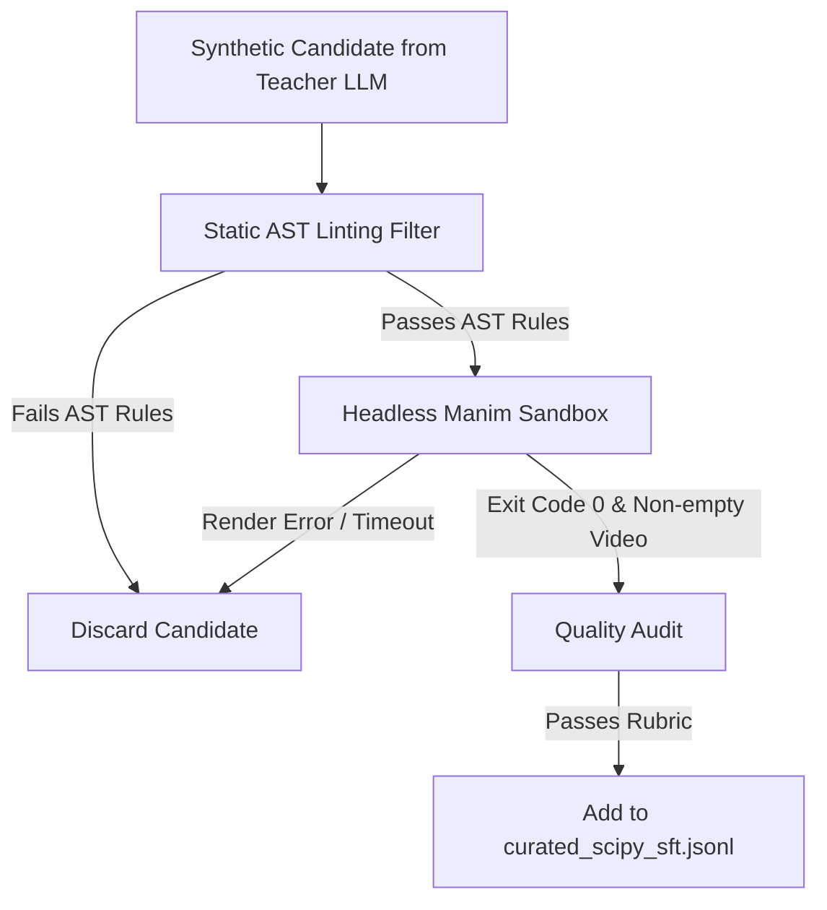

# SFT Dataset Specification: Multi-Library Manim Coordination

This specification outlines the data format, tokenization structure, and quality criteria for fine-tuning open-source coding models (e.g. **Qwen2.5-Coder-7B**, **Qwen3-8B**, **Gemma-4**) on scientific Manim video generation.

---

## 1. Design Philosophy: Quality Over Volume

As supervisor Nathan highlighted:
> *"CPT requires a massive corpus of text and significant compute power... Doing this on Colab or RunPod will drain your remaining funds very quickly. For coding tasks, 500 perfectly curated, step-by-step examples will drastically outperform thousands of low-quality snippets."*

Instead of collecting thousands of broken or trivial animation scripts:
- **Target Size**: **300 to 500 verified, diverse examples**.
- **100% Executable**: Every single example must compile and render without error via headless Manim (`manim render -ql`).
- **Chain-of-Thought (CoT) Prerequisite**: Models must be trained to reason through mathematical discretization and coordinate mapping before writing code.

---

## 2. Conversation & Schema Format (OpenAI / ChatML Standard)

Each dataset entry is a JSON object in `.jsonl` format containing three conversational turns:

```json
{
  "messages": [
    {
      "role": "system",
      "content": "You are an expert scientific visualizer and Python developer specializing in Manim Community Edition, NumPy/SciPy scientific computing, and synchronized voiceover narration. When asked to create an educational animation, first write a detailed, numbered Chain-of-Thought plan breaking down the mathematical computation and visual layout. Then write clean, complete, self-contained executable Python code."
    },
    {
      "role": "user",
      "content": "<USER_PROMPT_CONTAINING_MATHEMATICAL_GOAL_AND_VISUAL_REQUIREMENTS>"
    },
    {
      "role": "assistant",
      "content": "1. Plan: <STEP_1_MATH_FORMULATION>\n2. Plan: <STEP_2_SCIENTIFIC_COMPUTATION>\n3. Plan: <STEP_3_SCENE_AND_CAMERA_SETUP>\n4. Plan: <STEP_4_TIMELINE_AND_ARRAY_TRACKING>\n5. Plan: <STEP_5_SYNCHRONIZED_VOICEOVER_MAPPING>\n\n```python\n<COMPLETE_EXECUTABLE_PYTHON_SCRIPT>\n```"
    }
  ]
}
```

---

## 3. Required Chain-of-Thought (CoT) Anatomy

To train the model to decouple heavy numerical calculation from rendering loops, every assistant response MUST follow this 5-stage CoT plan:

1. **Mathematical Definition**: Formalize equations (e.g., differential equations $\dot{x} = \sigma(y-x)$, loss functions $f(x,y)$, Fourier harmonics).
2. **Pre-computation Strategy**: Specify exact SciPy/NumPy functions (`solve_ivp`, `minimize`, `fft`) and output array dimensions.
3. **Spatial & Visual Setup**: Define the scene type (`VoiceoverScene, ThreeDScene`), coordinate system (`ThreeDAxes`, `NumberPlane`), camera angles, and scaling factors.
4. **Temporal Bridging**: Explicitly declare how continuous time maps to array indices using `ValueTracker` and slice bounds (`points[:idx + 1]`).
5. **Narration & Pacing**: Map each narration sentence to context manager blocks, binding `run_time=tracker.duration` or fractional allocations.

---

## 4. Code Quality Standards & Hard Invariants

Every Python script in the assistant response must satisfy:
1. **Self-Contained Executability**: Must include all imports (`from manim import *`, `import numpy as np`, `from scipy...`).
2. **Correct MRO**: If using voiceover, `class SceneName(VoiceoverScene, BaseScene):`.
3. **No Compute in Loops**: Zero calls to `solve_ivp`, `minimize`, or `fft` inside updater functions or render loops.
4. **Camera Anchoring**: Any 2D text placed in a `ThreeDScene` must either be faded out before camera tilts, or anchored with `self.add_fixed_in_frame_mobjects(...)`.
5. **Array Boundary Guard**: Updaters must check `if idx > 1:` before passing slices to `set_points_as_corners`.
6. **TTS Initialization**: Must instantiate speech service explicitly (defaulting to `self.set_speech_service(GTTSService())` for offline compatibility).

---

## 5. Dataset Validation & Acceptance Pipeline



### Automated Acceptance Checks
- **Syntax Check**: `ast.parse()` succeeds without syntax errors.
- **AST Safety Check**: Passes AST-01 through AST-05 rules.
- **Dry/Low-Quality Render**: `manim render -ql --media_dir <tmpdir> <file>` finishes in under 30 seconds with exit code 0.
- **Non-Empty Output**: Produces a valid `.mp4` file larger than 100 KB.
