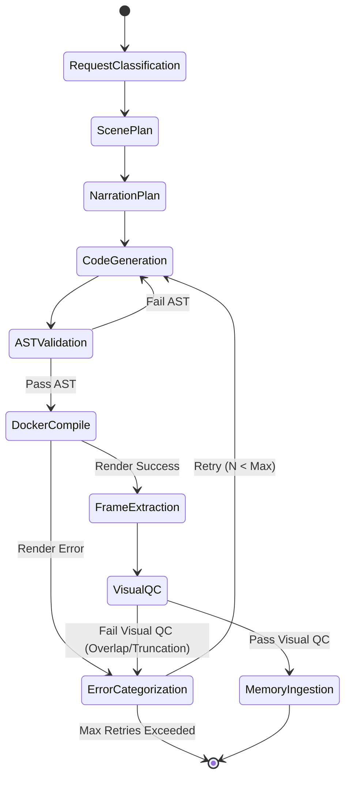

# Phase 1 Data Model: Complete EduClaw Harness & Manim Animation Engine

## Entities & Data Structures

### 1. `EduClawTheme` (`educlaw/animateworkflow/theme.py`)
Defines visual theme styling and color tokens for Manim animations.

```python
class ColorPalette(BaseModel):
    name: str
    background: str  # Hex or Manim color string (e.g., "#0F172A")
    primary: str     # Main text/latex color (e.g., "#F8FAFC")
    accent: str      # Highlight color (e.g., "#38BDF8")
    secondary: str   # Subtitle/secondary text color (e.g., "#94A3B8")
    card_bg: str     # Container card background (e.g., "#1E293B")
    success: str     # Proof/correct state color (e.g., "#4ADE80")
    warning: str     # Warning/alert state color (e.g., "#FACC15")

class EduClawTheme(BaseModel):
    palette: ColorPalette
    font_family: str = "sans-serif"
    latex_preamble: list[str] = Field(default_factory=list)
```

### 2. `VisualQCReport` & `FrameInspection` (`educlaw/animateworkflow/contracts.py`)
Captures the output of multimodal visual inspection on rendered keyframes.

```python
class FrameInspection(BaseModel):
    frame_index: int
    timestamp_sec: float
    has_overlap: bool
    has_text_truncation: bool
    contrast_issue: bool
    issues_description: str = ""

class VisualQCReport(BaseModel):
    passed: bool
    total_frames_checked: int
    inspections: list[FrameInspection] = Field(default_factory=list)
    remediation_suggestion: str = ""
```

### 3. `ComponentSnippet` (`educlaw/animateworkflow/components.py`)
Modular visual templates injected into the coder agent system context.

```python
class ComponentCategory(str, Enum):
    CALLOUT = "callout"
    PROOF_STEP = "proof_step"
    CODE_WINDOW = "code_window"
    LAYOUT = "layout"

class ComponentSnippet(BaseModel):
    name: str
    category: ComponentCategory
    description: str
    manim_code_template: str
```

### 4. `ManimSymbolDoc` (`educlaw/animateworkflow/manim_kb.py`)
Indexed Manim API metadata for agent lookup tools.

```python
class ManimSymbolDoc(BaseModel):
    symbol: str
    module: str
    kind: str  # "class" | "function" | "animation"
    signature: str
    docstring: str
    valid_kwargs: list[str]
    example_usage: str
```

---

## State Transitions

### `WorkflowOrchestrator` Pipeline Loop with Visual QC


